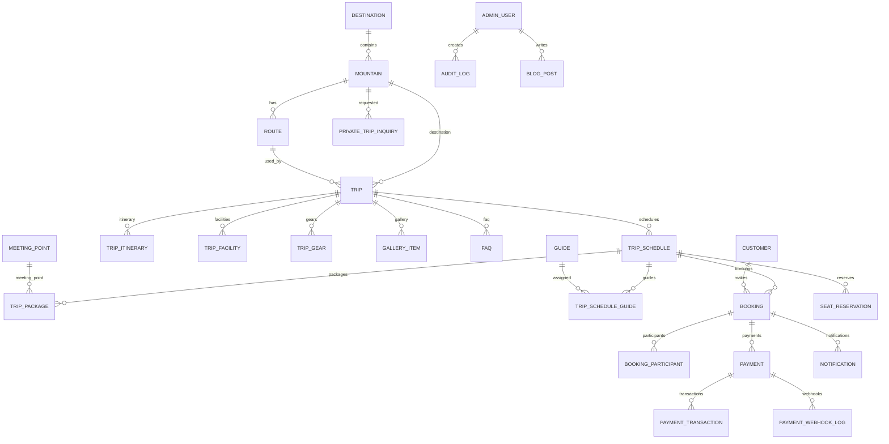
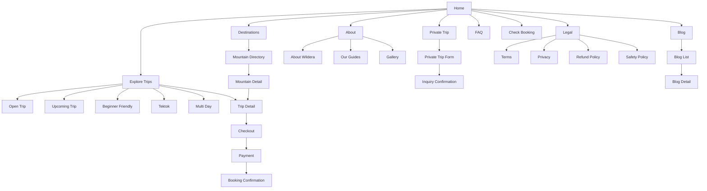
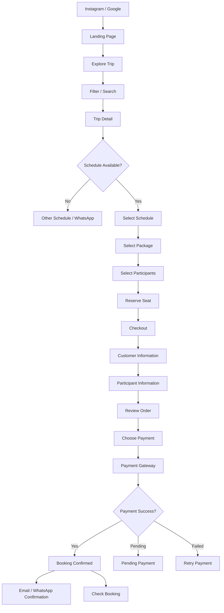
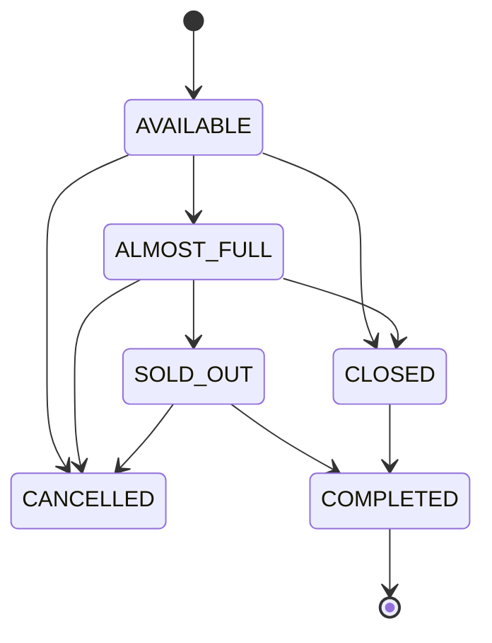
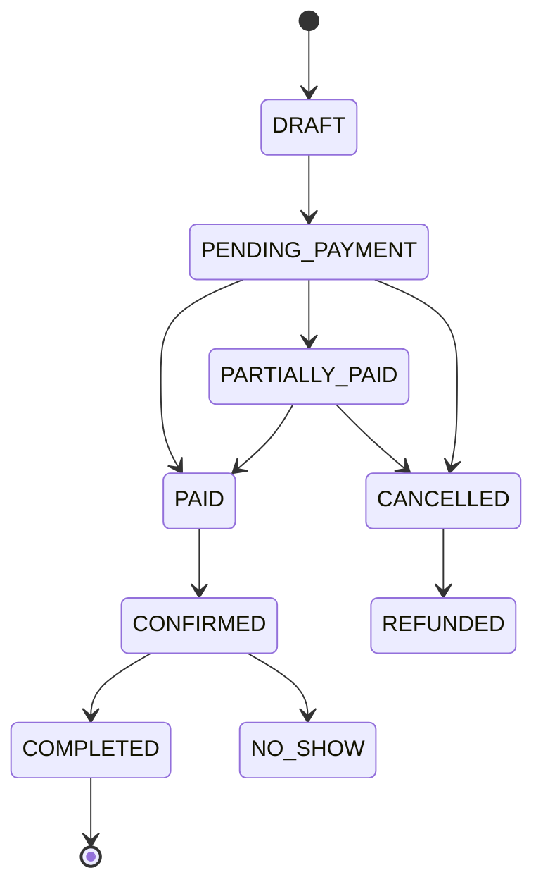
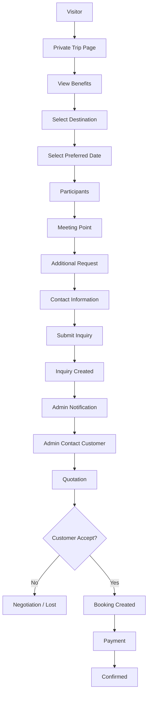
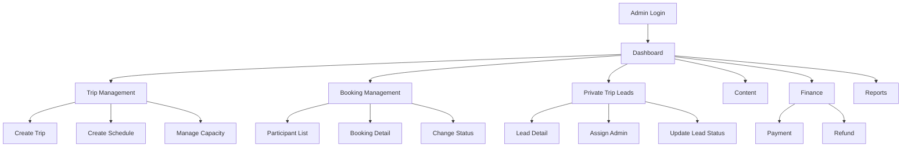

# WILDERA ADVENTURE
## Technical Product Blueprint
### Database Architecture, ERD, Sitemap, User Flow & Wireframe

Version: 1.0  
Product: Wildera Adventure  
Business: Open Trip & Private Trip Pendakian Gunung Indonesia

---

# 1. PRODUCT ARCHITECTURE

## 1.1 Core Product Concept

Website Wildera Adventure bukan sekadar company profile.

Sistem terdiri dari 5 domain utama:

```text
CONTENT
│
├── Destination
├── Mountain
├── Route
├── Blog
├── Gallery
└── Testimonial

TRIP CATALOG
│
├── Trip
├── Trip Schedule
├── Package
├── Meeting Point
├── Guide
└── Capacity / Seat

BOOKING
│
├── Customer
├── Booking
├── Participant
├── Seat Reservation
└── Add-on

PAYMENT
│
├── Invoice
├── Payment
├── Payment Transaction
├── Refund
└── Webhook Log

OPERATIONS
│
├── Admin
├── Role
├── Private Trip Inquiry
├── Notifications
├── Audit Log
└── Reports
```

---

# 2. RECOMMENDED SYSTEM ARCHITECTURE

Untuk Wildera, saya merekomendasikan modular monolith terlebih dahulu.

Jangan langsung microservices.

Microservices pada skala awal hanya akan:

- memperlambat development
- membuat deployment lebih kompleks
- meningkatkan DevOps cost
- memperbanyak failure point
- membuat debugging lebih sulit

Gunakan struktur:

```text
                          ┌─────────────────────┐
                          │      Customer       │
                          │ Mobile / Desktop    │
                          └──────────┬──────────┘
                                     │
                                     ▼
                          ┌─────────────────────┐
                          │      Next.js        │
                          │ Frontend + SSR/SEO  │
                          └──────────┬──────────┘
                                     │
                                  HTTPS/API
                                     │
                                     ▼
                    ┌────────────────────────────────┐
                    │         Backend API            │
                    │                                │
                    │ Authentication                 │
                    │ Trip                           │
                    │ Booking                        │
                    │ Payment                        │
                    │ Private Trip                   │
                    │ Content                        │
                    │ Notification                   │
                    │ Admin                          │
                    └─────────────┬──────────────────┘
                                  │
                     ┌────────────┼────────────┐
                     │            │            │
                     ▼            ▼            ▼
                PostgreSQL      Redis      Object Storage
                                            │
                                        Images / Docs

                     External Services
                     ─────────────────
                     Payment Gateway
                     Email Provider
                     WhatsApp
                     Analytics
```

---

# 3. RECOMMENDED TECH STACK

## Frontend

Recommended:

```text
Next.js
TypeScript
Tailwind CSS
React Query / TanStack Query
Zod
React Hook Form
```

Reason:

- SEO kuat
- SSR / SSG
- performance baik
- cocok untuk landing page dan booking
- ecosystem matang

---

# 4. BACKEND

Recommended:

```text
NestJS
TypeScript
REST API
Prisma ORM
```

Alternative:

```text
Next.js API / Server Actions
```

Tetapi untuk produk yang mempunyai:

- booking
- payment
- webhook
- admin
- seat locking
- notification
- scheduled job

saya lebih memilih backend terpisah seperti NestJS.

Architecture:

```text
modules/

auth
admin
customer
destination
mountain
route
trip
schedule
booking
participant
payment
private-trip
guide
content
notification
report
audit
```

---

# 5. DATABASE

Recommended:

```text
PostgreSQL
```

Alasan:

- relational data sangat kuat
- transaction support
- row locking
- constraint
- mature
- sangat cocok untuk booking system

Redis digunakan hanya untuk:

```text
seat reservation
temporary checkout state
rate limiting
cache
job queue
```

Redis BUKAN database utama.

---

# 6. DATABASE DESIGN PRINCIPLE

Gunakan:

```text
UUID untuk primary key internal
```

Contoh:

```text
id UUID PK
```

Jangan expose UUID tersebut sebagai booking number.

Gunakan:

```text
booking_number
WLD-260915-X7G4
```

sebagai identifier customer-facing.

---

# 7. DATABASE CORE STRUCTURE

Struktur inti:

```text
Destination
     │
     ▼
Mountain
     │
     ▼
Route
     │
     ▼
Trip
     │
     ▼
TripSchedule
     │
     ├── TripPackage
     │
     ├── MeetingPoint
     │
     └── TripGuide
     │
     ▼
Booking
     │
     ├── BookingParticipant
     │
     ├── BookingItem
     │
     ├── Invoice
     │
     └── Payment
```

Ini adalah struktur paling penting dari seluruh sistem.

---

# 8. DESTINATION TABLE

```text
destinations
```

Fields:

```text
id UUID PK

name VARCHAR
slug VARCHAR UNIQUE

province VARCHAR
city VARCHAR

description TEXT

seo_title VARCHAR
seo_description TEXT

cover_image_url TEXT

status ENUM
ACTIVE
INACTIVE

created_at TIMESTAMP
updated_at TIMESTAMP
```

Contoh:

```text
Jawa Tengah
Lombok
Jawa Timur
```

---

# 9. MOUNTAINS

```text
mountains
```

Fields:

```text
id UUID PK
destination_id UUID FK

name VARCHAR
slug VARCHAR UNIQUE

altitude INTEGER

description TEXT
short_description TEXT

difficulty ENUM
EASY
MODERATE
HARD
EXTREME

best_season VARCHAR

latitude DECIMAL
longitude DECIMAL

cover_image_url TEXT

seo_title VARCHAR
seo_description TEXT

status ENUM

created_at
updated_at
```

Contoh:

```text
Gunung Prau
2590 mdpl
```

---

# 10. ROUTES

Satu gunung dapat mempunyai banyak jalur.

```text
routes
```

Fields:

```text
id UUID PK

mountain_id UUID FK

name VARCHAR

slug VARCHAR

description TEXT

distance_km DECIMAL

estimated_duration_hours DECIMAL

elevation_gain INTEGER

difficulty ENUM

starting_point VARCHAR

created_at
updated_at
```

Contoh:

```text
Prau
 ├── Patak Banteng
 ├── Dieng
 └── Kalilembu
```

---

# 11. TRIPS

Trip adalah TEMPLATE PRODUK.

Trip bukan keberangkatan.

Contoh:

```text
Open Trip Gunung Prau via Patak Banteng
```

bukan:

```text
Open Trip Prau 10 September
```

Table:

```text
trips
```

Fields:

```text
id UUID PK

mountain_id UUID FK
route_id UUID FK

name VARCHAR

slug VARCHAR UNIQUE

trip_type ENUM
OPEN_TRIP
PRIVATE_TRIP
TEKTOK
MULTI_DAY

short_description TEXT

description TEXT

duration_days INTEGER
duration_nights INTEGER

minimum_age INTEGER
maximum_age INTEGER NULL

difficulty ENUM

beginner_friendly BOOLEAN

featured BOOLEAN

status ENUM
DRAFT
PUBLISHED
ARCHIVED

seo_title VARCHAR
seo_description TEXT

cover_image_url TEXT

created_by UUID

created_at
updated_at
published_at
deleted_at
```

---

# 12. TRIP SCHEDULE

Ini merepresentasikan keberangkatan.

```text
trip_schedules
```

Fields:

```text
id UUID PK

trip_id UUID FK

start_date DATE
end_date DATE

registration_deadline DATE

capacity INTEGER

reserved_seats INTEGER DEFAULT 0

booked_seats INTEGER DEFAULT 0

minimum_participant INTEGER

status ENUM
DRAFT
AVAILABLE
ALMOST_FULL
SOLD_OUT
CLOSED
CANCELLED
COMPLETED

notes TEXT

created_at
updated_at
```

Available seat:

```text
available =
capacity
- booked_seats
- active_reserved_seats
```

---

# 13. TRIP PACKAGES

Satu schedule dapat mempunyai beberapa harga.

Contoh:

```text
Start Jakarta
Rp1.750.000

Start Basecamp
Rp950.000
```

Table:

```text
trip_packages
```

Fields:

```text
id UUID PK

schedule_id UUID FK

name VARCHAR

description TEXT

price DECIMAL

deposit_amount DECIMAL NULL

capacity INTEGER NULL

meeting_point_id UUID NULL

status ENUM
ACTIVE
INACTIVE

created_at
updated_at
```

---

# 14. MEETING POINTS

```text
meeting_points
```

Fields:

```text
id UUID PK

name VARCHAR

city VARCHAR

address TEXT

latitude DECIMAL
longitude DECIMAL

meeting_time TIME NULL

notes TEXT

created_at
updated_at
```

---

# 15. TRIP ITINERARY

Jangan simpan itinerary sebagai satu text besar.

Gunakan table:

```text
trip_itineraries
```

Fields:

```text
id

trip_id

day_number

title

description

sort_order
```

Contoh:

```text
Day 1
Jakarta → Basecamp

Day 2
Basecamp → Sunrise Point
```

---

# 16. INCLUDE / EXCLUDE

Gunakan table generic:

```text
trip_facilities
```

Fields:

```text
id

trip_id

type ENUM
INCLUDE
EXCLUDE

name

description

sort_order
```

---

# 17. GEAR CHECKLIST

```text
trip_gears
```

Fields:

```text
id

trip_id

name

type ENUM
MANDATORY
RECOMMENDED

description
```

---

# 18. GUIDES

```text
guides
```

Fields:

```text
id

name

slug

photo_url

short_bio

experience_years

certification

status
```

Relationship:

```text
trip_schedule_guides
```

Fields:

```text
schedule_id
guide_id

role

LEAD_GUIDE
GUIDE
PORTER_COORDINATOR
```

---

# 19. CUSTOMERS

```text
customers
```

Fields:

```text
id UUID

full_name

email

phone

created_at
updated_at
```

Customer belum membutuhkan password untuk MVP.

---

# 20. BOOKINGS

Ini transaksi utama.

```text
bookings
```

Fields:

```text
id UUID PK

booking_number VARCHAR UNIQUE

customer_id UUID FK

schedule_id UUID FK

package_id UUID FK

quantity INTEGER

subtotal DECIMAL

discount_amount DECIMAL

total_amount DECIMAL

deposit_amount DECIMAL

remaining_amount DECIMAL

status ENUM

DRAFT
PENDING_PAYMENT
PARTIALLY_PAID
PAID
CONFIRMED
CANCELLED
REFUNDED
COMPLETED
NO_SHOW

payment_status ENUM

UNPAID
PARTIAL
PAID
REFUNDED

source ENUM

WEBSITE
INSTAGRAM
WHATSAPP
ADMIN
OTHER

notes TEXT

expires_at TIMESTAMP

created_at
updated_at
cancelled_at
completed_at
```

---

# 21. PARTICIPANTS

Satu booking dapat memiliki beberapa peserta.

```text
booking_participants
```

Fields:

```text
id UUID

booking_id UUID FK

full_name

gender

date_of_birth

phone

identity_type

identity_number

emergency_contact_name

emergency_contact_phone

medical_notes TEXT

created_at
updated_at
```

Peringatan:

Data medis jangan dikumpulkan berlebihan.

Jika memang dibutuhkan untuk safety trip, batasi ke informasi yang relevan.

---

# 22. SEAT RESERVATION

Ini bagian kritikal.

```text
seat_reservations
```

Fields:

```text
id

schedule_id

package_id

checkout_token

quantity

expires_at

status ENUM
ACTIVE
EXPIRED
CONVERTED

created_at
```

Flow:

```text
Customer click Book

↓
Server checks available seat

↓
Transaction database

↓
Temporary reservation created

↓
Seat reserved 15 minutes

↓
Checkout

↓
Payment

↓
Booking confirmed
```

Jika tidak dibayar:

```text
reservation expires
```

Seat otomatis kembali.

---

# 23. PAYMENT

Gunakan abstraction.

Jangan masukkan semua logic Midtrans langsung ke booking.

Table:

```text
payments
```

Fields:

```text
id

booking_id

provider

MIDTRANS
XENDIT
MANUAL

provider_payment_id

payment_method

amount

status ENUM

PENDING
SUCCESS
FAILED
EXPIRED
REFUNDED
PARTIALLY_REFUNDED

payment_url

expired_at

paid_at

created_at
updated_at
```

---

# 24. PAYMENT TRANSACTION

Gunakan:

```text
payment_transactions
```

Untuk menyimpan events.

Fields:

```text
id

payment_id

external_transaction_id

type

REQUEST
PAYMENT
REFUND
CHARGEBACK

amount

status

raw_response JSONB

created_at
```

---

# 25. PAYMENT WEBHOOK LOG

Jangan abaikan ini.

```text
payment_webhook_logs
```

Fields:

```text
id

provider

event_type

external_id

payload JSONB

signature_valid BOOLEAN

processed BOOLEAN

processed_at

error_message

created_at
```

Webhook HARUS idempotent.

Jika gateway mengirim webhook 3 kali:

booking tidak boleh diproses tiga kali.

---

# 26. PRIVATE TRIP INQUIRY

```text
private_trip_inquiries
```

Fields:

```text
id

inquiry_number

customer_name

phone

email

mountain_id

preferred_date

alternative_date

participants

meeting_point

budget

requirements TEXT

status ENUM

NEW
CONTACTED
QUOTATION_SENT
NEGOTIATION
BOOKED
LOST

assigned_admin_id

created_at
updated_at
```

---

# 27. ADMIN USERS

```text
admin_users
```

Fields:

```text
id

name

email

password_hash

status

last_login_at

created_at
updated_at
```

---

# 28. ROLES

```text
roles
```

Contoh:

```text
SUPER_ADMIN
OPERATIONS
FINANCE
CONTENT_EDITOR
```

Relationship:

```text
admin_user_roles
```

---

# 29. AUDIT LOG

Wajib untuk admin operation.

```text
audit_logs
```

Fields:

```text
id

admin_user_id

action

entity_type

entity_id

old_value JSONB

new_value JSONB

ip_address

created_at
```

Contoh:

```text
Adam changed trip capacity
30 → 25
```

---

# 30. NOTIFICATION

```text
notifications
```

Fields:

```text
id

customer_id

booking_id

type

channel

EMAIL
WHATSAPP
SYSTEM

recipient

template

status

PENDING
SENT
FAILED

sent_at
created_at
```

---

# 31. TESTIMONIAL

```text
testimonials
```

Fields:

```text
id

customer_name

trip_id

rating

comment

photo_url

status

PENDING
PUBLISHED
REJECTED

created_at
```

---

# 32. BLOG

```text
blog_posts
```

Fields:

```text
id

title

slug

excerpt

content

cover_image

author_id

status

DRAFT
PUBLISHED

seo_title

seo_description

published_at
```

---

# 33. GALLERY

```text
gallery_items
```

Fields:

```text
id

trip_id NULL

mountain_id NULL

image_url

caption

sort_order
```

---

# 34. FAQ

```text
faqs
```

Fields:

```text
id

category

trip_id NULL

question

answer

sort_order

status
```

---

# 35. HIGH LEVEL ERD



---

# 36. DATABASE INDEX STRATEGY

Minimum index:

```text
trips.slug

mountains.slug

routes.slug

trip_schedules.trip_id

trip_schedules.start_date

trip_schedules.status

bookings.booking_number

bookings.customer_id

bookings.schedule_id

bookings.status

payments.booking_id

payments.provider_payment_id

private_trip_inquiries.status

blog_posts.slug
```

Composite index:

```text
trip_schedules (
    trip_id,
    start_date,
    status
)
```

---

# 37. SOFT DELETE

Gunakan:

```text
deleted_at
```

untuk:

```text
trips
guides
content
```

Jangan soft delete payment transaction.

Financial transaction harus immutable sejauh memungkinkan.

---

# 38. SITEMAP



---

# 39. URL STRUCTURE

Gunakan:

```text
/
```

Homepage.

```text
/trip
```

Trip catalog.

```text
/trip/[slug]
```

Example:

```text
/trip/open-trip-gunung-prau
```

Destination:

```text
/gunung
```

Detail:

```text
/gunung/rinjani
```

Private trip:

```text
/private-trip
```

Blog:

```text
/blog
/blog/[slug]
```

Booking:

```text
/booking/[booking-number]
```

Check booking:

```text
/check-booking
```

Admin:

```text
/admin
```

---

# 40. USER FLOW — OPEN TRIP



---

# 41. OPEN TRIP STATE FLOW



---

# 42. BOOKING STATE FLOW



---

# 43. USER FLOW — PRIVATE TRIP



---

# 44. USER FLOW — ADMIN



---

# 45. WIREFRAME — HOMEPAGE

Desktop:

```text
┌─────────────────────────────────────────────┐
│ WILDERA                                    │
│ Trips  Destinations  Private Trip  About   │
│                              [WhatsApp]     │
├─────────────────────────────────────────────┤

│                                             │
│          FULL WIDTH MOUNTAIN IMAGE          │
│                                             │
│     Your Next Summit Starts Here            │
│                                             │
│  Explore curated mountain trips across      │
│  Indonesia with Wildera Adventure.          │
│                                             │
│  [ EXPLORE TRIP ]  [ PRIVATE TRIP ]         │
│                                             │

├─────────────────────────────────────────────┤

│ UPCOMING TRIPS                              │
│                                             │
│ ┌────────┐ ┌────────┐ ┌────────┐            │
│ │ Prau   │ │Rinjani │ │Gede    │            │
│ │12 Sep  │ │22 Sep  │ │28 Sep  │            │
│ │Rp950K  │ │Rp2.5M  │ │Rp800K  │            │
│ │5 seats │ │3 seats │ │8 seats │            │
│ └────────┘ └────────┘ └────────┘            │

├─────────────────────────────────────────────┤

│ EXPLORE BY DESTINATION                      │
│                                             │
│ Rinjani     Prau      Semeru      Gede      │

├─────────────────────────────────────────────┤

│ WHY WILDERA                                 │
│                                             │
│ Safety      Experienced     Transparent     │
│ First       Guide           Pricing         │

├─────────────────────────────────────────────┤

│ HOW IT WORKS                                │
│                                             │
│ Choose → Book → Pay → Prepare → Adventure   │

├─────────────────────────────────────────────┤

│ PRIVATE TRIP                                │
│                                             │
│ Your group. Your schedule. Your adventure.  │
│                                             │
│ [ PLAN PRIVATE TRIP ]                       │

├─────────────────────────────────────────────┤

│ TESTIMONIAL                                 │

├─────────────────────────────────────────────┤

│ GALLERY                                     │

├─────────────────────────────────────────────┤

│ HIKING GUIDE                                │

├─────────────────────────────────────────────┤

│ FAQ                                         │

├─────────────────────────────────────────────┤

│ CTA                                         │
│                                             │
│ Sudah tahu gunung tujuanmu?                 │
│                                             │
│ [ FIND YOUR TRIP ]                          │

├─────────────────────────────────────────────┤

│ FOOTER                                      │
└─────────────────────────────────────────────┘
```

---

# 46. MOBILE HOMEPAGE

Mobile harus menjadi desain utama.

```text
┌─────────────────────┐
│ WILDERA          ☰  │
├─────────────────────┤

│                     │
│   MOUNTAIN IMAGE    │
│                     │

│ Your Next Summit    │
│ Starts Here         │

│ Explore mountain    │
│ adventures across   │
│ Indonesia           │

│ [ Explore Trip ]    │
│ [ Private Trip ]    │

├─────────────────────┤

│ Upcoming Trip       │

│ ┌─────────────────┐ │
│ │ Rinjani         │ │
│ │ 20-23 Sep       │ │
│ │ Rp2.500.000     │ │
│ │ 4 seats         │ │
│ │ [View]          │ │
│ └─────────────────┘ │

│ ← swipe →           │

├─────────────────────┤

│ Destination         │

│ Rinjani             │
│ Prau                │
│ Semeru              │

...
```

---

# 47. TRIP CATALOG WIREFRAME

```text
┌─────────────────────────────────────────────┐
│ Explore Trips                               │
│                                             │
│ Find your next mountain adventure           │
├─────────────────────────────────────────────┤

│ Search                                      │
│ [ Search mountain / trip             ]      │

│ FILTER                                      │

│ Month                                       │
│ Difficulty                                  │
│ Trip Type                                   │
│ Price                                       │
│ Availability                                │

│ Sort: Nearest Date ▼                        │

├─────────────────────────────────────────────┤

│ 18 Trips Found                              │

│ ┌─────────────┐ ┌─────────────┐             │
│ │ IMAGE       │ │ IMAGE       │             │
│ │             │ │             │             │
│ │ Rinjani     │ │ Prau        │             │
│ │ 20 Sep      │ │ 27 Sep      │             │
│ │ Moderate    │ │ Easy        │             │
│ │ Rp2.5M      │ │ Rp950K      │             │
│ │ 4 seats     │ │ 8 seats     │             │
│ └─────────────┘ └─────────────┘             │
```

Mobile:

Filter menggunakan:

```text
[ Filter ] [ Sort ]
```

bottom sheet.

---

# 48. MOUNTAIN DETAIL WIREFRAME

```text
┌─────────────────────────────────────────────┐

│ HERO IMAGE                                  │

│ Gunung Rinjani                              │
│ Lombok, NTB                                 │
│ 3,726 MDPL                                  │

├─────────────────────────────────────────────┤

│ ABOUT RINJANI                               │

├─────────────────────────────────────────────┤

│ ROUTES                                      │
│                                             │
│ Sembalun                                    │
│ Senaru                                      │
│ Torean                                      │

├─────────────────────────────────────────────┤

│ UPCOMING TRIPS                              │

│ Trip cards                                  │

├─────────────────────────────────────────────┤

│ DIFFICULTY                                  │

├─────────────────────────────────────────────┤

│ BEST SEASON                                 │

├─────────────────────────────────────────────┤

│ HIKING GUIDES / ARTICLES                    │
```

---

# 49. TRIP DETAIL WIREFRAME

Ini halaman conversion terpenting.

Desktop:

```text
┌───────────────────────────────────────────────────┐

│                     HERO IMAGE                    │

├───────────────────────────────────────────────────┤

│ Open Trip Gunung Rinjani                          │
│ Via Sembalun                                      │

│ Lombok • 4D3N • Hard • 3,726 MDPL                │

├───────────────────────────────┬───────────────────┤

│ LEFT CONTENT                  │ BOOKING BOX       │
│                               │                   │
│ About Trip                    │ From              │
│                               │ Rp2.500.000       │
│ Trip Highlights               │                   │
│                               │ Schedule          │
│ Itinerary                     │ [20-23 Sep ▼]     │
│                               │                   │
│ Day 1                         │ Package           │
│ Day 2                         │ [Jakarta ▼]       │
│ Day 3                         │                   │
│ Day 4                         │ Participants      │
│                               │ [-] 1 [+]         │
│ Include                       │                   │
│                               │ 4 seats left      │
│ Exclude                       │                   │
│                               │ [ BOOK NOW ]      │
│ Gear Checklist                │                   │
│                               │ WhatsApp          │
│ Meeting Point                 │                   │
│                               │                   │
│ Guide                         │                   │
│                               │                   │
│ FAQ                           │                   │
│                               │                   │
│ Policy                        │                   │

└───────────────────────────────┴───────────────────┘
```

Booking box:

```text
position: sticky
```

---

# 50. MOBILE TRIP DETAIL

```text
┌───────────────────────┐

│ HERO                  │

│ Open Trip Rinjani     │

│ 4D3N | Hard           │
│ 3,726 MDPL            │

│ ★ Beginner: No        │

├───────────────────────┤

│ Choose Schedule       │

│ 20-23 Sep             │
│ 27-30 Sep             │

├───────────────────────┤

│ About                 │

├───────────────────────┤

│ Itinerary             │

├───────────────────────┤

│ Include               │

├───────────────────────┤

│ Exclude               │

├───────────────────────┤

│ Gear                  │

├───────────────────────┤

│ FAQ                   │

├───────────────────────┤


STICKY BOTTOM:

┌───────────────────────┐
│ Rp2.500.000  [BOOK]   │
└───────────────────────┘
```

---

# 51. CHECKOUT FLOW

Checkout jangan dibuat satu form sepanjang satu kilometer.

Gunakan step.

```text
Step 1
Trip

Step 2
Contact

Step 3
Participants

Step 4
Payment
```

---

# 52. CHECKOUT STEP 1

```text
┌─────────────────────────────┐

Booking

1 Trip → 2 Contact → 3 Participant → 4 Payment

Trip
Open Trip Rinjani

Schedule
20-23 September

Package

○ Start Jakarta
  Rp2.500.000

○ Start Lombok
  Rp1.850.000

Participants

[-] 2 [+]

Subtotal

Rp5.000.000

[ CONTINUE ]

└─────────────────────────────┘
```

Saat masuk step ini:

seat reservation dimulai.

Timer:

```text
Your seats are reserved for

14:48
```

---

# 53. CHECKOUT STEP 2

```text
Contact Information

Full Name
[                ]

WhatsApp
[                ]

Email
[                ]

Emergency contact

[                ]

[ CONTINUE ]
```

---

# 54. PARTICIPANT INFORMATION

```text
Participant #1

Full Name

Gender

Date of Birth

Identity

Emergency Contact

Special Notes


Participant #2

...
```

Gunakan accordion.

---

# 55. REVIEW ORDER

```text
Open Trip Rinjani

20-23 September

2 Participants

Package
Start Jakarta

Price

2 x Rp2.500.000

Total
Rp5.000.000


Payment

○ Full payment

○ Deposit
  Rp1.000.000


☑ I agree to Terms & Conditions

[ PROCEED PAYMENT ]
```

---

# 56. PAYMENT PAGE

```text
Booking

WLD-260920-A7X2


Amount

Rp5.000.000


Select Payment

Virtual Account

BCA
BNI
Mandiri

QRIS

E-Wallet


[ PAY NOW ]
```

Dalam implementasi Midtrans/Xendit:

provider dapat mengambil alih bagian payment UI.

---

# 57. BOOKING CONFIRMATION

```text
✓ Booking Confirmed

Your adventure is booked.


Booking ID

WLD-260920-A7X2


Open Trip Rinjani

20-23 September


Participants

2


Payment

PAID


[ VIEW BOOKING ]

[ DOWNLOAD / SAVE INFO ]

[ WHATSAPP WILDERA ]
```

---

# 58. CHECK BOOKING PAGE

```text
Check Your Booking

Booking Number

[ WLD-____________ ]

Email / WhatsApp

[                  ]

[ CHECK BOOKING ]
```

Jika match:

```text
Booking
WLD-260920-A7X2

Rinjani

20 Sep 2026

STATUS

CONFIRMED

Payment

PAID

Meeting Point

Blok M

Participants

2
```

---

# 59. PRIVATE TRIP PAGE

```text
┌─────────────────────────────────┐

Private Adventure,
Built Around You.

Choose your mountain.
Choose your date.
We handle the rest.

[ PLAN PRIVATE TRIP ]

├─────────────────────────────────┤

Why Private Trip?

Flexible Date

Private Group

Custom Meeting Point

Custom Itinerary

Dedicated Guide

├─────────────────────────────────┤

How It Works

Request

Consultation

Quotation

Payment

Adventure

├─────────────────────────────────┤

FORM

Destination

[ Rinjani ▼ ]

Preferred Date

Participants

Meeting Point

Budget optional

Request

Contact

[ REQUEST TRIP ]

└─────────────────────────────────┘
```

---

# 60. BLOG LIST

```text
Hiking Guide

Search

Categories:

Beginner
Gear
Mountain Guide
Preparation


ARTICLE CARD

IMAGE

Persiapan Naik Gunung
untuk Pemula

8 min read
```

---

# 61. BLOG DETAIL

```text
Breadcrumb

Hiking Guide

Title

Hero Image

Article

Related Trip

Open Trip Gunung Prau

[ VIEW TRIP ]

Related Articles
```

SEO value paling besar ada pada hubungan:

```text
ARTICLE
↓
MOUNTAIN
↓
TRIP
↓
BOOKING
```

---

# 62. ABOUT PAGE

```text
Hero

Wildera Adventure

About Us

Our Philosophy

Safety & Preparation

Our Guides

Gallery

CTA

Explore Trip
```

---

# 63. FAQ PAGE

Categories:

```text
Booking
Payment
Trip
Equipment
Cancellation
Safety
Private Trip
```

Gunakan accordion.

---

# 64. ADMIN LOGIN

```text
WILDERA ADMIN

Email

Password

[ LOGIN ]
```

MVP:

admin only.

Tidak perlu customer account.

---

# 65. ADMIN DASHBOARD

```text
┌─────────────────────────────────────────┐

WILDERA ADMIN

Dashboard

Trips
Schedules
Bookings
Private Trips
Payments
Participants
Guides
Content
Reports
Settings

├─────────────────────────────────────────┤

TODAY

New Booking
12

Revenue
Rp18.500.000

Upcoming Trips
8

Private Leads
4

├─────────────────────────────────────────┤

UPCOMING TRIPS

Trip        Date       Seat

Prau        12 Sep     18/20
Rinjani     20 Sep      8/10
Gede        22 Sep     12/15

├─────────────────────────────────────────┤

RECENT BOOKINGS

Booking ID
Customer
Trip
Payment
Status

└─────────────────────────────────────────┘
```

---

# 66. ADMIN TRIP LIST

```text
Trips

[ + CREATE TRIP ]

Search

Filter Status

────────────────────────────────

Prau via Patak Banteng

OPEN TRIP

Published

Schedules: 5

[Edit] [Schedule] [Duplicate]
```

---

# 67. ADMIN CREATE TRIP

Gunakan step/tab.

```text
GENERAL

Destination
Mountain
Route
Trip Type
Title
Description


TRIP INFO

Duration
Difficulty
Beginner Friendly


CONTENT

Highlights
Itinerary
Include
Exclude
Gear


MEDIA

Cover
Gallery


SEO

Slug
Title
Description


[ SAVE DRAFT ]

[ PUBLISH ]
```

---

# 68. ADMIN SCHEDULE

```text
Open Trip Prau


[ + ADD SCHEDULE ]

────────────────────────────

12 Sep - 13 Sep

Capacity

20

Booked

16

Reserved

1

Available

3

Status

AVAILABLE


[Manage]
```

---

# 69. CREATE SCHEDULE

```text
Start Date

End Date

Registration Deadline

Capacity

Minimum Participants


Packages

+ Add Package


PACKAGE

Name

Start Jakarta

Price

Rp1.200.000

Deposit

Rp400.000

Meeting Point

Blok M


[ CREATE SCHEDULE ]
```

---

# 70. ADMIN BOOKING LIST

```text
BOOKINGS

Search Booking / Customer

Filter

Trip
Date
Status
Payment

─────────────────────────────────

WLD-X7D2

Adam

Rinjani

Rp2.500.000

PAID

CONFIRMED

[VIEW]
```

---

# 71. ADMIN BOOKING DETAIL

```text
Booking

WLD-260920-X7D2


Customer

Adam

WhatsApp

Email


Trip

Rinjani


Schedule

20-23 Sep


Participants

Adam

Budi


Payment

Rp5.000.000

PAID


TIMELINE

Booking Created

Payment Received

Booking Confirmed


ADMIN ACTION

Change Status

Cancel

Refund

Send Notification
```

---

# 72. ADMIN PRIVATE TRIP CRM

```text
PRIVATE TRIP LEADS

NEW
CONTACTED
QUOTATION
NEGOTIATION
BOOKED
LOST
```

Kanban bisa dibuat Phase 2.

MVP cukup table.

```text
Name

Destination

Participants

Date

Phone

Status

Assigned To
```

---

# 73. ADMIN CONTENT

Sections:

```text
Mountains

Destinations

Guides

Gallery

Testimonials

FAQ

Blog

Homepage
```

---

# 74. ADMIN PAYMENT

```text
PAYMENTS

Transaction

Booking

Customer

Amount

Method

Status

Provider

Date
```

Finance bisa melihat:

```text
SUCCESS
FAILED
REFUNDED
```

---

# 75. BOOKING CONCURRENCY

Scenario:

```text
Capacity = 1
```

Adam checkout.

Budi checkout pada waktu sama.

Jangan lakukan:

```text
SELECT available_seat

IF available > 0
    booking
```

Ini rentan race condition.

Gunakan transaction.

Concept:

```sql
BEGIN;

SELECT *
FROM trip_schedules
WHERE id = ?
FOR UPDATE;

CHECK AVAILABLE SEAT

INSERT seat_reservation

UPDATE reserved seat

COMMIT;
```

Atau gunakan atomic inventory model.

---

# 76. PAYMENT WEBHOOK

Payment flow:

```text
Customer
↓
Payment Gateway
↓
Payment
↓
Webhook
↓
Backend
↓
Validate Signature
↓
Check Idempotency
↓
Update Payment
↓
Update Booking
↓
Confirm Seat
↓
Notification
```

Jangan menganggap redirect browser berarti pembayaran berhasil.

Source of truth adalah:

```text
verified payment gateway webhook
```

---

# 77. BOOKING EXPIRATION

Job scheduler berjalan:

```text
every 1 minute
```

Check:

```text
seat_reservation

WHERE

status = ACTIVE

AND expires_at < NOW
```

Kemudian:

```text
status = EXPIRED
```

release seat.

---

# 78. ADMIN MANUAL BOOKING

Ini penting.

Banyak customer mungkin tetap booking via WhatsApp.

Admin perlu:

```text
Create Manual Booking
```

Source:

```text
WHATSAPP
INSTAGRAM
ADMIN
```

Jangan memaksa semua booking masuk website terlebih dahulu.

Operational flexibility lebih penting.

---

# 79. MVP DATABASE TABLES

P0:

```text
admin_users
roles
admin_user_roles

destinations
mountains
routes

trips
trip_schedules
trip_packages
meeting_points

trip_itineraries
trip_facilities
trip_gears

customers
bookings
booking_participants

seat_reservations

payments
payment_transactions
payment_webhook_logs

private_trip_inquiries

guides
trip_schedule_guides

notifications

audit_logs
```

---

# 80. P1 TABLES

Setelah core stabil:

```text
gallery_items
testimonials
blog_posts
faqs
```

---

# 81. P2 TABLES

Belum perlu pada awal:

```text
promo_codes

reviews

customer_accounts

loyalty_points

referrals

gear_rental

merchandise
```

---

# 82. API STRUCTURE

Public:

```text
GET /api/trips

GET /api/trips/:slug

GET /api/trips/:tripId/schedules

GET /api/mountains

GET /api/mountains/:slug

POST /api/checkout/reserve

POST /api/bookings

GET /api/bookings/lookup

POST /api/payments

POST /api/private-trip-inquiries
```

Payment:

```text
POST /api/webhooks/payment/:provider
```

Admin:

```text
GET /api/admin/trips

POST /api/admin/trips

PATCH /api/admin/trips/:id

POST /api/admin/schedules

PATCH /api/admin/schedules/:id

GET /api/admin/bookings

GET /api/admin/bookings/:id

PATCH /api/admin/bookings/:id/status

GET /api/admin/payments

GET /api/admin/private-trip-inquiries

PATCH /api/admin/private-trip-inquiries/:id
```

---

# 83. FRONTEND ROUTE STRUCTURE

```text
app/

page.tsx

trip/
    page.tsx

    [slug]/
        page.tsx

gunung/
    page.tsx

    [slug]/
        page.tsx

private-trip/
    page.tsx

checkout/
    [token]/
        page.tsx

booking/
    [bookingNumber]/
        page.tsx

check-booking/
    page.tsx

blog/
    page.tsx

    [slug]/
        page.tsx

about/
faq/
gallery/

terms/
privacy/
refund-policy/
safety/
```

Admin:

```text
admin/

dashboard

trips

schedules

bookings

private-trips

payments

guides

content

reports
```

---

# 84. MODULE STRUCTURE

Backend:

```text
src/

modules/

auth/

destination/

mountain/

trip/

schedule/

inventory/

booking/

payment/

customer/

private-trip/

guide/

notification/

admin/

content/

audit/
```

---

# 85. MVP PRIORITY

## P0

Harus ada sebelum launch:

```text
Homepage

Trip Catalog

Trip Detail

Schedule

Package

Seat Capacity

Checkout

Booking

Participants

Payment

Payment Webhook

Booking Confirmation

Check Booking

Private Trip

Admin

Trip Management

Schedule Management

Booking Management

Payment Management

Basic SEO

Analytics

Legal
```

---

# 86. P1

Launch + improvement:

```text
Blog

Gallery

Testimonials

Guide Profile

Advanced SEO

Automated Email

WhatsApp automation
```

---

# 87. P2

Jangan kerjakan terlebih dahulu:

```text
Customer login

Rewards

Referral

Promo engine

Merchandise

Rental

Dynamic pricing

AI trip recommendation

Affiliate

Community

Marketplace
```

---

# 88. DEVELOPMENT ORDER

Jangan membuat semuanya paralel.

Urutan terbaik:

## Phase 1

Foundation.

```text
Repository

Database

Authentication admin

CMS structure

Trip model

Schedule model
```

---

## Phase 2

Catalog.

```text
Homepage

Mountain

Trip Catalog

Trip Detail
```

---

## Phase 3

Booking engine.

```text
Seat reservation

Checkout

Participant

Booking
```

---

## Phase 4

Payment.

```text
Payment gateway

Webhook

Payment state

Booking confirmation
```

---

## Phase 5

Operations.

```text
Admin booking

Participant manifest

Schedule management

Private trip
```

---

## Phase 6

Growth.

```text
SEO

Analytics

Blog

Social

Conversion optimization
```

---

# 89. MVP BUSINESS FLOW

Final architecture harus menghasilkan flow ini:

```text
Instagram
        │
        ▼
Website
        │
        ▼
Trip
        │
        ▼
Schedule
        │
        ▼
Package
        │
        ▼
Seat Reservation
        │
        ▼
Checkout
        │
        ▼
Payment
        │
        ▼
Booking
        │
        ▼
Operations
        │
        ▼
Trip
        │
        ▼
Completed Customer
```

Untuk private:

```text
Instagram
        │
        ▼
Private Trip Page
        │
        ▼
Inquiry
        │
        ▼
Admin
        │
        ▼
Quotation
        │
        ▼
Booking
        │
        ▼
Payment
        │
        ▼
Trip
```

---

# 90. FINAL ARCHITECTURE PRINCIPLE

Ada lima keputusan arsitektur yang jangan diubah tanpa alasan kuat.

### 1.

```text
Trip ≠ Schedule
```

Trip adalah product template.

Schedule adalah keberangkatan.

### 2.

```text
Booking ≠ Participant
```

Satu booking dapat mewakili banyak peserta.

### 3.

```text
Payment ≠ Booking
```

Satu booking dapat mempunyai banyak transaksi pembayaran.

Ini penting untuk:

```text
DP
pelunasan
retry
refund
```

### 4.

```text
Mountain ≠ Route
```

Satu gunung dapat mempunyai banyak jalur.

### 5.

```text
Seat harus transactional.
```

Jangan menghitung seat hanya di frontend.

Database adalah source of truth.

---

# 91. RECOMMENDED MVP STACK

Final recommendation:

```text
FRONTEND

Next.js
TypeScript
Tailwind


BACKEND

NestJS
TypeScript


DATABASE

PostgreSQL


ORM

Prisma


CACHE / QUEUE

Redis


OBJECT STORAGE

Cloudflare R2 / S3


PAYMENT

Midtrans abstraction


EMAIL

Resend / SMTP


ANALYTICS

Google Analytics 4
Google Search Console


DEPLOYMENT

Frontend:
Vercel

Backend:
Railway / Render / AWS

Database:
Managed PostgreSQL
```

Pada tahap awal:

```text
Next.js
       │
       ▼
NestJS API
       │
       ▼
PostgreSQL
```

sudah lebih dari cukup.

Jangan menggunakan Kubernetes.

Jangan menggunakan microservices.

Jangan menggunakan event streaming seperti Kafka.

Itu tidak menyelesaikan masalah Wildera saat ini.

Yang perlu diselesaikan sekarang adalah:

```text
orang menemukan trip

↓

orang percaya

↓

orang booking

↓

orang bayar

↓

admin bisa mengelola perjalanan

↓

tidak terjadi overselling

↓

operasional tetap sederhana
```

Itulah sistem yang harus dibangun terlebih dahulu.