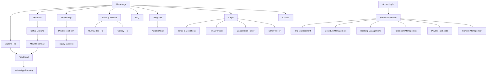
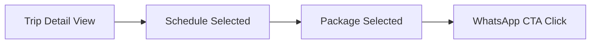
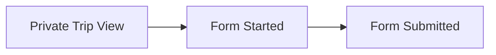
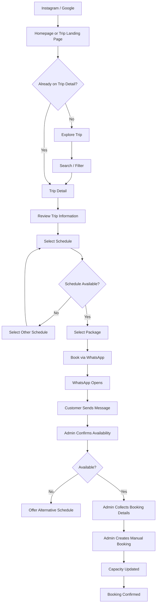
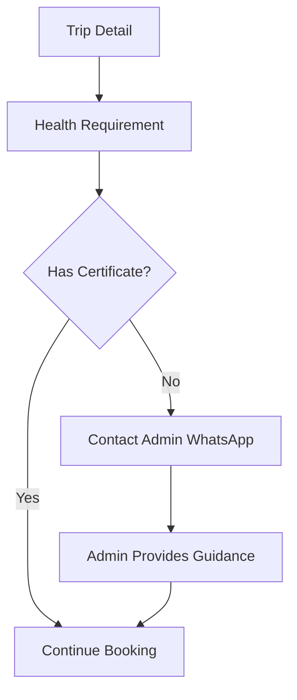
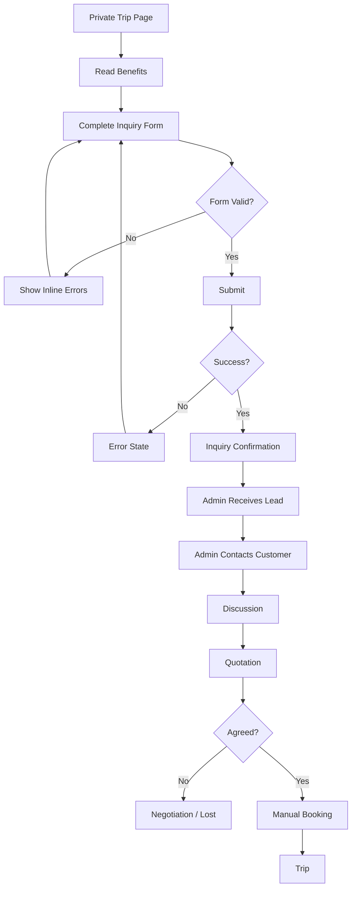
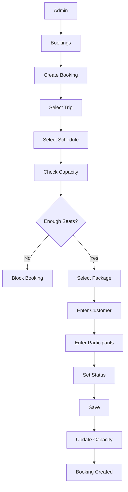
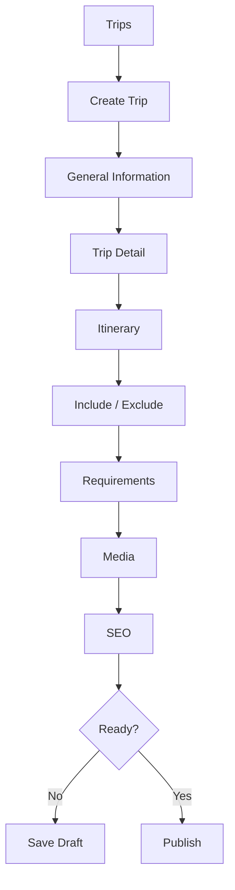

# Wildera Adventure
# UX Specification

**Document:** 02_UX_Specification_Wildera.md  
**Version:** 1.0  
**Status:** APPROVED FOR DEVELOPMENT
**Related PRD:** 01_PRD_Wildera_Adventure.md v1.1  
**Product:** Wildera Adventure Website  
**Owner:** Wildera Adventure  
**Last Updated:** September 2026  

---

# 1. Purpose

Dokumen ini menjelaskan bagaimana user berinteraksi dengan website Wildera Adventure.

PRD menentukan:

> Apa yang harus tersedia.

UX Specification menentukan:

> Bagaimana user menemukan, memahami, dan menggunakan fitur tersebut.

Dokumen ini menjadi acuan untuk:

- UI/UX Designer
- Frontend Developer
- Backend Developer
- QA Engineer
- Product Owner

---

# 2. Primary UX Goal

User harus dapat bergerak dari:

```text
Instagram / Google
        ↓
Wildera Website
        ↓
Trip
        ↓
Schedule
        ↓
WhatsApp
```

dengan friction seminimal mungkin.

Target utama website bukan membuat user menghabiskan waktu lama di website.

Target utamanya adalah:

> User menemukan trip yang tepat, memahami penawarannya, lalu mengambil tindakan.

---

# 3. UX Principles

## 3.1 Mobile First

Desain pertama dibuat untuk mobile.

Desktop merupakan enhancement.

Asumsi utama:

- traffic berasal dari Instagram
- banyak user membuka link melalui mobile browser
- WhatsApp digunakan pada perangkat yang sama

---

# 4. Conversion First

Setiap halaman harus memiliki next action yang jelas.

Contoh:

Homepage:

```text
Explore Trips
```

Trip Detail:

```text
Book via WhatsApp
```

Private Trip:

```text
Request Private Trip
```

Tidak boleh ada halaman utama tanpa CTA yang jelas.

---

# 5. Information Before Conversion

Jangan mengarahkan user ke WhatsApp terlalu cepat.

Customer harus bisa melihat:

- harga
- tanggal
- difficulty
- meeting point
- itinerary
- include
- exclude

sebelum menghubungi admin.

Tujuannya:

menghasilkan WhatsApp lead yang lebih berkualitas.

---

# 6. Reduce Cognitive Load

Hindari:

- terlalu banyak menu
- terlalu banyak filter
- popup berlebihan
- autoplay animation
- terlalu banyak CTA berbeda
- informasi penting yang tersembunyi

---

# 7. Progressive Disclosure

Informasi ditampilkan berdasarkan prioritas.

Trip Detail contoh:

Pertama:

```text
Trip
Date
Price
Difficulty
Availability
```

Kemudian:

```text
Overview
Itinerary
Include
Exclude
Gear
FAQ
```

---

# 8. Trust First

Trust dibangun melalui:

- real photography
- transparent pricing
- detailed itinerary
- clear contact information
- trip documentation
- policies
- guide information
- real customer testimonials

Bukan melalui klaim marketing yang tidak dapat diverifikasi.

---

# 9. Navigation Architecture

Main navigation desktop:

```text
Wildera Logo

Explore Trip
Destinasi
Private Trip
Tentang
FAQ

[WhatsApp]
```

Secondary navigation dapat berada di footer:

```text
Blog
Gallery
Terms
Privacy
Cancellation
Safety
Contact
```

---

# 10. Mobile Navigation

Header mobile:

```text
┌─────────────────────────┐
│ WILDERA              ☰  │
└─────────────────────────┘
```

Hamburger membuka:

```text
Explore Trip
Destinasi
Private Trip
Tentang Wildera
FAQ

────────────

Hubungi WhatsApp
```

Menu tidak boleh mempunyai terlalu banyak nested navigation.

---

# 11. Sticky Mobile Action

Pada Trip Detail:

```text
┌─────────────────────────────┐
│ Mulai Rp950.000   [BOOK WA] │
└─────────────────────────────┘
```

Sticky CTA hanya muncul pada halaman dengan conversion action.

---

# 12. Sitemap



---

# 13. Public URL Structure

Recommended:

```text
/
```

Homepage.

```text
/trip
```

Trip Catalog.

```text
/trip/[slug]
```

Trip Detail.

Example:

```text
/trip/open-trip-rinjani
```

---

```text
/gunung
```

Mountain directory.

```text
/gunung/[slug]
```

Mountain detail.

Example:

```text
/gunung/rinjani
```

---

```text
/private-trip
```

Private Trip.

---

```text
/tentang
```

About.

---

```text
/faq
```

FAQ.

---

P1:

```text
/blog
/blog/[slug]
```

---

Legal:

```text
/terms
/privacy
/cancellation
/safety
```

---

# 14. Homepage User Goal

Dalam 5–10 detik pertama user harus dapat memahami:

1. Wildera menjual jasa trip gunung.
2. Ada Open Trip.
3. Ada Private Trip.
4. User dapat melihat jadwal trip.

---

# 15. Homepage Information Hierarchy

Urutan:

```text
Hero

↓

Upcoming Trips

↓

Explore Destinations

↓

Why Wildera

↓

How It Works

↓

Private Trip

↓

Documentation / Testimonials

↓

FAQ

↓

Final CTA
```

Jangan meletakkan company history panjang sebelum daftar trip.

---

# 16. Homepage Desktop Wireframe

```text
┌─────────────────────────────────────────────────────────────┐
│ WILDERA       Trip   Destinasi   Private Trip   Tentang     │
│                                             FAQ   [WhatsApp] │
├─────────────────────────────────────────────────────────────┤

│                                                             │
│                     HERO PHOTOGRAPHY                        │
│                                                             │
│              Temukan Perjalanan Gunungmu                    │
│                                                             │
│      Open Trip & Private Trip ke berbagai gunung            │
│                     di Indonesia                            │
│                                                             │
│     [ EXPLORE TRIP ]        [ PRIVATE TRIP ]                │
│                                                             │

├─────────────────────────────────────────────────────────────┤

│ UPCOMING TRIPS                                              │
│                                                             │
│ Trip yang akan berangkat dalam waktu dekat                  │
│                                                             │
│ ┌─────────────┐ ┌─────────────┐ ┌─────────────┐            │
│ │ IMAGE       │ │ IMAGE       │ │ IMAGE       │            │
│ │ Prau        │ │ Rinjani     │ │ Gede        │            │
│ │ 12-13 Sep   │ │ 20-23 Sep   │ │ 26-27 Sep   │            │
│ │ Moderate    │ │ Hard        │ │ Moderate    │            │
│ │ Rp950K      │ │ Rp2.5M      │ │ Rp850K      │            │
│ │ 5 seat      │ │ 3 seat      │ │ 8 seat      │            │
│ │ [Detail]    │ │ [Detail]    │ │ [Detail]    │            │
│ └─────────────┘ └─────────────┘ └─────────────┘            │

│                       [Lihat Semua Trip]                     │

├─────────────────────────────────────────────────────────────┤

│ EXPLORE DESTINATIONS                                        │
│                                                             │
│ [Rinjani] [Prau] [Semeru] [Gede]                           │

├─────────────────────────────────────────────────────────────┤

│ WHY WILDERA                                                │
│                                                             │
│ Safety        Experienced        Transparent                │
│ Preparation   Trip Team          Information                │

├─────────────────────────────────────────────────────────────┤

│ HOW IT WORKS                                                │
│                                                             │
│ Pilih Trip → Hubungi Admin → Konfirmasi → Persiapan → Naik │

├─────────────────────────────────────────────────────────────┤

│ PRIVATE TRIP                                                │
│                                                             │
│ Punya grup dan jadwal sendiri?                              │
│                                                             │
│ [Rencanakan Private Trip]                                   │

├─────────────────────────────────────────────────────────────┤

│ DOCUMENTATION / TESTIMONIAL                                 │

├─────────────────────────────────────────────────────────────┤

│ FAQ                                                         │

├─────────────────────────────────────────────────────────────┤

│ Siap menentukan perjalanan berikutnya?                      │
│                                                             │
│ [EXPLORE TRIP]                                              │

├─────────────────────────────────────────────────────────────┤

│ FOOTER                                                      │
└─────────────────────────────────────────────────────────────┘
```

---

# 17. Homepage Mobile Wireframe

```text
┌───────────────────────┐
│ WILDERA            ☰  │
├───────────────────────┤

│                       │
│     HERO PHOTO        │
│                       │

│ Temukan Perjalanan    │
│ Gunungmu              │

│ Open Trip & Private   │
│ Trip gunung Indonesia │

│ [ Explore Trip ]      │
│ [ Private Trip ]      │

├───────────────────────┤

│ Trip Terdekat         │

│ ┌───────────────────┐ │
│ │ IMAGE             │ │
│ │ Prau              │ │
│ │ 12-13 Sep         │ │
│ │ Moderate          │ │
│ │ Rp950.000         │ │
│ │ Sisa 5 seat       │ │
│ │ [Lihat Detail]    │ │
│ └───────────────────┘ │

│ swipe →               │

├───────────────────────┤

│ Destinasi             │

│ [Rinjani]             │
│ [Prau]                │
│ [Semeru]              │

├───────────────────────┤

│ Kenapa Wildera        │

├───────────────────────┤

│ Cara Booking          │

│ 1 Pilih Trip          │
│ 2 Hubungi Admin       │
│ 3 Konfirmasi          │
│ 4 Persiapan           │
│ 5 Berangkat           │

├───────────────────────┤

│ Private Trip          │

│ [Rencanakan Trip]     │

├───────────────────────┤

│ FAQ                   │

├───────────────────────┤

│ Footer                │
└───────────────────────┘
```

---

# 18. Trip Catalog User Goal

User harus dapat menjawab:

> Trip apa yang cocok dengan tanggal dan kemampuan saya?

tanpa browsing terlalu lama.

---

# 19. Trip Catalog Layout

Desktop:

```text
┌───────────────────────────────────────────────────────┐

│ Explore Trip                                          │
│ Temukan jadwal perjalanan berikutnya                  │

├───────────────────────────────────────────────────────┤

│ [Search gunung / trip                         ]       │

├───────────────┬───────────────────────────────────────┤
│ FILTER        │                                       │
│               │ Sort: Keberangkatan Terdekat ▼       │
│ Bulan         │                                       │
│               │ 12 Trip ditemukan                    │
│ Trip Type     │                                       │
│               │ ┌──────────┐ ┌──────────┐             │
│ Difficulty    │ │ Trip     │ │ Trip     │             │
│               │ │ Card     │ │ Card     │             │
│ Availability  │ └──────────┘ └──────────┘             │
│               │                                       │
│               │ ┌──────────┐ ┌──────────┐             │
│               │ │ Trip     │ │ Trip     │             │
│               │ │ Card     │ │ Card     │             │
│               │ └──────────┘ └──────────┘             │
└───────────────┴───────────────────────────────────────┘
```

---

# 20. Trip Catalog Mobile

```text
Explore Trip

[ Search Trip          ]

[ Filter ]   [ Sort ]

12 Trip tersedia

┌─────────────────────┐
│ IMAGE               │
│                     │
│ Open Trip Prau      │
│ 12-13 September     │
│                     │
│ Moderate • 2D1N     │
│                     │
│ Mulai Rp950.000     │
│ Sisa 5 seat         │
│                     │
│ [Lihat Detail]      │
└─────────────────────┘
```

Filter membuka bottom sheet.

---

# 21. Trip Filters

P0:

### Bulan

Example:

```text
September
Oktober
November
```

### Trip Type

```text
Open Trip
Private Trip
Tektok
Multi Day
```

### Difficulty

```text
Easy
Moderate
Hard
Extreme
```

### Availability

```text
Available
Almost Full
```

Sold-out trip tetap dapat ditemukan jika user secara langsung membuka URL-nya.

Tetapi catalog default tidak perlu memprioritaskannya.

---

# 22. Filter UX

Filter harus dapat:

- digunakan kombinasi
- di-reset
- menunjukkan active filter count

Mobile:

```text
Filter (2)
```

Reset:

```text
Reset Semua
```

---

# 23. Trip Card Specification

Trip Card mempunyai:

```text
Cover Image

Trip Type Badge

Trip Name

Schedule

Duration

Difficulty

Starting Price

Available Seat

CTA
```

Example:

```text
┌───────────────────────────┐
│         IMAGE             │
│                           │
│ OPEN TRIP                 │
│                           │
│ Gunung Prau               │
│ via Patak Banteng         │
│                           │
│ 12–13 September           │
│ 2 Hari 1 Malam            │
│                           │
│ Moderate                  │
│                           │
│ Mulai Rp950.000           │
│                           │
│ Sisa 5 seat               │
│                           │
│ [Lihat Detail]            │
└───────────────────────────┘
```

---

# 24. Seat Status Display

Avoid false urgency.

Status:

### AVAILABLE

```text
12 seat tersedia
```

### ALMOST_FULL

```text
Tersisa 3 seat
```

### SOLD_OUT

```text
Sold Out
```

Jangan menggunakan:

```text
BURUAN!!!
TINGGAL SEDIKIT!!!
```

---

# 25. Trip Catalog Empty State

Jika filter tidak menghasilkan trip:

```text
Belum ada trip yang cocok.

Coba ubah tanggal atau filter pencarianmu.

[Reset Filter]

[Hubungi Wildera]
```

---

# 26. Mountain Directory

Tujuan:

- destination discovery
- SEO

Layout:

```text
Gunung di Indonesia

Search

Jawa
Sumatra
Bali & Nusa Tenggara
Sulawesi

Mountain Cards
```

---

# 27. Mountain Card

```text
IMAGE

Gunung Rinjani

Lombok, NTB

3.726 MDPL

Hard

[Lihat Gunung]
```

---

# 28. Mountain Detail Page

Information hierarchy:

```text
Hero
↓
Mountain Overview
↓
Quick Facts
↓
Routes
↓
Upcoming Trips
↓
Difficulty
↓
Preparation
↓
Related Content
```

---

# 29. Mountain Detail Wireframe

```text
┌─────────────────────────────────────────────┐

│                HERO IMAGE                   │

│ Gunung Rinjani                              │
│ Lombok, Nusa Tenggara Barat                 │
│ 3.726 MDPL                                  │

├─────────────────────────────────────────────┤

│ Tentang Rinjani                             │

│ Description                                 │

├─────────────────────────────────────────────┤

│ QUICK FACTS                                 │

│ Altitude       3,726 MDPL                   │
│ Difficulty     Hard                         │
│ Location       Lombok                       │

├─────────────────────────────────────────────┤

│ JALUR                                       │

│ Sembalun                                    │
│ Senaru                                      │
│ Torean                                      │

├─────────────────────────────────────────────┤

│ UPCOMING TRIP                               │

│ Trip Cards                                  │

├─────────────────────────────────────────────┤

│ PREPARATION                                 │

├─────────────────────────────────────────────┤

│ RELATED ARTICLE - P1                        │

└─────────────────────────────────────────────┘
```

---

# 30. Trip Detail Primary Goal

Trip Detail harus menjawab:

### Apa trip ini?

### Kapan berangkat?

### Berapa harganya?

### Apakah saya mampu?

### Apa yang saya dapat?

### Apa yang harus saya bawa?

### Bagaimana cara ikut?

Jika customer masih perlu bertanya pertanyaan dasar tersebut melalui WhatsApp, Trip Detail belum cukup baik.

---

# 31. Trip Detail Information Hierarchy

```text
Hero

↓

Trip Summary

↓

Schedule Selector

↓

Package / Price

↓

Booking CTA

↓

Overview

↓

Highlights

↓

Itinerary

↓

Include / Exclude

↓

Meeting Point

↓

Gear

↓

Health Requirement

↓

Difficulty / Preparation

↓

FAQ

↓

Policies

↓

Final CTA
```

---

# 32. Trip Detail Desktop Wireframe

```text
┌───────────────────────────────────────────────────────────┐

│                     HERO GALLERY                          │

├──────────────────────────────────────┬────────────────────┤
│                                      │ BOOKING CARD       │
│ Open Trip Gunung Rinjani             │                    │
│ via Sembalun                         │ Jadwal             │
│                                      │                    │
│ Lombok                               │ [20-23 Sep ▼]      │
│ 4D3N                                 │                    │
│ Hard                                 │ Paket              │
│ 3.726 MDPL                           │                    │
│                                      │ ○ Start Jakarta    │
│                                      │ ○ Start Lombok     │
│                                      │                    │
│                                      │ Mulai              │
│                                      │ Rp2.500.000        │
│                                      │                    │
│                                      │ Sisa 4 seat        │
│                                      │                    │
│                                      │ [BOOK VIA WA]      │
│                                      │                    │
├──────────────────────────────────────┤                    │
│ ABOUT                                │                    │
│                                      │                    │
│ Description                          │                    │
│                                      │                    │
├──────────────────────────────────────┤                    │
│ HIGHLIGHTS                           │                    │
├──────────────────────────────────────┤                    │
│ ITINERARY                            │                    │
│                                      │                    │
│ Day 1                                │                    │
│ Day 2                                │                    │
│ Day 3                                │                    │
├──────────────────────────────────────┤                    │
│ INCLUDE                              │                    │
├──────────────────────────────────────┤                    │
│ EXCLUDE                              │                    │
├──────────────────────────────────────┤                    │
│ MEETING POINT                       │                    │
├──────────────────────────────────────┤                    │
│ GEAR                                 │                    │
├──────────────────────────────────────┤                    │
│ HEALTH REQUIREMENT                   │                    │
├──────────────────────────────────────┤                    │
│ FAQ                                  │                    │
├──────────────────────────────────────┤                    │
│ POLICY                               │                    │
└──────────────────────────────────────┴────────────────────┘
```

Booking card desktop:

```text
position: sticky
```

hingga mendekati footer.

---

# 33. Trip Detail Mobile

```text
┌───────────────────────┐

│    HERO GALLERY       │

├───────────────────────┤

│ Open Trip Rinjani     │
│ via Sembalun          │

│ Lombok                │

│ 4D3N • Hard           │
│ 3.726 MDPL            │

├───────────────────────┤

│ Pilih Jadwal          │

│ ○ 20-23 Sep           │
│   Available           │
│                       │
│ ○ 27-30 Sep           │
│   Almost Full         │

├───────────────────────┤

│ Pilih Paket           │

│ ○ Start Jakarta       │
│   Rp2.500.000         │

│ ○ Start Lombok        │
│   Rp1.850.000         │

├───────────────────────┤

│ Sisa 4 seat           │

├───────────────────────┤

│ Tentang Trip          │

├───────────────────────┤

│ Itinerary             │

├───────────────────────┤

│ Include               │

├───────────────────────┤

│ Exclude               │

├───────────────────────┤

│ Perlengkapan          │

├───────────────────────┤

│ Surat Kesehatan       │

├───────────────────────┤

│ FAQ                   │

├───────────────────────┤

│ Policy                │

└───────────────────────┘


STICKY:

┌───────────────────────┐
│ Rp2.5jt   [BOOK WA]   │
└───────────────────────┘
```

---

# 34. Schedule Selector

Schedule item harus menampilkan:

```text
Date

Duration

Availability
```

Example:

```text
○ 20–23 September 2026

4D3N

Sisa 4 seat
```

---

# 35. Schedule States

## AVAILABLE

Selectable.

```text
20–23 September

12 seat tersedia
```

---

## ALMOST_FULL

Selectable.

Visual emphasis ringan:

```text
27–30 September

Tersisa 3 seat
```

---

## SOLD_OUT

Tidak selectable untuk booking.

```text
5–8 Oktober

Sold Out
```

Possible action:

```text
[Hubungi Admin]
```

tetapi bukan:

```text
[Book]
```

---

## CLOSED

```text
Pendaftaran Ditutup
```

---

## CANCELLED

```text
Trip Dibatalkan
```

Tidak mempunyai booking CTA.

---

# 36. Package Selector

Package menggunakan schedule capacity yang sama.

Example:

```text
○ Start Jakarta

Rp2.500.000

Meeting Point:
Blok M


○ Start Lombok

Rp1.850.000

Meeting Point:
Lombok
```

---

# 37. Booking CTA Logic

## Scenario A

No schedule selected:

CTA:

```text
Pilih Jadwal
```

disabled.

---

## Scenario B

Schedule selected tetapi package belum dipilih:

```text
Pilih Paket
```

---

## Scenario C

Schedule dan package selected:

```text
Book via WhatsApp
```

active.

---

## Scenario D

Schedule sold out:

```text
Sold Out
```

atau:

```text
Hubungi Admin
```

---

# 38. WhatsApp Handoff

User menekan:

```text
Book via WhatsApp
```

System membuat contextual message.

Example:

```text
Halo Wildera Adventure 👋

Saya tertarik dengan:

Trip: Open Trip Gunung Rinjani
Jadwal: 20–23 September 2026
Paket: Start Jakarta
Harga: Rp2.500.000

Mohon info untuk proses booking selanjutnya.
```

User tetap dapat mengedit message sebelum mengirim.

---

# 39. WhatsApp Tracking

Click harus menghasilkan analytics event:

```text
click_book_whatsapp
```

Properties:

```text
trip_id
trip_name
schedule_id
schedule_date
package_id
package_name
```

Jangan memasukkan data pribadi user ke analytics event.

---

# 40. Itinerary UX

Gunakan accordion pada mobile.

Example:

```text
Day 1

Jakarta → Basecamp

[v]
```

Ketika dibuka:

```text
07:00 Meeting Point
08:00 Departure
...
```

Desktop dapat menampilkan timeline.

---

# 41. Include / Exclude

Gunakan dua section terpisah.

Include:

```text
✓ Guide
✓ Transport
✓ Tenda
✓ Makan
```

Exclude:

```text
× Personal equipment
× Personal expenses
× Health certificate
```

Hindari menyatukan keduanya menjadi paragraph panjang.

---

# 42. Gear Checklist

Section:

```text
Perlengkapan Wajib

□ Hiking shoes
□ Jacket
□ Headlamp


Direkomendasikan

□ Trekking pole
□ Sunglasses
```

Ini hanya information checklist.

Tidak perlu interactive saved checklist pada MVP.

---

# 43. Health Requirement UX

Jika trip membutuhkan surat kesehatan:

```text
┌───────────────────────────────┐
│ Surat Kesehatan              │
│                               │
│ Trip ini membutuhkan surat    │
│ keterangan sehat.             │
│                               │
│ Belum punya?                  │
│                               │
│ Admin Wildera dapat membantu  │
│ memberikan informasi mengenai │
│ proses yang diperlukan.       │
│                               │
│ [Hubungi Admin via WhatsApp]  │
└───────────────────────────────┘
```

CTA event:

```text
click_health_whatsapp
```

---

# 44. Difficulty UX

Jangan hanya menampilkan:

```text
Hard
```

Tambahkan explanation.

Example:

```text
Difficulty

HARD

Cocok untuk peserta dengan kondisi fisik baik
dan pengalaman hiking sebelumnya.

Approx:
Distance XX km
Duration XX hours
Elevation gain XX m
```

Data teknis hanya ditampilkan jika tersedia.

---

# 45. Beginner Friendly

Example:

```text
Beginner Friendly

NO

Trip ini direkomendasikan bagi peserta
yang sudah memiliki pengalaman hiking.
```

atau:

```text
YES

Trip ini dapat diikuti pemula dengan
persiapan fisik yang memadai.
```

---

# 46. Trip FAQ

Accordion.

Example:

```text
Apakah trip ini cocok untuk pemula?        +

Apakah harus membawa tenda?                +

Bagaimana jika belum punya surat sehat?     +

Apakah harga termasuk transport?            +
```

---

# 47. Policy Links

Pada Trip Detail:

```text
Sebelum booking, baca:

Terms & Conditions
Cancellation Policy
Safety Policy
```

Jangan menampilkan seluruh legal document di Trip Detail.

---

# 48. Private Trip Goal

User harus memahami bahwa Private Trip cocok untuk:

- grup sendiri
- tanggal sendiri
- kebutuhan custom

---

# 49. Private Trip Page Structure

```text
Hero

↓

Benefits

↓

Destination Examples

↓

How It Works

↓

Inquiry Form

↓

FAQ

↓

WhatsApp Alternative
```

---

# 50. Private Trip Desktop Wireframe

```text
┌───────────────────────────────────────────────────┐

│ HERO                                              │
│                                                   │
│ Pendakian dengan Jadwalmu Sendiri                 │
│                                                   │
│ Private trip untuk grup, komunitas,               │
│ maupun organisasi.                                │
│                                                   │
│ [Rencanakan Trip]                                 │

├───────────────────────────────────────────────────┤

│ WHY PRIVATE TRIP                                  │

│ Flexible Date                                     │
│ Private Group                                     │
│ Custom Meeting Point                              │
│ Customized Plan                                   │

├───────────────────────────────────────────────────┤

│ HOW IT WORKS                                      │

│ Request → Discussion → Quotation → Confirm → Trip │

├───────────────────────────────────────────────────┤

│ PRIVATE TRIP FORM                                 │
│                                                   │
│ Destination                                       │
│ [                         ▼ ]                     │
│                                                   │
│ Preferred Date                                    │
│ [                           ]                     │
│                                                   │
│ Participant                                       │
│ [                           ]                     │
│                                                   │
│ Meeting Point                                     │
│ [                           ]                     │
│                                                   │
│ Name                                              │
│ [                           ]                     │
│                                                   │
│ WhatsApp                                          │
│ [                           ]                     │
│                                                   │
│ Requirement                                       │
│ [                           ]                     │
│                                                   │
│ [REQUEST PRIVATE TRIP]                            │

└───────────────────────────────────────────────────┘
```

---

# 51. Private Trip Form

Required:

```text
Destination

Preferred Date

Participant Count

Customer Name

WhatsApp
```

Optional:

```text
Alternative Date

Meeting Point

Budget

Additional Requirement

Email
```

---

# 52. Private Trip Success State

Setelah submit:

```text
Permintaanmu sudah terkirim.

Tim Wildera akan menghubungi melalui WhatsApp
untuk membahas detail perjalanan.

Inquiry:

WLD-PT-XXXX

[Chat Wildera]
```

Jangan menjanjikan response time jika belum ada SLA resmi.

---

# 53. Private Trip Form Error

Jika gagal:

```text
Permintaan belum berhasil dikirim.

Data yang kamu isi belum hilang.

Coba kembali atau hubungi Wildera melalui WhatsApp.

[Coba Lagi]

[WhatsApp Wildera]
```

---

# 54. About Wildera

Structure:

```text
Hero

About Wildera

What We Do

Approach to Safety

Team / Guide - P1

Trip Documentation

CTA Explore Trip
```

Company story jangan menjadi halaman terlalu panjang jika belum ada cukup material.

---

# 55. FAQ Page

Categories:

```text
Open Trip

Private Trip

Booking

Equipment

Health Requirement

Cancellation

Safety
```

Search tidak wajib pada MVP.

---

# 56. Contact

Contact page minimal:

```text
WhatsApp

Instagram

Email

Operational contact information
```

Jangan menampilkan alamat fisik jika tidak relevan untuk customer.

---

# 57. Legal UX

Legal pages menggunakan layout sederhana.

```text
Title

Last Updated

Content

Related Policy
```

Tidak perlu decorative design berlebihan.

---

# 58. Footer

Recommended:

```text
WILDERA ADVENTURE

Explore
Open Trip
Destinations
Private Trip

Company
About
FAQ
Contact

Legal
Terms
Privacy
Cancellation
Safety

Social
Instagram
WhatsApp

© Wildera Adventure
```

---

# 59. Floating WhatsApp Button

Global floating WhatsApp dapat tersedia.

Namun behavior berbeda dengan booking CTA.

Global WA:

```text
Halo Wildera Adventure,
saya ingin bertanya mengenai trip.
```

Trip booking WA:

memiliki context trip.

Jangan menggantikan trip-specific CTA dengan global floating WA.

---

# 60. Admin UX Principles

Admin interface harus:

- functional
- dense tetapi readable
- cepat digunakan
- minim decorative element

Customer website:

```text
experience-oriented
```

Admin:

```text
operation-oriented
```

---

# 61. Admin Navigation

Desktop sidebar:

```text
WILDERA ADMIN

Dashboard

Trips
Schedules
Bookings
Participants
Private Trips

Content

Settings

Logout
```

P1:

```text
Reports
Guides
Blog
Testimonials
```

---

# 62. Admin Dashboard

```text
┌──────────────┬─────────────────────────────────────────┐
│              │ WILDERA ADMIN                           │
│ Dashboard    │                                         │
│ Trips        │ Dashboard                               │
│ Schedules    │                                         │
│ Bookings     │ ┌─────────┐ ┌─────────┐ ┌─────────┐    │
│ Participants │ │Upcoming │ │Booking  │ │Private  │    │
│ Private Trip │ │Trips    │ │Today    │ │Leads    │    │
│              │ └─────────┘ └─────────┘ └─────────┘    │
│ Content      │                                         │
│              │ UPCOMING TRIPS                          │
│ Settings     │                                         │
│              │ Prau     18/20                          │
│              │ Rinjani   8/10                          │
│              │ Gede     12/15                          │
│              │                                         │
│              │ RECENT BOOKING                          │
│              │                                         │
└──────────────┴─────────────────────────────────────────┘
```

---

# 63. Admin Dashboard Metrics

P0:

```text
Upcoming Trips

Upcoming Participants

Recent Booking

New Private Leads
```

Optional:

```text
Available Seats

Almost Full Trip
```

Revenue bukan prioritas karena payment belum dikelola di website.

---

# 64. Admin Trip List

```text
TRIPS

[+ Create Trip]

Search

Status ▼
Trip Type ▼

────────────────────────────────────────────

Prau via Patak Banteng

OPEN TRIP

Published

3 Active Schedules

[Edit]

[Schedules]

[Duplicate]

────────────────────────────────────────────
```

---

# 65. Create Trip UX

Use tabs/steps:

```text
General

Trip Information

Content

Requirements

Media

SEO
```

---

# 66. Create Trip — General

Fields:

```text
Trip Name

Mountain

Route

Trip Type

Slug

Status
```

---

# 67. Create Trip — Trip Information

```text
Duration

Difficulty

Beginner Friendly

Short Description

Full Description
```

---

# 68. Create Trip — Content

```text
Highlights

Itinerary

Include

Exclude
```

Dynamic list.

Example:

```text
+ Add Itinerary Day

+ Add Include

+ Add Exclude
```

---

# 69. Create Trip — Requirements

```text
Mandatory Gear

Recommended Gear

Health Certificate Required?

Age Requirement

Additional Requirement
```

---

# 70. Create Trip — Media

```text
Cover Image

Gallery
```

P0 cukup:

```text
Cover Image
```

Gallery dapat P1 jika scope perlu diperkecil.

---

# 71. Create Trip — SEO

```text
SEO Title

SEO Description

Slug
```

Provide preview optional.

---

# 72. Admin Schedule List

From Trip:

```text
Open Trip Prau
```

Display:

```text
Schedules

[+ Add Schedule]

────────────────────────────────────

12-13 Sep

Capacity
20

Confirmed
15

Available
5

Status
AVAILABLE

Packages
2

[Manage]

────────────────────────────────────
```

---

# 73. Schedule Form

```text
Start Date

End Date

Registration Deadline

Capacity

Status

Notes
```

Packages:

```text
Package #1

Name:
Start Jakarta

Price:
Rp...

Meeting Point:
...


[+ Add Package]
```

---

# 74. Capacity Visibility

Admin harus melihat:

```text
Capacity
Confirmed
Available
```

bersamaan.

Example:

```text
Capacity      20
Confirmed     18
Available      2
```

Jangan hanya menampilkan capacity.

---

# 75. Capacity Warning

Jika hampir penuh:

```text
Almost Full

2 seat tersisa.
```

Jika admin mencoba menurunkan capacity:

```text
Capacity tidak dapat diubah menjadi 15.

Saat ini sudah terdapat 18 confirmed participants.
```

---

# 76. Admin Booking List

```text
BOOKINGS

[+ Add Booking]

Search:
Booking / Customer / WhatsApp

Schedule ▼
Status ▼
Source ▼

────────────────────────────────────────────

WLD-260912-X4F

Adam Hidayat

Open Trip Prau

12-13 Sep

2 Participants

CONFIRMED

Source:
WHATSAPP

[View]
```

---

# 77. Create Manual Booking

Flow:

```text
Select Trip

↓

Select Schedule

↓

Select Package

↓

Check Availability

↓

Customer Information

↓

Participants

↓

Booking Status

↓

Save
```

---

# 78. Manual Booking Wireframe

```text
ADD BOOKING

Trip
[Open Trip Prau ▼]

Schedule
[12-13 September ▼]

Available:
5 seats

Package
[Start Jakarta ▼]

Participants
[2]

────────────────────

CUSTOMER

Name
[             ]

WhatsApp
[             ]

────────────────────

PARTICIPANTS

Participant 1
[             ]

Participant 2
[             ]

────────────────────

Status
[Confirmed ▼]

Source
[WhatsApp ▼]

Notes
[             ]

[CREATE BOOKING]
```

---

# 79. Booking Capacity Validation

Before save:

```text
Requested:
2

Available:
1
```

Result:

```text
Tidak dapat membuat booking.

Schedule hanya memiliki 1 seat tersisa.
```

Admin tidak boleh dapat bypass secara tidak sengaja.

---

# 80. Admin Booking Detail

```text
BOOKING

WLD-260912-X4F

Status:
CONFIRMED

────────────────────

CUSTOMER

Adam Hidayat

WhatsApp
08xxxxxxxxxx

Source
Website → WhatsApp

────────────────────

TRIP

Prau

Schedule
12-13 Sep

Package
Start Jakarta

────────────────────

PARTICIPANTS

1 Adam
2 Budi

────────────────────

NOTES

...

────────────────────

ACTIONS

[Edit]

[Cancel Booking]

[Mark Completed]
```

---

# 81. Booking Cancellation UX

Danger action should not be instant.

```text
Cancel Booking?

This will return 2 seats to schedule availability.

Reason:

[                         ]

[Back]

[Confirm Cancellation]
```

---

# 82. Participant Manifest

From schedule:

```text
Open Trip Prau

12-13 September

18 Participants
```

Table:

```text
Name

Booking

WhatsApp

Package

Emergency Contact

Notes
```

P1:

```text
Export CSV
```

---

# 83. Private Trip Lead List

```text
PRIVATE TRIP

NEW | CONTACTED | QUOTATION | NEGOTIATION | BOOKED | LOST

────────────────────────────────────────────

Adam

Rinjani

5 Participants

20 October

NEW

[View]
```

---

# 84. Private Trip Lead Detail

```text
PRIVATE TRIP REQUEST

WLD-PT-XXXX

Status:
NEW

Customer

Name
WhatsApp
Email

Trip

Destination
Preferred Date
Alternative Date

Participants

Meeting Point

Budget

Requirements

────────────────────

ADMIN

Assigned To

Status

Notes

[Update]
```

---

# 85. Content Admin

P0 sections:

```text
Homepage

Mountains

Routes

FAQ
```

Trip content tetap dikelola melalui Trip Management.

---

# 86. Responsive Breakpoints

UX behavior:

### Mobile

Primary target.

Approx:

```text
< 768px
```

### Tablet

```text
768–1023px
```

### Desktop

```text
≥ 1024px
```

Exact implementation dapat ditentukan frontend.

---

# 87. Responsive Rules

Desktop sidebar filter:

```text
Filter left
Results right
```

Mobile:

```text
Filter button
↓
Bottom sheet
```

Desktop booking card:

```text
Sticky sidebar
```

Mobile:

```text
Sticky bottom CTA
```

---

# 88. Form UX Principles

Forms harus:

- mempunyai visible labels
- menggunakan correct input types
- menunjukkan required fields
- menunjukkan inline validation
- mempertahankan input jika submission gagal

---

# 89. Phone Input

WhatsApp field:

```text
Nomor WhatsApp

08xxxxxxxxxx
```

UX dapat menerima:

```text
08...
+62...
```

Normalization merupakan technical concern.

---

# 90. Date Input

Private Trip preferred date menggunakan date picker.

Mobile menggunakan native-friendly interaction jika memungkinkan.

---

# 91. Number Inputs

Participant:

Minimum:

```text
1
```

Private Trip dapat menggunakan:

```text
[-] 5 [+]
```

atau numeric input.

---

# 92. Error Messages

Bad:

```text
Invalid input.
```

Better:

```text
Masukkan nomor WhatsApp yang valid.
```

---

# 93. Required Field

Use:

```text
Nama *
```

Bukan mengandalkan placeholder saja.

---

# 94. Loading State

Trip Catalog:

gunakan skeleton cards.

Example:

```text
██████████
██████
████
```

Hindari page blank dengan spinner besar jika data dapat menggunakan skeleton.

---

# 95. Button Loading

Submit:

```text
Mengirim...
```

button disabled selama submission.

Prevent double submit.

---

# 96. Generic Error State

```text
Terjadi kendala.

Kami belum dapat memuat halaman ini.

[Coba Lagi]

[Hubungi Wildera]
```

Contact CTA hanya ditampilkan jika relevan.

---

# 97. 404

```text
Halaman tidak ditemukan.

Mungkin trip sudah tidak tersedia atau alamatnya berubah.

[Lihat Trip]

[Kembali ke Homepage]
```

---

# 98. Sold Out State

Trip tetap dapat diakses untuk:

- SEO
- trip information
- future customer interest

Hero:

```text
SOLD OUT
```

CTA:

```text
Lihat Jadwal Lain
```

Jika semua schedule sold out:

```text
Jadwal ini sudah penuh.

[Lihat Trip Lain]

[Hubungi Wildera]
```

---

# 99. No Upcoming Schedule

```text
Belum ada jadwal keberangkatan terbaru.

Ikuti Instagram Wildera atau hubungi admin
untuk informasi jadwal berikutnya.

[Instagram]

[WhatsApp]
```

---

# 100. Cancelled Schedule

```text
Trip Dibatalkan

Keberangkatan tanggal 12–13 September
tidak lagi tersedia.

Silakan pilih jadwal lain.

[Lihat Jadwal]
```

---

# 101. Private Trip Empty Destination

Jika mountain belum tersedia dalam options:

```text
Tujuan belum ada?

Pilih "Tujuan Lain" dan tuliskan gunung
yang kamu inginkan.
```

This prevents dead-end.

---

# 102. Image UX

Gunakan real Wildera photography sebanyak mungkin.

Priority:

1. real participants
2. real mountain trip
3. real guides
4. landscape

Avoid excessive generic stock photography.

---

# 103. Image Ratios

Trip Card:

```text
4:3
```

atau:

```text
3:2
```

Hero:

```text
16:9 desktop
```

Mobile crop harus diuji.

Important subjects tidak boleh terpotong.

---

# 104. Typography

Priorities:

- readable
- clean
- outdoor/editorial feel
- strong heading hierarchy

Avoid overly decorative fonts for body copy.

---

# 105. Design Tone

Brand visual:

```text
Modern

Outdoor

Editorial

Premium

Natural

Clean

Trustworthy
```

Avoid:

```text
cheap marketplace look

excessive neon colors

excessive gradients

too many icon styles

too much animation
```

---

# 106. Motion

Allowed:

- subtle hover
- card transition
- accordion
- mobile sheet
- gallery transition

Avoid:

- scroll hijacking
- excessive parallax
- automatic horizontal movement
- loading animation for decorative purposes

---

# 107. Accessibility

Interactive elements minimum:

- button accessible by keyboard
- clear labels
- focus state
- color contrast
- meaningful alt text
- no critical information conveyed only by color

Example:

Bad:

```text
green = available
```

Good:

```text
AVAILABLE
```

with color enhancement.

---

# 108. Analytics UX Events

Homepage:

```text
view_home
click_explore_trip
click_private_trip
```

Trip Catalog:

```text
view_trip_list
search_trip
filter_trip
click_trip_card
```

Trip Detail:

```text
view_trip
select_schedule
select_package
click_book_whatsapp
click_health_whatsapp
```

Private Trip:

```text
view_private_trip
start_private_trip_form
private_trip_inquiry
```

---

# 109. Event Properties

Example:

```text
select_schedule

trip_id
trip_name
schedule_id
start_date
```

Do not capture:

- participant name
- phone
- email
- health information

in general analytics.

---

# 110. Primary Funnel UX



This is MVP's primary digital funnel.

---

# 111. Secondary Funnel

Private Trip:



---

# 112. Open Trip Full User Flow



---

# 113. Health Requirement Flow



Website does not upload or validate document in MVP.

---

# 114. Private Trip Full Flow



---

# 115. Admin Manual Booking Flow



---

# 116. Admin Trip Creation Flow



---

# 117. UX Copy Principles

Copy should be:

- simple
- conversational
- clear
- informative
- not overly formal

Example:

Bad:

```text
Silakan melakukan komunikasi terhadap pihak
administrator untuk melanjutkan proses reservasi.
```

Good:

```text
Hubungi admin Wildera untuk melanjutkan booking.
```

---

# 118. CTA Language

Preferred:

```text
Explore Trip

Lihat Detail

Pilih Jadwal

Book via WhatsApp

Hubungi Admin

Rencanakan Private Trip

Kirim Permintaan
```

Avoid ambiguous:

```text
Submit

Click Here

More
```

---

# 119. Mobile Sticky CTA Rules

Sticky Trip CTA appears after user scrolls past main booking selector.

CTA should show:

```text
Price

Book via WhatsApp
```

Example:

```text
Mulai Rp950rb

[BOOK VIA WA]
```

---

# 120. Sticky CTA and Schedule

If schedule not selected:

```text
[PILIH JADWAL]
```

Click scrolls to schedule section.

Do not open WhatsApp without sufficient trip context.

---

# 121. Breadcrumb

Desktop:

```text
Home
>
Trip
>
Open Trip Rinjani
```

Mountain:

```text
Home
>
Gunung
>
Rinjani
```

Useful for:

- navigation
- SEO
- orientation

Mobile breadcrumb may be simplified.

---

# 122. Back Navigation

Do not rely solely on browser back.

Example:

Trip Detail:

```text
← Kembali ke Explore Trip
```

optional on mobile header.

---

# 123. Search UX

Search matches:

- trip name
- mountain
- location

Placeholder:

```text
Cari gunung atau trip...
```

Search should tolerate partial names.

Technical implementation detail moved to technical docs.

---

# 124. No Search Results

```text
Tidak menemukan “Kerinci”?

Coba kata lain atau lihat semua trip.

[Lihat Semua Trip]

[Hubungi Wildera]
```

---

# 125. P1 UX Features

Do not block MVP.

## Blog

User flow:

```text
Google
↓
Article
↓
Related Mountain
↓
Related Trip
↓
WhatsApp
```

---

## Testimonial

Prefer real participant:

```text
Name
Trip
Comment
Photo optional
```

---

## Gallery

Should support:

- trip
- mountain
- real Wildera documentation

---

## Guide Profile

May appear on:

- About
- Trip Detail

---

# 126. Features Explicitly Excluded from Current UX

Not designed as active MVP flow:

```text
Online Checkout

Payment Page

Payment Countdown

Payment Gateway

Customer Login

Customer Dashboard

Voucher

Loyalty

Referral

Rental

Merchandise
```

These may be added later without changing the core discovery structure.

---

# 127. UX QA Checklist — Homepage

Before release confirm:

- CTA visible above fold
- upcoming trips load
- cards readable on mobile
- no horizontal overflow
- Private Trip visible
- WhatsApp works
- footer links work

---

# 128. UX QA Checklist — Trip Catalog

Confirm:

- search works
- filters work
- reset works
- sort works
- empty state works
- sold out display correct
- card links correct

---

# 129. UX QA Checklist — Trip Detail

Confirm:

- schedule selector works
- schedule status correct
- package selection works
- correct price displayed
- capacity correct
- sticky CTA works
- WhatsApp context correct
- itinerary readable
- health section visible when required
- FAQ works
- policy links work

---

# 130. UX QA Checklist — Private Trip

Confirm:

- required validation
- correct phone validation
- failed submission preserves data
- duplicate click prevention
- success state works
- WhatsApp fallback works

---

# 131. UX QA Checklist — Admin

Confirm:

- admin login
- unauthorized user cannot access
- create trip
- edit trip
- publish/unpublish
- add schedule
- capacity calculation
- add booking
- overselling prevented
- cancellation returns seat
- participant list correct
- private leads visible

---

# 132. MVP Navigation Final

Desktop:

```text
WILDERA

Trip
Destinasi
Private Trip
Tentang
FAQ

[WhatsApp]
```

Mobile:

```text
WILDERA
☰
```

Drawer:

```text
Explore Trip

Destinasi

Private Trip

Tentang Wildera

FAQ

──────────

WhatsApp
Instagram
```

---

# 133. MVP Public Pages Final

P0:

```text
Homepage

Trip Catalog

Trip Detail

Mountain Directory

Mountain Detail

Private Trip

About

FAQ

Contact

Terms

Privacy

Cancellation

Safety
```

---

# 134. MVP Admin Pages Final

```text
Login

Dashboard

Trips

Trip Create/Edit

Schedules

Schedule Create/Edit

Bookings

Booking Create/Edit

Participants

Private Trip Leads

Content

Settings
```

---

# 135. Product-to-UX Traceability

PRD:

```text
Customer dapat menemukan trip.
```

UX:

```text
Homepage
↓
Trip Catalog
↓
Filter/Search
```

---

PRD:

```text
Customer dapat memilih schedule.
```

UX:

```text
Trip Detail
↓
Schedule Selector
```

---

PRD:

```text
Booking via WhatsApp.
```

UX:

```text
Schedule
↓
Package
↓
Contextual WhatsApp CTA
```

---

PRD:

```text
Capacity per schedule.
```

UX Admin:

```text
Schedule
↓
Capacity
Confirmed
Available
```

---

PRD:

```text
Surat kesehatan ditangani admin.
```

UX:

```text
Health Requirement
↓
Contact Admin CTA
```

---

# 136. UX MVP Definition of Done

UX specification dianggap berhasil jika user baru dapat menyelesaikan flow berikut tanpa penjelasan tambahan:

```text
Find Trip

↓

Understand Trip

↓

Select Schedule

↓

Select Package

↓

Contact Wildera
```

dan admin dapat:

```text
Create Trip

↓

Create Schedule

↓

Record Booking

↓

Manage Capacity

↓

View Participants
```

---

# 137. UX North Star

Setiap halaman harus mendukung minimal salah satu fungsi berikut:

```text
DISCOVER

TRUST

UNDERSTAND

CONVERT

OPERATE
```

Jika sebuah UI section tidak mendukung salah satunya, section tersebut harus dipertanyakan kembali.

---

# 138. Final UX Funnel

Public:

```text
Instagram / Google
        ↓
Homepage / Landing Page
        ↓
Trip Discovery
        ↓
Trip Detail
        ↓
Schedule
        ↓
Package
        ↓
WhatsApp
        ↓
Admin
        ↓
Booking
```

Private:

```text
Visitor
↓
Private Trip
↓
Inquiry
↓
Admin
↓
Quotation
↓
Manual Booking
```

Admin:

```text
Trip
↓
Schedule
↓
Capacity
↓
Booking
↓
Participant
↓
Operation
```

---

# 139. UX Approval Criteria

Dokumen dapat menjadi `APPROVED` jika:

1. Sitemap disetujui.
2. Main navigation disetujui.
3. Open Trip flow disetujui.
4. Trip Detail hierarchy disetujui.
5. WhatsApp booking flow disetujui.
6. Private Trip flow disetujui.
7. Admin booking flow disetujui.
8. Mobile-first behavior disetujui.
9. MVP pages disepakati.
10. Tidak ada active payment flow pada MVP.

---

# 140. Next Document

Setelah UX Specification dikunci:

```text
03_Technical_Architecture_Wildera.md
```

Dokumen berikutnya akan menentukan:

- application architecture
- frontend architecture
- backend architecture
- authentication
- modules
- database interaction
- booking/capacity logic
- WhatsApp integration
- content management
- deployment
- logging
- monitoring
- security
- environments
- recommended technology stack