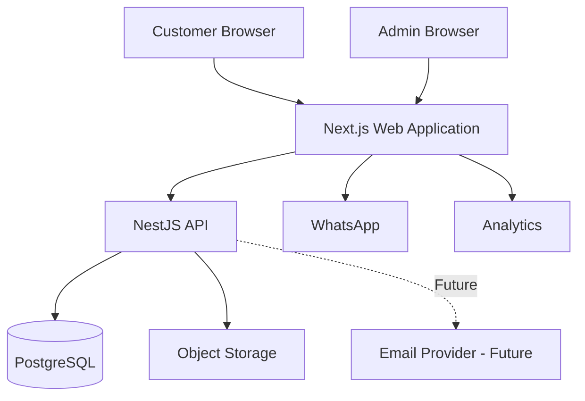
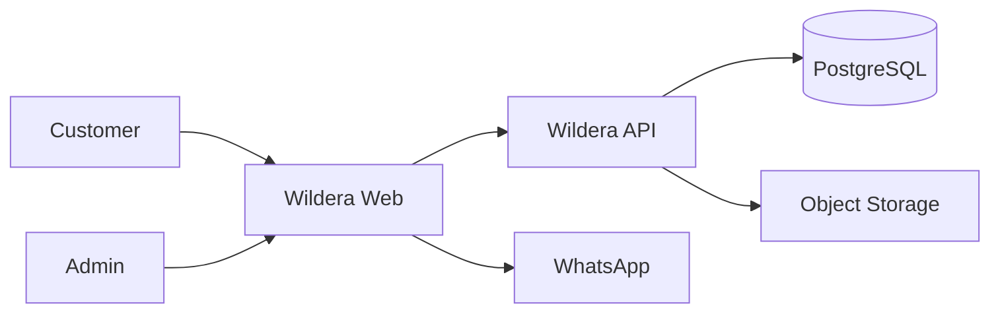
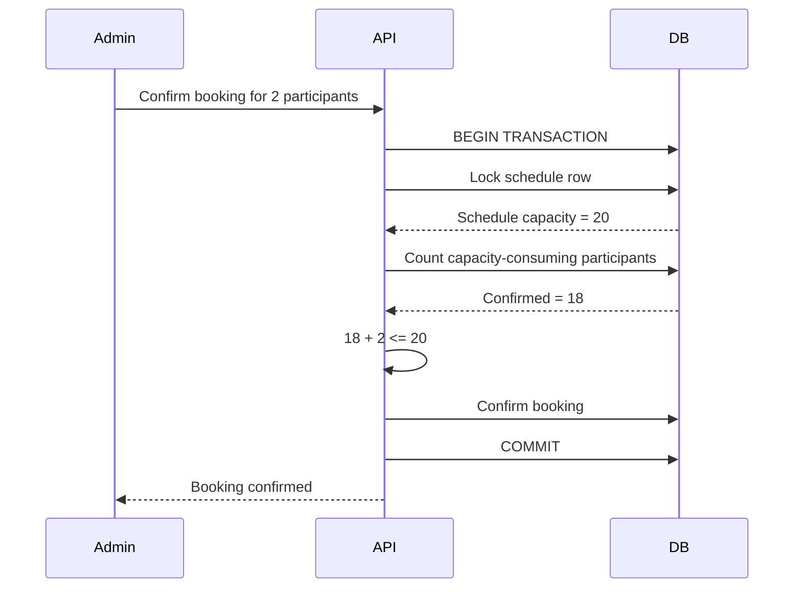
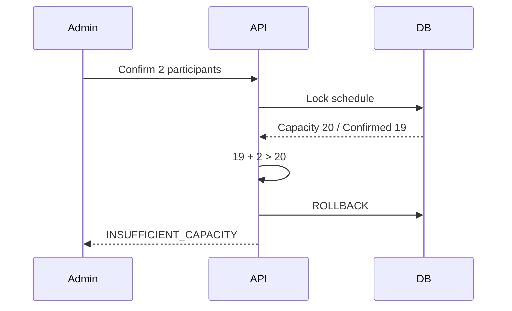
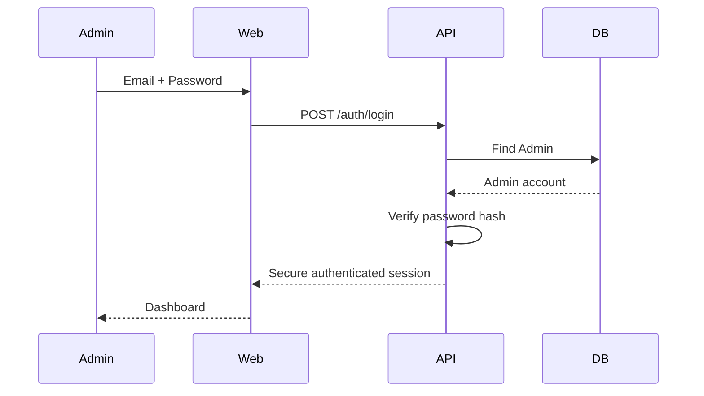
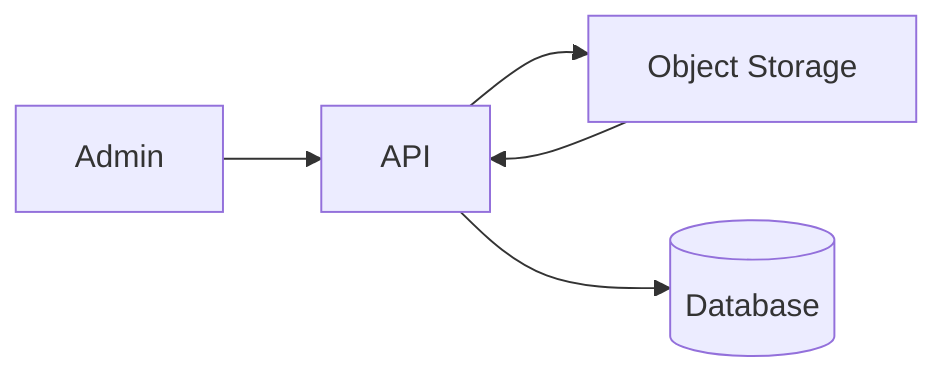
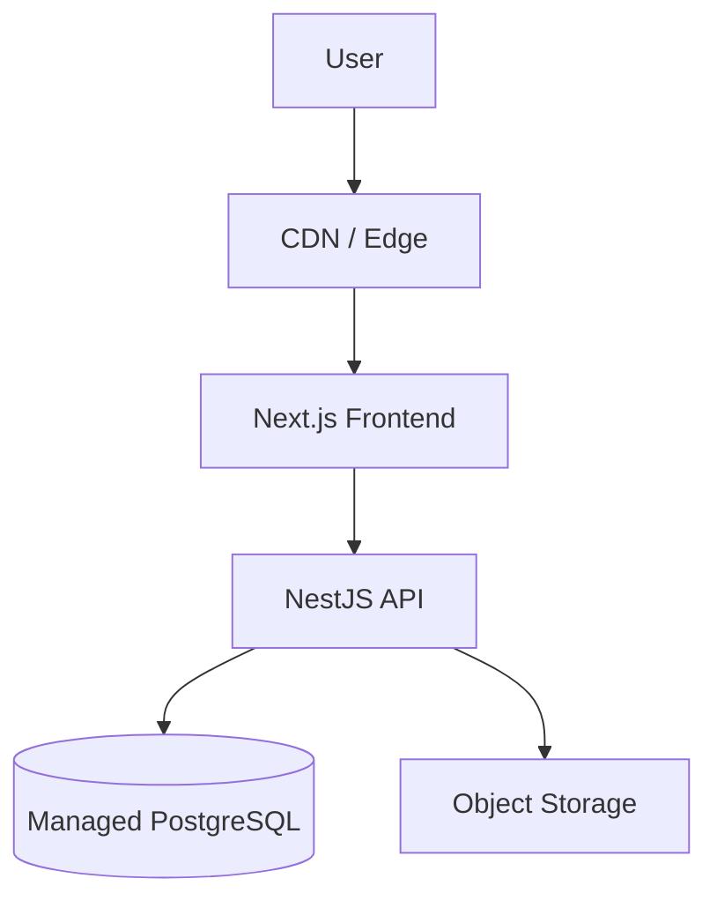
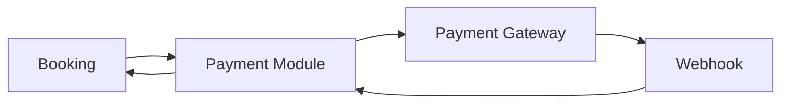

# Wildera Adventure
# Technical Architecture Document

**Document:** 03_Technical_Architecture_Wildera.md  
**Version:** 1.0  
**Status:** APPROVED FOR DEVELOPMENT  
**Related PRD:** 01_PRD_Wildera_Adventure.md v1.1  
**Related UX:** 02_UX_Specification_Wildera.md v1.0  
**Product:** Wildera Adventure Website  
**Owner:** Wildera Adventure  
**Last Updated:** September 2026  

---

# 1. Purpose

Dokumen ini menentukan bagaimana sistem Wildera Adventure dibangun secara teknis.

Dokumen ini menjadi acuan utama untuk:

- Frontend Developer
- Backend Developer
- DevOps / Infrastructure
- Database Engineer
- QA Engineer
- Technical Lead

PRD menentukan:

```text
WHAT & WHY
```

UX Specification menentukan:

```text
HOW USER USES IT
```

Technical Architecture menentukan:

```text
HOW THE SYSTEM WORKS
```

---

# 2. Architecture Goals

Arsitektur Wildera harus memenuhi prinsip:

```text
Simple

Maintainable

Secure

SEO Friendly

Mobile Friendly

Operationally Reliable

Scalable Enough

Low Operational Complexity
```

Target bukan membuat sistem paling kompleks.

Targetnya:

> Membuat arsitektur yang cukup kuat untuk production tanpa overengineering.

---

# 3. Architecture Principle

## 3.1 Modular Monolith

MVP menggunakan:

> **Modular Monolith**

Bukan microservices.

Application tetap satu backend service tetapi dipisahkan berdasarkan domain.

Contoh:

```text
Trip Module

Schedule Module

Booking Module

Customer Module

Private Trip Module

Content Module

Admin Module
```

---

# 4. Why Not Microservices

Microservices belum memberikan value untuk Wildera.

Microservices akan menambah:

- deployment complexity
- network communication
- service discovery
- observability complexity
- distributed transaction
- infrastructure cost
- debugging complexity

Traffic dan team size Wildera belum membutuhkan itu.

---

# 5. High-Level Architecture



---

# 6. Recommended Technology Stack

## Frontend

```text
Next.js
TypeScript
React
Tailwind CSS
```

Next.js App Router menjadi basis routing frontend.

Public pages dapat memanfaatkan server rendering untuk SEO dan performance, sedangkan komponen interaktif seperti filter dan schedule selector menggunakan Client Components sesuai kebutuhan. Next.js App Router memang dirancang dengan Server Components sebagai default dan Client Components untuk interaktivitas/browser APIs.

---

# 7. Backend

Recommended:

```text
NestJS
TypeScript
REST API
```

NestJS dipilih karena struktur module cocok dengan domain Wildera:

```text
Trip
Schedule
Booking
Admin
Private Trip
Content
```

NestJS sendiri mendorong penggunaan feature modules untuk mengorganisasi capability aplikasi.

---

# 8. Database

```text
PostgreSQL
```

PostgreSQL menjadi:

> Primary Source of Truth.

Data utama seperti:

- trip
- schedule
- capacity
- booking
- participant
- private trip inquiry
- admin

tersimpan di PostgreSQL.

---

# 9. ORM / Data Access

Recommended:

```text
Prisma ORM
```

Digunakan untuk:

- CRUD
- schema mapping
- migration
- type-safe database access

Untuk critical concurrency operation seperti capacity update, backend dapat menggunakan transaction dan targeted SQL locking bila diperlukan.

Prisma menyediakan transaction scope untuk menjalankan beberapa operasi sebagai satu unit commit/rollback.

---

# 10. Cache

## MVP

Tidak membutuhkan Redis.

Jangan menambahkan dependency sebelum ada use case.

MVP belum memiliki:

- payment checkout timer
- customer seat reservation
- distributed queue
- high-volume cache

PostgreSQL cukup.

---

# 11. Future Redis Use

Redis dapat ditambahkan jika nanti Wildera memiliki:

```text
Online Checkout

Temporary Seat Lock

Background Queue

Heavy API Cache

Rate Limiting at Scale
```

Redis adalah future infrastructure component, bukan MVP dependency.

---

# 12. Object Storage

Gunakan S3-compatible object storage.

Examples:

```text
Cloudflare R2

AWS S3

compatible managed storage
```

Digunakan untuk:

- trip cover
- mountain image
- homepage media
- gallery
- guide image

Jangan menyimpan binary image langsung di PostgreSQL.

Database hanya menyimpan:

```text
object_key

URL

metadata
```

---

# 13. Monorepo

Recommended:

```text
wildera-adventure/
```

Menggunakan monorepo.

Structure:

```text
wildera-adventure/
│
├── apps/
│   │
│   ├── web/
│   │
│   │   └── Next.js
│   │
│   └── api/
│       └── NestJS
│
├── packages/
│   │
│   ├── ui/
│   ├── contracts/
│   ├── validation/
│   ├── config/
│   └── types/
│
├── docs/
│   │
│   ├── 01_PRD_Wildera_Adventure.md
│   ├── 02_UX_Specification_Wildera.md
│   ├── 03_Technical_Architecture_Wildera.md
│   ├── 04_Database_ERD_Wildera.md
│   ├── 05_API_Specification_Wildera.md
│   └── 06_Development_Backlog_Wildera.md
│
├── database/
│   ├── migrations/
│   └── seeds/
│
├── infrastructure/
│
├── scripts/
│
└── README.md
```

---

# 14. Why Monorepo

Frontend dan backend tetap terpisah sebagai application.

Tetapi source berada dalam repository yang sama.

Benefit:

- shared TypeScript types
- shared validation
- coordinated release
- easier local development
- easier documentation
- consistent linting
- easier CI/CD

---

# 15. Application Boundaries

```text
apps/web

Responsible for:

UI
Routing
SEO
User Interaction
Admin UI
Analytics
WhatsApp Handoff
```

```text
apps/api

Responsible for:

Business Logic
Authentication
Authorization
Database
Capacity
Booking
Private Trip
CMS
Audit
```

Frontend tidak boleh menjadi source of truth untuk business rules.

---

# 16. System Context



---

# 17. Frontend Architecture

Frontend menggunakan:

```text
Next.js App Router
```

Recommended structure:

```text
apps/web/src/

app/

components/

features/

lib/

services/

hooks/

types/

utils/
```

---

# 18. Next.js Route Structure

```text
app/

├── page.tsx
│
├── trip/
│   ├── page.tsx
│   └── [slug]/
│       └── page.tsx
│
├── gunung/
│   ├── page.tsx
│   └── [slug]/
│       └── page.tsx
│
├── private-trip/
│   └── page.tsx
│
├── tentang/
│   └── page.tsx
│
├── faq/
│   └── page.tsx
│
├── contact/
│   └── page.tsx
│
├── terms/
│
├── privacy/
│
├── cancellation/
│
├── safety/
│
└── admin/
```

---

# 19. Public Rendering Strategy

SEO-critical pages sebaiknya dirender di server.

Contoh:

```text
Homepage

Trip Catalog

Trip Detail

Mountain Directory

Mountain Detail

Private Trip
```

Tujuan:

- search engine readability
- social sharing
- faster initial content
- reduced client JavaScript where possible

Next.js App Router mendukung server-side page/layout rendering dan optimized navigation/prefetching.

---

# 20. Client Components

Gunakan Client Component hanya jika dibutuhkan.

Example:

```text
Trip Filters

Schedule Selector

Package Selector

Mobile Drawer

FAQ Accordion

Private Trip Form

Admin Interactive Tables
```

Jangan menjadikan seluruh website Client Component.

---

# 21. Frontend Feature Organization

Recommended:

```text
features/

trip/

mountain/

schedule/

whatsapp/

private-trip/

admin/

content/
```

Example:

```text
features/trip/

components/

hooks/

services/

types/

utils/
```

---

# 22. Shared UI

Reusable component masuk:

```text
packages/ui
```

Examples:

```text
Button

Input

Select

Card

Modal

Badge

Accordion

Alert

Table

Pagination

Skeleton
```

---

# 23. Frontend API Client

Semua communication ke API menggunakan centralized API client.

Example structure:

```text
services/

api-client.ts

trip.service.ts

schedule.service.ts

booking.service.ts

private-trip.service.ts
```

Jangan menulis random `fetch()` tersebar di puluhan component tanpa abstraction.

---

# 24. API Architecture

Backend root:

```text
/api/v1
```

Example:

```text
GET /api/v1/trips

GET /api/v1/trips/:slug

POST /api/v1/private-trip-inquiries
```

Versioning sejak awal menghindari breaking change di masa depan.

---

# 25. Backend Module Structure

```text
src/modules/

auth/

admin/

destination/

mountain/

route/

trip/

schedule/

package/

customer/

booking/

participant/

private-trip/

content/

media/

setting/

audit/
```

---

# 26. Core Domain Relationships

```text
Mountain
   │
   ▼
Route
   │
   ▼
Trip
   │
   ▼
Schedule
   │
   ├── Package
   │
   └── Booking
           │
           ▼
       Participant
```

---

# 27. Domain Rule

Critical relationship:

```text
Trip ≠ Schedule
```

Trip:

```text
Open Trip Prau via Patak Banteng
```

Schedule:

```text
19–20 September 2026
```

---

# 28. Capacity Domain

Capacity belongs to:

```text
Schedule
```

NOT:

```text
Package
```

Example:

```text
Schedule Capacity
20

Start Jakarta
+
Start Basecamp

share the same 20 seats.
```

---

# 29. Capacity Calculation

Conceptual formula:

```text
Available Seats
=
Schedule Capacity
-
Confirmed Participants
```

Do not rely solely on cached counter from frontend.

Backend/database is source of truth.

---

# 30. Booking Status

MVP:

```text
INQUIRY

PENDING_CONFIRMATION

CONFIRMED

CANCELLED

COMPLETED

NO_SHOW
```

Capacity should only be consumed by status defined as capacity-holding.

For MVP:

```text
CONFIRMED
```

consumes capacity.

Whether `PENDING_CONFIRMATION` also holds capacity can be introduced later if operational workflow requires it.

---

# 31. Capacity Concurrency Problem

Scenario:

```text
Capacity = 20

Confirmed = 19

Available = 1
```

Admin A attempts:

```text
+1 participant
```

Admin B simultaneously attempts:

```text
+1 participant
```

Naive application logic can result in:

```text
21 confirmed participants
```

This must not happen.

---

# 32. Capacity Transaction Rule

Booking confirmation must occur in a database transaction.

Concept:

```sql
BEGIN;

SELECT schedule
FOR UPDATE;

calculate confirmed participants;

validate requested seats;

create/update booking;

COMMIT;
```

PostgreSQL `FOR UPDATE` prevents another transaction from modifying/locking the same row incompatibly until the current transaction completes.

---

# 33. Capacity Confirmation Sequence



---

# 34. Capacity Rejection



---

# 35. Cancel Booking

When:

```text
CONFIRMED
→
CANCELLED
```

capacity is released.

Calculation should derive from current valid bookings rather than trusting a frontend number.

---

# 36. Capacity Counter Strategy

Recommended MVP:

Do NOT maintain multiple independent counters such as:

```text
booked_seats
reserved_seats
available_seats
```

unless necessary.

Prefer deriving:

```text
confirmed participant count
```

against:

```text
schedule.capacity
```

Reason:

fewer synchronization bugs.

Optimization can be introduced later if traffic requires it.

---

# 37. WhatsApp Architecture

WhatsApp booking does not require WhatsApp Business API for MVP.

Frontend builds:

```text
wa.me / WhatsApp deep link
```

using configured business number and prefilled text.

Concept:

```text
Trip
+
Schedule
+
Package
+
Price
→
Prefilled WhatsApp Message
```

---

# 38. WhatsApp Number Configuration

Do not hard-code number across frontend components.

Store in application settings:

```text
business_whatsapp
```

Frontend obtains setting from configuration/API.

---

# 39. WhatsApp Message Builder

Central utility:

```text
buildBookingWhatsAppMessage()
```

Inputs:

```text
trip name

schedule

package

price
```

Output:

contextual message.

---

# 40. WhatsApp Security

Do not put sensitive customer information into WhatsApp URL.

Safe:

```text
Trip Name

Schedule

Package

Price
```

Do not include:

```text
KTP

Medical Notes

Emergency Contact
```

---

# 41. WhatsApp Tracking

Before redirect:

frontend records analytics event:

```text
click_book_whatsapp
```

Then opens WhatsApp.

Analytics failure must NOT prevent user from opening WhatsApp.

Conversion is more important than analytics.

---

# 42. Private Trip Architecture

Flow:

```text
Public Form
↓
API
↓
Validation
↓
Database
↓
Admin Dashboard
```

---

# 43. Private Trip Submission

Endpoint concept:

```text
POST /api/v1/private-trip-inquiries
```

Backend:

1. validate input
2. normalize phone
3. apply rate limit
4. create inquiry
5. generate inquiry number
6. return success

---

# 44. Private Trip Spam Protection

Minimum:

```text
rate limiting

server-side validation

honeypot or bot protection if needed
```

CAPTCHA should not automatically be added unless spam actually becomes a problem.

Avoid hurting legitimate conversion unnecessarily.

---

# 45. Admin Authentication

Public users do not authenticate.

Only Admin requires authentication.

Recommended:

```text
Email
+
Password
```

---

# 46. Authentication Architecture

Admin login:



NestJS provides standard patterns for authentication modules, credential validation, JWT and route guards.

---

# 47. Authentication Token Strategy

Recommended:

```text
Secure HttpOnly Cookie
```

rather than storing auth token in:

```text
localStorage
```

Cookie requirements:

```text
HttpOnly

Secure

SameSite

appropriate expiration
```

---

# 48. Password Storage

Never store plaintext password.

Use password hashing algorithm designed for passwords.

Recommended:

```text
Argon2id
```

Alternative:

```text
bcrypt
```

Store only:

```text
password_hash
```

---

# 49. Admin Authorization

MVP roles:

```text
SUPER_ADMIN

OPERATIONS

CONTENT
```

Future:

```text
FINANCE
```

---

# 50. RBAC

Authorization must be checked:

> Backend side.

Never rely solely on hiding frontend buttons.

Example:

CONTENT user may access:

```text
mountain

trip content

FAQ
```

but should not necessarily:

```text
cancel booking
```

---

# 51. Authorization Flow

```text
Request
↓
Authentication
↓
Role Guard
↓
Permission Check
↓
Controller
↓
Service
```

---

# 52. Admin Session Security

Implement:

- session expiration
- logout
- failed login protection
- disabled account support
- last login timestamp

Future:

- MFA

MFA not required for initial MVP but architecture should not make it impossible later.

---

# 53. Custom CMS Strategy

Do not add separate headless CMS in MVP.

Content volume is still manageable.

Use Wildera Admin itself to manage:

```text
Trip

Mountain

Route

FAQ

Homepage basic content
```

Benefit:

one admin interface.

---

# 54. Why Not Headless CMS Yet

Adding:

```text
Strapi

Sanity

Contentful

etc.
```

would create another:

- admin system
- permission model
- deployment/service
- content integration

without enough benefit for current scope.

Can be reconsidered if editorial content grows significantly.

---

# 55. Media Upload Flow



Database stores:

```text
object key

URL/path

alt text

metadata
```

---

# 56. Image Processing

Public images should be:

- resized
- optimized
- served in modern formats where possible

Frontend image layer should prevent full-resolution camera photos from being downloaded unnecessarily.

---

# 57. Public API Access

Read endpoints:

```text
GET trips

GET mountains

GET schedules
```

do not require authentication.

Write endpoints such as:

```text
POST private-trip-inquiries
```

are public but protected through validation/rate limiting.

---

# 58. Admin API

All:

```text
/api/v1/admin/*
```

require authentication.

Examples:

```text
POST /admin/trips

PATCH /admin/trips/:id

POST /admin/schedules

POST /admin/bookings
```

---

# 59. Validation

Request validation occurs on both:

```text
Frontend
```

for UX

and:

```text
Backend
```

for security/data integrity.

Backend validation is authoritative.

---

# 60. Shared Validation

Where practical, common definitions can live in:

```text
packages/validation
```

using:

```text
Zod
```

or compatible validation strategy.

However backend should retain control over final domain rules.

---

# 61. Error Response Convention

API should return predictable structure.

Example:

```json
{
  "success": false,
  "error": {
    "code": "INSUFFICIENT_CAPACITY",
    "message": "Schedule hanya memiliki 1 seat tersisa."
  }
}
```

---

# 62. Domain Error Codes

Examples:

```text
TRIP_NOT_FOUND

SCHEDULE_NOT_FOUND

SCHEDULE_NOT_AVAILABLE

INSUFFICIENT_CAPACITY

BOOKING_NOT_FOUND

INVALID_BOOKING_STATUS

UNAUTHORIZED

FORBIDDEN

VALIDATION_ERROR

PRIVATE_TRIP_SUBMISSION_FAILED
```

Exact contract belongs in:

```text
05_API_Specification_Wildera.md
```

---

# 63. Logging Architecture

Backend should produce structured logs.

Minimum fields:

```text
timestamp

level

request_id

method

path

status_code

duration

user/admin id when appropriate

error code
```

---

# 64. Do Not Log

Never log sensitive data unnecessarily.

Avoid:

```text
password

auth token

KTP

medical notes

full emergency information
```

---

# 65. Request Correlation

Generate:

```text
request_id
```

for each API request.

Allows tracking:

```text
Frontend Error
↓
API Log
↓
Database Operation
```

---

# 66. Audit Log

Critical admin activity should produce audit entries.

Examples:

```text
Trip Published

Capacity Changed

Booking Confirmed

Booking Cancelled

Participant Edited

Admin Role Changed
```

---

# 67. Audit Entry

Minimum:

```text
admin_id

action

entity_type

entity_id

timestamp
```

Potential:

```text
old_value

new_value
```

---

# 68. Health Monitoring

API exposes:

```text
GET /health
```

Checks:

```text
Application

Database
```

Object storage check can be handled separately.

---

# 69. Monitoring

Minimum production monitoring:

```text
Application uptime

API errors

Server errors

Database availability

Disk/storage errors

Frontend runtime errors
```

---

# 70. Error Tracking

Recommended dedicated error tracking service.

Purpose:

- frontend exceptions
- backend exceptions
- stack traces
- release correlation

Provider can be selected during infrastructure implementation.

---

# 71. Analytics

Client analytics:

```text
GA4
```

Potential:

```text
Meta Pixel
```

only if marketing requires it.

---

# 72. Analytics Architecture

```text
User Interaction
↓
Analytics Event
↓
Analytics Platform
```

Analytics is independent from transactional data.

Do not use Google Analytics as booking database.

---

# 73. SEO Architecture

Public pages must support:

```text
metadata

canonical

OpenGraph

structured content

sitemap

robots
```

Generated pages:

```text
Trip

Mountain
```

should have stable slug.

---

# 74. Slug Rules

Example:

```text
open-trip-gunung-rinjani
```

not:

```text
trip123991
```

Slug should be unique.

Changing slug after page is indexed should create redirect where feasible.

---

# 75. Sitemap

Generate XML sitemap dynamically based on published content.

Include:

```text
Homepage

Trip

Mountain

Private Trip

Static Pages
```

Do not include:

```text
Admin

Draft Trip
```

---

# 76. Robots

Prevent indexing:

```text
/admin
```

Draft/private management pages must not become publicly indexed.

---

# 77. Environment Strategy

Minimum:

```text
LOCAL

STAGING

PRODUCTION
```

---

# 78. Local

Used by developers.

Example:

```text
localhost web

localhost API

local PostgreSQL
```

---

# 79. Staging

Purpose:

- QA
- UAT
- integration testing
- deployment verification

Staging must use separate:

```text
database

credentials

storage namespace
```

from production.

---

# 80. Production

Contains live:

- trip
- customer
- booking
- participant
- admin

Production credentials must never be reused in development.

---

# 81. Environment Variables

Examples:

```text
DATABASE_URL

API_BASE_URL

APP_URL

JWT_SECRET / SESSION_SECRET

OBJECT_STORAGE_KEY

OBJECT_STORAGE_SECRET

OBJECT_STORAGE_BUCKET

WHATSAPP_NUMBER

ANALYTICS_ID
```

Secrets must never be committed to Git.

---

# 82. Deployment Architecture

Recommended initial topology:



---

# 83. Deployment Recommendation

Frontend:

```text
Vercel
```

or equivalent platform optimized for Next.js.

Backend:

```text
Managed container/application hosting
```

Examples:

```text
Railway

Render

AWS / GCP managed services
```

Database:

```text
Managed PostgreSQL
```

Object Storage:

```text
S3-compatible service
```

---

# 84. Infrastructure Principle

Prefer managed services over self-hosting.

Do NOT begin with:

```text
Kubernetes

self-hosted PostgreSQL

multi-region cluster

Kafka

service mesh
```

They do not solve Wildera's current business problem.

---

# 85. Database Backup

Production PostgreSQL must have:

```text
automatic backup
```

and ideally:

```text
point-in-time recovery
```

depending on selected provider.

Backup existence alone is insufficient.

Restore procedure must eventually be tested.

---

# 86. Object Storage Backup

Images are less critical than booking data but should still use durable managed object storage.

Original content should not live only on developer laptops.

---

# 87. Security Layers

Architecture security:

```text
TLS/HTTPS

Admin Authentication

RBAC

Input Validation

Rate Limiting

Secure Cookies

Password Hashing

Database Constraints

Audit Logging

Secret Management

Object Upload Validation
```

---

# 88. HTTPS

Production traffic must use:

```text
HTTPS
```

HTTP should redirect to HTTPS.

---

# 89. CORS

API accepts requests only from approved origins.

Example:

```text
wilderaadventure.id

admin application origin if separate
```

Avoid:

```text
Access-Control-Allow-Origin: *
```

for authenticated admin APIs.

---

# 90. CSRF

Because admin authentication may use cookies, unsafe operations must consider CSRF protection.

Mitigation may include:

```text
SameSite cookies

Origin validation

CSRF token where required
```

Final implementation must be defined during API/security implementation.

---

# 91. XSS

Frontend must not render untrusted HTML directly.

CMS rich content should be:

- sanitized
- controlled
- restricted

before rendering.

---

# 92. SQL Injection

Use ORM/parameterized query.

Raw SQL is permitted only where required, such as targeted locking logic, and must remain parameterized.

---

# 93. Upload Security

Validate:

```text
MIME type

file size

allowed extension

image dimensions where useful
```

Do not trust filename supplied by browser.

Generate internal object key.

---

# 94. Rate Limiting

Apply especially to:

```text
login

private trip form

future public write endpoints
```

Avoid overly aggressive limits that block legitimate visitors.

---

# 95. API Pagination

Admin lists should use pagination.

Examples:

```text
Bookings

Trips

Private Leads
```

Do not load thousands of records into browser simultaneously.

---

# 96. Public Caching

Relatively static content may be cached:

```text
Mountain

Trip Content

FAQ
```

Dynamic availability should be refreshed more aggressively.

---

# 97. Capacity Freshness

Availability displayed publicly is informational until admin confirms booking via WhatsApp.

Therefore UX should not imply:

> seat is guaranteed merely because website says available.

Actual confirmation occurs with admin.

---

# 98. Availability Source

Public capacity endpoint reads current confirmed booking data.

Do not store separate manually editable:

```text
available_seats
```

field.

Calculate it.

---

# 99. Admin Booking Integrity

All confirmed bookings, regardless of source:

```text
Website → WhatsApp

Instagram

Direct WhatsApp

Offline
```

must be entered into same booking system.

Otherwise capacity becomes unreliable.

---

# 100. Booking Source

Store:

```text
WEBSITE_WHATSAPP

WHATSAPP

INSTAGRAM

ADMIN

OTHER
```

This also enables future marketing attribution.

---

# 101. Booking Number

Internal primary key:

```text
UUID
```

Customer/admin-facing number:

```text
WLD-XXXXXXX
```

Do not expose sequential database IDs.

---

# 102. ID Strategy

Internal entities use:

```text
UUID
```

Examples:

```text
trip.id

schedule.id

booking.id
```

Public routing uses:

```text
slug
```

where appropriate.

---

# 103. Timestamp Strategy

Database stores timestamps consistently.

Recommended:

```text
UTC internally
```

Application presents time in relevant timezone.

Primary operational timezone:

```text
Asia/Jakarta
```

Trip-specific meeting times may eventually need destination/local timezone handling if business expands.

---

# 104. Soft Delete

Use soft-delete selectively.

Content entities:

```text
Trip

Mountain

Route
```

may have:

```text
deleted_at
```

Operational/booking records should not simply disappear.

---

# 105. Immutable Operational History

Critical historical data should be retained.

Avoid physically deleting:

```text
Booking

Participant history

Audit logs
```

without explicit retention policy.

---

# 106. Search Architecture

MVP search uses PostgreSQL.

No need for:

```text
Elasticsearch

Algolia

OpenSearch
```

Search dataset is too small to justify them.

---

# 107. Future Search

External search engine can be introduced if:

- catalog becomes large
- typo tolerance becomes important
- ranking becomes complex

Until then:

PostgreSQL is sufficient.

---

# 108. Background Jobs

MVP has little need for workers.

Possible job later:

```text
notification

content processing

report generation
```

Do not deploy job queue infrastructure until actual requirements exist.

---

# 109. Scheduler

Minimal scheduled work:

Potential future:

```text
close expired schedule registration

send trip reminders

generate reports
```

MVP can calculate schedule state dynamically or use simple scheduled jobs if required.

---

# 110. Payment Module Boundary

Payment is NOT MVP.

However future architecture should reserve domain boundary:

```text
payment/
```

Future:

```text
Booking

↓
Payment

↓
Payment Provider

↓
Webhook

↓
Confirmation
```

Do not implement empty payment infrastructure now beyond design documentation.

---

# 111. Future Payment Architecture



Potential providers:

```text
Midtrans

Xendit
```

Provider should eventually be abstracted to avoid hard-coding booking business logic to one gateway.

---

# 112. Future Seat Reservation

When direct online booking is added, current capacity model will evolve to:

```text
Capacity
-
Confirmed
-
Temporary Reservations
=
Available
```

At that point Redis or database reservation table may become appropriate.

Not required now.

---

# 113. Testing Architecture

Minimum:

```text
Unit Test

Integration Test

API Test

End-to-End Test
```

---

# 114. Unit Test Priority

Highest value modules:

```text
Capacity

Booking Status

Schedule Availability

WhatsApp Message Builder

Validation
```

---

# 115. Integration Tests

Must cover:

```text
Booking + Database

Schedule + Capacity

Cancellation + Capacity Release

Private Trip Submission

Authentication
```

---

# 116. Critical Concurrency Test

Test scenario:

```text
Schedule capacity = 1
```

Two simultaneous booking confirmations.

Expected:

```text
1 success

1 rejected
```

Never:

```text
2 success
```

---

# 117. End-to-End Tests

Critical customer flow:

```text
Homepage
↓
Trip
↓
Select Schedule
↓
Select Package
↓
WhatsApp CTA
```

Critical admin flow:

```text
Login
↓
Trip
↓
Schedule
↓
Booking
↓
Capacity Update
```

---

# 118. CI Pipeline

On Pull Request:

```text
Install Dependencies

Lint

Type Check

Unit Tests

Build
```

Optional:

```text
Integration Tests
```

if test database available.

---

# 119. CD Pipeline

Recommended:

```text
feature branch
↓
Pull Request
↓
Review
↓
develop/staging
↓
QA
↓
main
↓
Production
```

---

# 120. Git Branch Strategy

Keep simple.

Recommended:

```text
main

develop

feature/*
fix/*
```

Avoid complex Git Flow unless team size actually requires it.

---

# 121. Pull Request Requirements

Before merge:

- code review
- tests passing
- lint passing
- no secret committed
- database migration reviewed if applicable

---

# 122. Database Migration

Every database change requires migration.

Do not manually alter production schema without migration history.

Flow:

```text
Schema Change
↓
Migration
↓
Review
↓
Staging
↓
Production
```

---

# 123. Seed Data

Provide development seed:

```text
Admin User

Mountains

Routes

Sample Trip

Sample Schedule

Sample Package
```

Never seed production with fake customer data.

---

# 124. Configuration

Business configuration should not require code deployment where practical.

Examples:

```text
WhatsApp Number

Instagram URL

Contact Email

Company Name
```

Manage from:

```text
Settings
```

or environment/config depending sensitivity.

---

# 125. Feature Flags

Not required as full platform.

Simple config flags can support:

```text
blog_enabled

gallery_enabled

online_payment_enabled
```

Future feature should not require destructive code changes.

---

# 126. Performance Budget

Critical public pages should minimize:

- JS bundle
- unnecessary client libraries
- large image downloads
- blocking third-party scripts

Images likely become largest performance risk for Wildera.

---

# 127. Third-Party Scripts

Analytics / Meta scripts must not block rendering.

Every new third-party script should justify:

```text
What business value does this provide?
```

---

# 128. Availability Target

MVP does not need enterprise banking-level architecture.

Target:

> Reliable managed infrastructure suitable for customer-facing SME production.

Avoid designing for theoretical millions of users before evidence exists.

---

# 129. Scalability Strategy

Scale vertically/managed first.

Order:

```text
Optimize query
↓
Add indexes
↓
Increase managed resources
↓
Introduce caching
↓
Separate workloads if necessary
```

Not:

```text
Microservices first.
```

---

# 130. Failure Strategy

If analytics fails:

```text
website still works
```

If WhatsApp tracking fails:

```text
WhatsApp still opens
```

If optional media fails:

```text
critical booking information still visible
```

Business flow should degrade gracefully.

---

# 131. Dependency Failure Priority

Critical:

```text
Database
API
Frontend
```

High:

```text
Object Storage
```

Non-critical:

```text
Analytics
```

WhatsApp is external conversion dependency, so fallback should expose Wildera's phone/contact where possible.

---

# 132. Architecture Decision — ADR

Significant future technical decisions should be documented.

Directory:

```text
docs/adr/
```

Example:

```text
ADR-001-modular-monolith.md

ADR-002-postgresql.md

ADR-003-whatsapp-booking-mvp.md
```

---

# 133. ADR Template

```text
Title

Status

Context

Decision

Alternatives

Consequences
```

This prevents future developers from asking:

> "Kenapa arsitekturnya dibuat seperti ini?"

without historical context.

---

# 134. MVP Technical Components

Required:

```text
Next.js

NestJS

PostgreSQL

Prisma

Object Storage

Admin Authentication

REST API

Analytics

WhatsApp Deep Link
```

---

# 135. Explicitly Not Required MVP

```text
Redis

Kafka

RabbitMQ

Kubernetes

Microservices

Elasticsearch

Payment Gateway

Customer Authentication

WebSocket

GraphQL

Service Mesh

Event Streaming
```

---

# 136. Architecture Summary

```text
                   INTERNET
                       │
                       ▼
               ┌──────────────┐
               │   Next.js    │
               │              │
               │ Public Site  │
               │ Admin UI     │
               └──────┬───────┘
                      │
                      │ REST API
                      ▼
               ┌──────────────┐
               │   NestJS     │
               │              │
               │ Auth         │
               │ Trip         │
               │ Schedule     │
               │ Booking      │
               │ Private Trip │
               │ Content      │
               │ Audit        │
               └──────┬───────┘
                      │
             ┌────────┴────────┐
             │                 │
             ▼                 ▼
      ┌────────────┐    ┌──────────────┐
      │ PostgreSQL │    │Object Storage│
      └────────────┘    └──────────────┘


Customer Conversion:

Next.js
   │
   ▼
WhatsApp
   │
   ▼
Admin
   │
   ▼
Manual Booking
   │
   ▼
PostgreSQL
```

---

# 137. Critical Technical Rules

These rules are considered architectural constraints.

## RULE-01

PostgreSQL is source of truth.

## RULE-02

Capacity belongs to Schedule.

## RULE-03

Package does not maintain separate capacity.

## RULE-04

Booking confirmation must be transactional.

## RULE-05

Backend validates capacity.

## RULE-06

Frontend never decides authoritative capacity.

## RULE-07

Every confirmed booking must enter the central booking system.

## RULE-08

Admin authorization is enforced by backend.

## RULE-09

Sensitive data must not enter analytics.

## RULE-10

Payment is outside MVP.

---

# 138. MVP Infrastructure

Recommended initial:

```text
Domain / DNS
        │
        ▼
CDN
        │
        ▼
Next.js
        │
        ▼
NestJS API
        │
        ├───────── PostgreSQL
        │
        └───────── Object Storage
```

No infrastructure component should be added merely because it is fashionable.

---

# 139. Architecture Evolution

## MVP

```text
Website
+
Admin
+
WhatsApp
+
Manual Booking
```

## Phase 1.1

```text
Enhanced Content
+
Notifications
+
Reporting
```

## Phase 1.2

```text
Online Booking Form
+
Booking Lookup
```

## Phase 2

```text
Online Payment
+
DP
+
Pelunasan
+
Payment Webhook
+
Temporary Seat Reservation
```

## Future

Only if justified:

```text
Customer Account

Loyalty

Referral

Rental

Merchandise
```

---

# 140. Technical Definition of Done

Architecture implementation MVP is considered valid when:

1. Public site runs independently from admin authentication.
2. SEO pages render correctly.
3. API business logic is centralized.
4. Admin authentication is secure.
5. RBAC works.
6. Trip and Schedule are separate entities.
7. Capacity belongs to Schedule.
8. Package shares Schedule capacity.
9. Booking confirmation cannot oversell capacity.
10. Booking cancellation releases capacity.
11. Private Trip form is protected against invalid input.
12. WhatsApp booking message contains selected context.
13. Application uses separate staging and production environments.
14. Production database has automated backup.
15. Secrets are outside repository.
16. Critical admin actions are auditable.
17. API errors are structured.
18. Critical customer and admin flows have automated tests.
19. Payment infrastructure is not required to launch MVP.
20. Architecture can add payment later without redesigning Trip/Schedule/Booking domains.

---

# 141. Architecture Approval Criteria

This document can become:

```text
APPROVED
```

when the development team agrees on:

```text
Next.js

NestJS

PostgreSQL

Prisma

Monorepo

REST API

Custom Admin CMS

Managed Infrastructure

WhatsApp Booking MVP
```

and understands that:

```text
Redis

Payment Gateway

Microservices

Customer Login
```

are deliberately excluded from MVP.

---

# 142. Next Document

Next:

```text
04_Database_ERD_Wildera.md
```

This document will translate the architecture into actual data structures:

```text
Table

Column

Datatype

PK

FK

Unique Constraint

Check Constraint

Index

Enum

Relationship

Deletion Rule

Capacity Transaction

Audit Strategy
```

The core model will follow:

```text
Destination
     │
     ▼
Mountain
     │
     ▼
Route
     │
     ▼
Trip
     │
     ▼
Schedule
     │
     ├── Package
     │
     └── Booking
             │
             ▼
         Participant
```

with additional domains:

```text
Admin

Private Trip

Content

Media

Settings

Audit
```