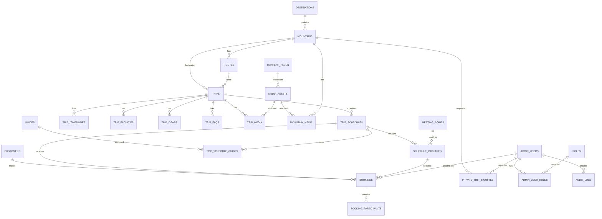

# Wildera Adventure
# Database & ERD Specification

**Document:** 04_Database_ERD_Wildera.md  
**Version:** 1.0  
**Status:** APPROVED FOR DEVELOPMENT  
**Related PRD:** 01_PRD_Wildera_Adventure.md v1.1  
**Related UX:** 02_UX_Specification_Wildera.md v1.0  
**Related Architecture:** 03_Technical_Architecture_Wildera.md v1.0  
**Database:** PostgreSQL  
**ORM:** Prisma  
**Last Updated:** September 2026  

---

# 1. Purpose

Dokumen ini mendefinisikan struktur data Wildera Adventure untuk MVP.

Dokumen menjadi source of truth untuk:

- database schema
- Prisma schema
- database migration
- backend entity
- API contract
- data validation
- database indexing
- relational integrity
- booking capacity

Database harus mendukung flow utama:

```text
Mountain
↓
Route
↓
Trip
↓
Schedule
↓
Package
↓
Booking
↓
Participant
```

serta:

```text
Private Trip
Admin
Content
Media
Settings
Audit
```

---

# 2. Database Principles

Database mengikuti prinsip:

```text
PostgreSQL = Source of Truth

Normalize business-critical data

Avoid duplicated counters

Use database constraints

Use transaction for critical booking operation

Preserve operational history

Do not physically delete financial/booking history

Use UUID for internal identifiers

Use human-friendly IDs for operational reference
```

---

# 3. Naming Convention

Table:

```text
snake_case
plural
```

Example:

```text
trip_schedules
booking_participants
private_trip_inquiries
```

Column:

```text
snake_case
```

Example:

```text
created_at
registration_deadline
whatsapp_number
```

Primary key:

```text
id
```

Foreign key:

```text
<entity>_id
```

Example:

```text
trip_id
schedule_id
booking_id
```

---

# 4. Identifier Strategy

Internal identifier:

```text
UUID
```

Example:

```text
550e8400-e29b-41d4-a716-446655440000
```

Customer/admin operational references menggunakan human-readable identifier.

Booking example:

```text
WLD-260913-A7K4
```

Private Trip:

```text
WLD-PT-260913-F8B2
```

UUID tidak ditampilkan sebagai booking number.

---

# 5. Timestamp Standard

Semua timestamp:

```text
TIMESTAMPTZ
```

Database menyimpan waktu secara konsisten.

Application menggunakan:

```text
Asia/Jakarta
```

sebagai operational timezone utama.

Fields umum:

```text
created_at
updated_at
deleted_at
```

---

# 6. High-Level Entity Model

```text
Destination
    │
    ▼
Mountain
    │
    ▼
Route
    │
    ▼
Trip
    │
    ├── Itinerary
    ├── Facilities
    ├── Gear
    ├── FAQ
    └── Media
    │
    ▼
Trip Schedule
    │
    ├── Schedule Package
    ├── Guide Assignment
    └── Booking
            │
            └── Booking Participant
```

Additional:

```text
Customer

Private Trip Inquiry

Admin User

Role

Audit Log

Media Asset

Content Page

Site Setting
```

---

# 7. ERD



---

# 8. Entity Groups

Database dibagi secara logical menjadi:

```text
CATALOG
destinations
mountains
routes
trips

TRIP CONTENT
trip_itineraries
trip_facilities
trip_gears
trip_faqs

SCHEDULE
trip_schedules
schedule_packages
meeting_points

BOOKING
customers
bookings
booking_participants

PRIVATE TRIP
private_trip_inquiries

GUIDE
guides
trip_schedule_guides

CMS
media_assets
trip_media
mountain_media
content_pages
faqs
site_settings

ADMIN
admin_users
roles
admin_user_roles
audit_logs
```

---

# 9. destinations

Table:

```text
destinations
```

Purpose:

Mengelompokkan mountain berdasarkan area/lokasi.

Fields:

| Column | Type | Constraint |
|---|---|---|
| id | UUID | PK |
| name | VARCHAR(120) | NOT NULL |
| slug | VARCHAR(140) | UNIQUE NOT NULL |
| province | VARCHAR(120) | NULL |
| region | VARCHAR(120) | NULL |
| description | TEXT | NULL |
| status | destination_status | NOT NULL |
| seo_title | VARCHAR(160) | NULL |
| seo_description | VARCHAR(320) | NULL |
| created_at | TIMESTAMPTZ | NOT NULL |
| updated_at | TIMESTAMPTZ | NOT NULL |
| deleted_at | TIMESTAMPTZ | NULL |

Example:

```text
Lombok
Jawa Tengah
Jawa Timur
```

---

# 10. destination_status

Enum:

```text
ACTIVE
INACTIVE
```

---

# 11. mountains

Table:

```text
mountains
```

Fields:

| Column | Type | Constraint |
|---|---|---|
| id | UUID | PK |
| destination_id | UUID | FK destinations.id |
| name | VARCHAR(160) | NOT NULL |
| slug | VARCHAR(180) | UNIQUE NOT NULL |
| altitude_m | INTEGER | NULL |
| short_description | TEXT | NULL |
| description | TEXT | NULL |
| default_difficulty | difficulty_level | NULL |
| best_season | VARCHAR(255) | NULL |
| latitude | NUMERIC(9,6) | NULL |
| longitude | NUMERIC(9,6) | NULL |
| status | content_status | NOT NULL |
| seo_title | VARCHAR(160) | NULL |
| seo_description | VARCHAR(320) | NULL |
| created_at | TIMESTAMPTZ | NOT NULL |
| updated_at | TIMESTAMPTZ | NOT NULL |
| deleted_at | TIMESTAMPTZ | NULL |

Example:

```text
Gunung Rinjani

altitude_m:
3726
```

---

# 12. difficulty_level

Enum:

```text
EASY
MODERATE
HARD
EXTREME
```

---

# 13. content_status

Enum:

```text
DRAFT
PUBLISHED
ARCHIVED
```

---

# 14. routes

Table:

```text
routes
```

Satu mountain dapat mempunyai banyak route.

Fields:

| Column | Type | Constraint |
|---|---|---|
| id | UUID | PK |
| mountain_id | UUID | FK mountains.id |
| name | VARCHAR(160) | NOT NULL |
| slug | VARCHAR(180) | NOT NULL |
| description | TEXT | NULL |
| distance_km | NUMERIC(6,2) | NULL |
| elevation_gain_m | INTEGER | NULL |
| estimated_duration_hours | NUMERIC(5,2) | NULL |
| difficulty | difficulty_level | NULL |
| starting_point | VARCHAR(255) | NULL |
| status | content_status | NOT NULL |
| created_at | TIMESTAMPTZ | NOT NULL |
| updated_at | TIMESTAMPTZ | NOT NULL |
| deleted_at | TIMESTAMPTZ | NULL |

Constraint:

```text
UNIQUE (mountain_id, slug)
```

Example:

```text
Mountain:
Rinjani

Routes:

Sembalun
Senaru
Torean
```

---

# 15. trips

Trip merupakan product/template.

Bukan keberangkatan.

Table:

```text
trips
```

Fields:

| Column | Type | Constraint |
|---|---|---|
| id | UUID | PK |
| mountain_id | UUID | FK mountains.id |
| route_id | UUID | FK routes.id NULL |
| name | VARCHAR(200) | NOT NULL |
| slug | VARCHAR(220) | UNIQUE NOT NULL |
| trip_type | trip_type | NOT NULL |
| short_description | TEXT | NULL |
| description | TEXT | NULL |
| duration_days | SMALLINT | NOT NULL |
| duration_nights | SMALLINT | NOT NULL DEFAULT 0 |
| difficulty | difficulty_level | NOT NULL |
| beginner_friendly | BOOLEAN | NOT NULL DEFAULT FALSE |
| health_certificate_required | BOOLEAN | NOT NULL DEFAULT FALSE |
| minimum_age | SMALLINT | NULL |
| maximum_age | SMALLINT | NULL |
| status | content_status | NOT NULL |
| featured | BOOLEAN | NOT NULL DEFAULT FALSE |
| seo_title | VARCHAR(160) | NULL |
| seo_description | VARCHAR(320) | NULL |
| published_at | TIMESTAMPTZ | NULL |
| created_by | UUID | FK admin_users.id |
| created_at | TIMESTAMPTZ | NOT NULL |
| updated_at | TIMESTAMPTZ | NOT NULL |
| deleted_at | TIMESTAMPTZ | NULL |

---

# 16. trip_type

Enum:

```text
OPEN_TRIP
PRIVATE_TRIP
TEKTOK
MULTI_DAY
```

Catatan:

Private Trip landing page/inquiry berbeda dengan Trip template.

`PRIVATE_TRIP` di `trip_type` hanya digunakan jika Wildera nantinya menyimpan contoh/product Private Trip tertentu.

---

# 17. Trip Constraints

Minimum:

```text
duration_days >= 1

duration_nights >= 0
```

Age:

```text
minimum_age >= 0

maximum_age >= minimum_age
```

jika keduanya tersedia.

---

# 18. trip_itineraries

Table:

```text
trip_itineraries
```

Fields:

| Column | Type | Constraint |
|---|---|---|
| id | UUID | PK |
| trip_id | UUID | FK trips.id |
| day_number | SMALLINT | NOT NULL |
| title | VARCHAR(200) | NOT NULL |
| description | TEXT | NULL |
| sort_order | SMALLINT | NOT NULL DEFAULT 0 |
| created_at | TIMESTAMPTZ | NOT NULL |
| updated_at | TIMESTAMPTZ | NOT NULL |

Constraint:

```text
day_number >= 1
```

Recommended unique:

```text
UNIQUE (trip_id, day_number)
```

---

# 19. trip_facilities

Digunakan untuk:

```text
Include
Exclude
```

Table:

```text
trip_facilities
```

Fields:

| Column | Type |
|---|---|
| id | UUID PK |
| trip_id | UUID FK |
| facility_type | facility_type |
| name | VARCHAR(200) |
| description | TEXT NULL |
| sort_order | SMALLINT |
| created_at | TIMESTAMPTZ |
| updated_at | TIMESTAMPTZ |

---

# 20. facility_type

Enum:

```text
INCLUDE
EXCLUDE
```

---

# 21. trip_gears

Table:

```text
trip_gears
```

Fields:

| Column | Type |
|---|---|
| id | UUID PK |
| trip_id | UUID FK |
| gear_type | gear_type |
| name | VARCHAR(200) |
| description | TEXT NULL |
| sort_order | SMALLINT |
| created_at | TIMESTAMPTZ |
| updated_at | TIMESTAMPTZ |

---

# 22. gear_type

Enum:

```text
MANDATORY
RECOMMENDED
```

---

# 23. trip_faqs

FAQ khusus satu trip.

Fields:

| Column | Type |
|---|---|
| id | UUID PK |
| trip_id | UUID FK |
| question | TEXT |
| answer | TEXT |
| sort_order | SMALLINT |
| status | content_status |
| created_at | TIMESTAMPTZ |
| updated_at | TIMESTAMPTZ |

---

# 24. trip_schedules

Table:

```text
trip_schedules
```

Satu record merepresentasikan satu keberangkatan.

Fields:

| Column | Type | Constraint |
|---|---|---|
| id | UUID | PK |
| trip_id | UUID | FK trips.id |
| start_date | DATE | NOT NULL |
| end_date | DATE | NOT NULL |
| registration_deadline | TIMESTAMPTZ | NULL |
| capacity | SMALLINT | NOT NULL |
| minimum_participants | SMALLINT | NULL |
| status | schedule_status | NOT NULL |
| notes | TEXT | NULL |
| created_by | UUID | FK admin_users.id |
| created_at | TIMESTAMPTZ | NOT NULL |
| updated_at | TIMESTAMPTZ | NOT NULL |

---

# 25. schedule_status

Database lifecycle status:

```text
DRAFT
OPEN
CLOSED
CANCELLED
COMPLETED
```

Important:

Database TIDAK menyimpan:

```text
AVAILABLE
ALMOST_FULL
SOLD_OUT
```

sebagai authoritative lifecycle state.

Status tersebut adalah computed availability state.

---

# 26. Why Availability Is Computed

Jika database menyimpan:

```text
capacity = 20
confirmed = 20
status = AVAILABLE
```

data menjadi kontradiktif.

Karena itu:

```text
AVAILABLE
ALMOST_FULL
SOLD_OUT
```

dihitung dari capacity.

---

# 27. Computed Availability

Pseudo logic:

```text
IF schedule.status != OPEN
    use schedule lifecycle status

ELSE IF available_seats = 0
    SOLD_OUT

ELSE IF available_seats <= almost_full_threshold
    ALMOST_FULL

ELSE
    AVAILABLE
```

Threshold `ALMOST_FULL` ditentukan aplikasi/configuration.

Default candidate:

```text
20% remaining capacity
```

---

# 28. Schedule Constraints

```text
capacity > 0
```

```text
minimum_participants >= 1
```

jika ada.

```text
minimum_participants <= capacity
```

```text
end_date >= start_date
```

---

# 29. meeting_points

Reusable meeting points.

Table:

```text
meeting_points
```

Fields:

| Column | Type |
|---|---|
| id | UUID PK |
| name | VARCHAR(180) |
| city | VARCHAR(120) NULL |
| address | TEXT NULL |
| latitude | NUMERIC(9,6) NULL |
| longitude | NUMERIC(9,6) NULL |
| notes | TEXT NULL |
| status | entity_status |
| created_at | TIMESTAMPTZ |
| updated_at | TIMESTAMPTZ |

---

# 30. entity_status

Enum:

```text
ACTIVE
INACTIVE
```

---

# 31. schedule_packages

Package merupakan pilihan harga untuk satu schedule.

Table:

```text
schedule_packages
```

Fields:

| Column | Type | Constraint |
|---|---|---|
| id | UUID | PK |
| schedule_id | UUID | FK trip_schedules.id |
| meeting_point_id | UUID | FK meeting_points.id NULL |
| name | VARCHAR(180) | NOT NULL |
| description | TEXT | NULL |
| price | NUMERIC(14,2) | NOT NULL |
| meeting_datetime | TIMESTAMPTZ | NULL |
| status | entity_status | NOT NULL |
| sort_order | SMALLINT | DEFAULT 0 |
| created_at | TIMESTAMPTZ | NOT NULL |
| updated_at | TIMESTAMPTZ | NOT NULL |

---

# 32. Package Capacity Rule

Tidak ada field:

```text
capacity
available_seats
booked_seats
```

di `schedule_packages`.

Semua package berbagi:

```text
trip_schedules.capacity
```

---

# 33. Package Price Constraint

```text
price >= 0
```

Gunakan:

```text
NUMERIC
```

bukan floating-point.

---

# 34. customers

Customer adalah contact/person yang melakukan booking.

Table:

```text
customers
```

Fields:

| Column | Type |
|---|---|
| id | UUID PK |
| full_name | VARCHAR(180) |
| whatsapp_number | VARCHAR(30) |
| email | VARCHAR(254) NULL |
| created_at | TIMESTAMPTZ |
| updated_at | TIMESTAMPTZ |

Customer tidak memiliki password pada MVP.

---

# 35. Customer Unique Rules

Jangan membuat:

```text
whatsapp_number UNIQUE
```

sebagai constraint wajib.

Alasan:

- nomor dapat berubah
- satu nomor dapat digunakan keluarga/group
- admin bisa memasukkan data imperfect

Backend dapat menggunakan nomor untuk duplicate detection tanpa memaksakan database uniqueness.

---

# 36. bookings

Table:

```text
bookings
```

Merupakan operational booking record.

Fields:

| Column | Type | Constraint |
|---|---|---|
| id | UUID | PK |
| booking_number | VARCHAR(40) | UNIQUE NOT NULL |
| customer_id | UUID | FK customers.id NULL |
| schedule_id | UUID | FK trip_schedules.id |
| package_id | UUID | FK schedule_packages.id |
| status | booking_status | NOT NULL |
| source | booking_source | NOT NULL |
| participant_count | SMALLINT | NOT NULL |
| total_amount | NUMERIC(14,2) | NULL |
| contact_name | VARCHAR(180) | NOT NULL |
| contact_whatsapp | VARCHAR(30) | NOT NULL |
| contact_email | VARCHAR(254) | NULL |
| notes | TEXT | NULL |
| cancellation_reason | TEXT | NULL |
| confirmed_at | TIMESTAMPTZ | NULL |
| cancelled_at | TIMESTAMPTZ | NULL |
| completed_at | TIMESTAMPTZ | NULL |
| created_by | UUID | FK admin_users.id |
| created_at | TIMESTAMPTZ | NOT NULL |
| updated_at | TIMESTAMPTZ | NOT NULL |

---

# 37. Why Contact Snapshot Exists

Walaupun booking dapat memiliki:

```text
customer_id
```

booking juga menyimpan:

```text
contact_name
contact_whatsapp
contact_email
```

Tujuannya:

menjaga snapshot operational contact saat booking dibuat.

Jika customer kemudian mengganti nomor utama, booking lama tetap menyimpan contact historis.

---

# 38. booking_status

Enum MVP:

```text
INQUIRY
PENDING_CONFIRMATION
CONFIRMED
CANCELLED
COMPLETED
NO_SHOW
```

---

# 39. Capacity-Consuming Status

MVP:

```text
CONFIRMED
```

mengonsumsi seat.

Tidak mengonsumsi seat:

```text
INQUIRY
PENDING_CONFIRMATION
CANCELLED
COMPLETED
NO_SHOW
```

Namun setelah trip selesai, historical participant tetap dihitung secara reporting.

Availability hanya relevan sebelum keberangkatan.

---

# 40. Booking Source

Enum:

```text
WEBSITE_WHATSAPP
WHATSAPP
INSTAGRAM
ADMIN
OTHER
```

---

# 41. Booking Constraints

```text
participant_count > 0
```

```text
total_amount >= 0
```

jika tersedia.

Package harus berasal dari Schedule yang sama dengan booking.

Ini adalah domain constraint dan wajib divalidasi backend.

---

# 42. package_schedule Integrity

Scenario invalid:

```text
Booking:
Schedule A

Package:
Package milik Schedule B
```

Harus ditolak.

Application validation wajib.

Recommended database improvement:

gunakan composite relationship bila implementasi ORM memungkinkan.

Minimum MVP:

backend verifies:

```text
package.schedule_id == booking.schedule_id
```

dalam transaction.

---

# 43. booking_participants

Table:

```text
booking_participants
```

Fields:

| Column | Type | Constraint |
|---|---|---|
| id | UUID | PK |
| booking_id | UUID | FK bookings.id |
| full_name | VARCHAR(180) | NOT NULL |
| date_of_birth | DATE | NULL |
| gender | gender_type | NULL |
| phone | VARCHAR(30) | NULL |
| identity_type | identity_type | NULL |
| identity_number | VARCHAR(100) | NULL |
| emergency_contact_name | VARCHAR(180) | NULL |
| emergency_contact_phone | VARCHAR(30) | NULL |
| notes | TEXT | NULL |
| created_at | TIMESTAMPTZ | NOT NULL |
| updated_at | TIMESTAMPTZ | NOT NULL |

---

# 44. Participant Data Principle

Jangan menjadikan seluruh field participant mandatory.

Minimum sesuai PRD:

```text
full_name
```

Field lain hanya wajib jika operasional memerlukannya.

---

# 45. Health Certificate

Tidak ada table health certificate pada MVP.

Tidak ada:

```text
health_document
health_certificate_upload
```

Health requirement hanya disimpan sebagai:

```text
trips.health_certificate_required
```

Customer yang belum memiliki surat kesehatan diarahkan ke WhatsApp/admin.

---

# 46. Medical Data

MVP tidak membutuhkan field detail medis khusus.

Jika di masa depan dibutuhkan:

harus dibuat melalui review privacy/security tersendiri.

Jangan menyimpan health data hanya karena "mungkin berguna".

---

# 47. gender_type

Enum optional:

```text
MALE
FEMALE
```

Jika business process membutuhkan value lain, enum harus direview sebelum migration.

---

# 48. identity_type

Enum:

```text
KTP
PASSPORT
OTHER
```

Identity data tidak mandatory pada level database.

---

# 49. Participant Count Consistency

`bookings.participant_count` berfungsi sebagai operational booking quantity.

Ideal:

```text
participant_count
=
jumlah participant yang dimaksud dalam booking
```

Jumlah row `booking_participants` mungkin belum lengkap ketika booking baru dibuat.

Karena itu jangan enforce:

```text
participant_count == COUNT(booking_participants)
```

sebagai immediate database constraint.

Backend/admin UI dapat menunjukkan:

```text
2 participants expected

1 participant data completed
```

---

# 50. Capacity Calculation

Capacity digunakan berdasarkan:

```text
SUM(bookings.participant_count)
```

untuk booking:

```text
status = CONFIRMED
```

pada schedule tertentu.

Formula:

```text
available_seats =
schedule.capacity
-
SUM(confirmed booking participant_count)
```

---

# 51. Why Capacity Uses Booking Count

Jangan menghitung capacity dari:

```text
COUNT(booking_participants)
```

karena participant details dapat diisi setelah booking dikonfirmasi.

Seat consumption berdasarkan quantity booking.

---

# 52. Capacity Query Concept

```sql
SELECT
    s.capacity -
    COALESCE(
        SUM(
            CASE
                WHEN b.status = 'CONFIRMED'
                THEN b.participant_count
                ELSE 0
            END
        ),
        0
    ) AS available_seats
FROM trip_schedules s
LEFT JOIN bookings b
    ON b.schedule_id = s.id
WHERE s.id = :schedule_id
GROUP BY s.id;
```

---

# 53. Booking Confirmation Transaction

Critical operation:

```text
PENDING_CONFIRMATION
↓
CONFIRMED
```

must use database transaction.

Concept:

```sql
BEGIN;

SELECT id, capacity
FROM trip_schedules
WHERE id = :schedule_id
FOR UPDATE;

SELECT COALESCE(SUM(participant_count), 0)
FROM bookings
WHERE schedule_id = :schedule_id
AND status = 'CONFIRMED';

-- Backend validates:
-- confirmed + new_count <= capacity

UPDATE bookings
SET
    status = 'CONFIRMED',
    confirmed_at = NOW()
WHERE id = :booking_id;

COMMIT;
```

---

# 54. Concurrent Booking Rule

Example:

```text
Schedule Capacity:
20

Existing Confirmed:
19
```

Admin A:

```text
confirm 1
```

Admin B:

```text
confirm 1
```

Expected:

```text
Admin A = success

Admin B = insufficient capacity
```

or vice versa.

Never:

```text
21/20
```

---

# 55. Booking Cancellation

Transaction:

```text
CONFIRMED
↓
CANCELLED
```

does not require manually adding available seat.

Because availability is computed.

After status changes:

```text
confirmed total decreases automatically
```

from subsequent queries.

---

# 56. Do Not Store Available Seats

Do NOT create:

```text
available_seats
```

column.

Do NOT allow admin to manually edit:

```text
available seats
```

Only edit:

```text
schedule.capacity
```

subject to validation.

---

# 57. Capacity Update Rule

Before admin changes:

```text
capacity
```

backend calculates:

```text
confirmed_participants
```

Reject if:

```text
new_capacity < confirmed_participants
```

---

# 58. Capacity Constraint Example

Current:

```text
capacity = 20

confirmed = 18
```

Valid:

```text
capacity → 18
capacity → 25
```

Invalid:

```text
capacity → 17
```

---

# 59. private_trip_inquiries

Table:

```text
private_trip_inquiries
```

Fields:

| Column | Type | Constraint |
|---|---|---|
| id | UUID | PK |
| inquiry_number | VARCHAR(40) | UNIQUE NOT NULL |
| mountain_id | UUID | FK mountains.id NULL |
| destination_other | VARCHAR(200) | NULL |
| customer_name | VARCHAR(180) | NOT NULL |
| whatsapp_number | VARCHAR(30) | NOT NULL |
| email | VARCHAR(254) | NULL |
| preferred_date | DATE | NOT NULL |
| alternative_date | DATE | NULL |
| participant_count | SMALLINT | NOT NULL |
| meeting_point_request | VARCHAR(255) | NULL |
| budget | NUMERIC(14,2) | NULL |
| requirements | TEXT | NULL |
| status | private_trip_status | NOT NULL |
| assigned_admin_id | UUID | FK admin_users.id NULL |
| admin_notes | TEXT | NULL |
| created_at | TIMESTAMPTZ | NOT NULL |
| updated_at | TIMESTAMPTZ | NOT NULL |

---

# 60. private_trip_status

Enum:

```text
NEW
CONTACTED
QUOTATION_SENT
NEGOTIATION
BOOKED
LOST
```

---

# 61. Private Trip Constraints

```text
participant_count > 0
```

```text
budget >= 0
```

if budget available.

Either:

```text
mountain_id
```

or:

```text
destination_other
```

should contain target destination.

Validation primarily handled backend.

---

# 62. guides

P1-capable table but safe to include schema now.

Fields:

| Column | Type |
|---|---|
| id | UUID PK |
| name | VARCHAR(180) |
| slug | VARCHAR(200) UNIQUE |
| short_bio | TEXT NULL |
| experience_years | SMALLINT NULL |
| certifications | TEXT NULL |
| status | entity_status |
| created_at | TIMESTAMPTZ |
| updated_at | TIMESTAMPTZ |
| deleted_at | TIMESTAMPTZ NULL |

---

# 63. trip_schedule_guides

Many-to-many:

```text
Trip Schedule
↔
Guide
```

Fields:

| Column | Type |
|---|---|
| schedule_id | UUID FK |
| guide_id | UUID FK |
| role | guide_role |
| created_at | TIMESTAMPTZ |

Primary key / unique:

```text
UNIQUE (schedule_id, guide_id)
```

---

# 64. guide_role

Enum:

```text
TRIP_LEADER
GUIDE
PORTER_COORDINATOR
OTHER
```

---

# 65. media_assets

Central media metadata.

Table:

```text
media_assets
```

Fields:

| Column | Type |
|---|---|
| id | UUID PK |
| object_key | VARCHAR(500) UNIQUE |
| url | TEXT |
| mime_type | VARCHAR(120) |
| file_size_bytes | BIGINT |
| width_px | INTEGER NULL |
| height_px | INTEGER NULL |
| alt_text | VARCHAR(255) NULL |
| created_by | UUID FK admin_users.id |
| created_at | TIMESTAMPTZ |

Binary file disimpan di object storage.

---

# 66. trip_media

Fields:

| Column | Type |
|---|---|
| id | UUID PK |
| trip_id | UUID FK |
| media_id | UUID FK |
| media_role | media_role |
| sort_order | SMALLINT |
| created_at | TIMESTAMPTZ |

---

# 67. mountain_media

Fields:

| Column | Type |
|---|---|
| id | UUID PK |
| mountain_id | UUID FK |
| media_id | UUID FK |
| media_role | media_role |
| sort_order | SMALLINT |
| created_at | TIMESTAMPTZ |

---

# 68. media_role

Enum:

```text
COVER
GALLERY
```

---

# 69. Global FAQ

Trip FAQ terpisah dari FAQ website.

Table:

```text
faqs
```

Fields:

| Column | Type |
|---|---|
| id | UUID PK |
| category | VARCHAR(100) NULL |
| question | TEXT |
| answer | TEXT |
| sort_order | SMALLINT |
| status | content_status |
| created_at | TIMESTAMPTZ |
| updated_at | TIMESTAMPTZ |

---

# 70. content_pages

Static CMS pages.

Examples:

```text
About

Terms

Privacy

Cancellation

Safety
```

Fields:

| Column | Type |
|---|---|
| id | UUID PK |
| page_key | VARCHAR(100) UNIQUE |
| title | VARCHAR(200) |
| slug | VARCHAR(200) UNIQUE |
| content | TEXT |
| status | content_status |
| seo_title | VARCHAR(160) NULL |
| seo_description | VARCHAR(320) NULL |
| published_at | TIMESTAMPTZ NULL |
| created_at | TIMESTAMPTZ |
| updated_at | TIMESTAMPTZ |

---

# 71. site_settings

Simple application/business settings.

Fields:

| Column | Type |
|---|---|
| id | UUID PK |
| setting_key | VARCHAR(120) UNIQUE |
| setting_value | JSONB |
| is_public | BOOLEAN |
| updated_by | UUID FK admin_users.id NULL |
| updated_at | TIMESTAMPTZ |

Examples:

```text
business_whatsapp

instagram_url

contact_email

almost_full_percentage

homepage_hero
```

---

# 72. Site Setting Security

Do not store secrets such as:

```text
database password

session secret

storage secret
```

inside `site_settings`.

Secrets belong to environment/secret management.

---

# 73. admin_users

Fields:

| Column | Type | Constraint |
|---|---|---|
| id | UUID | PK |
| name | VARCHAR(180) | NOT NULL |
| email | VARCHAR(254) | UNIQUE NOT NULL |
| password_hash | TEXT | NOT NULL |
| status | admin_status | NOT NULL |
| last_login_at | TIMESTAMPTZ | NULL |
| created_at | TIMESTAMPTZ | NOT NULL |
| updated_at | TIMESTAMPTZ | NOT NULL |

---

# 74. admin_status

Enum:

```text
ACTIVE
DISABLED
```

---

# 75. roles

Fields:

| Column | Type |
|---|---|
| id | UUID PK |
| name | VARCHAR(100) |
| slug | VARCHAR(100) UNIQUE |
| description | TEXT NULL |
| created_at | TIMESTAMPTZ |

Seed:

```text
super_admin

operations

content
```

Future:

```text
finance
```

---

# 76. admin_user_roles

Fields:

```text
admin_user_id UUID FK
role_id UUID FK
created_at TIMESTAMPTZ
```

Unique:

```text
UNIQUE (admin_user_id, role_id)
```

---

# 77. audit_logs

Audit log immutable operational history.

Fields:

| Column | Type |
|---|---|
| id | UUID PK |
| admin_user_id | UUID FK NULL |
| action | VARCHAR(120) |
| entity_type | VARCHAR(120) |
| entity_id | UUID NULL |
| old_value | JSONB NULL |
| new_value | JSONB NULL |
| request_id | VARCHAR(100) NULL |
| ip_address | INET NULL |
| user_agent | TEXT NULL |
| created_at | TIMESTAMPTZ |

No:

```text
updated_at
deleted_at
```

Audit rows are append-only.

---

# 78. Audit Events

Critical audit examples:

```text
TRIP_CREATED

TRIP_PUBLISHED

SCHEDULE_CREATED

SCHEDULE_CAPACITY_CHANGED

BOOKING_CREATED

BOOKING_CONFIRMED

BOOKING_CANCELLED

BOOKING_UPDATED

ADMIN_CREATED

ADMIN_ROLE_CHANGED
```

---

# 79. Booking Audit Example

```json
{
  "action": "BOOKING_CONFIRMED",
  "entity_type": "booking",
  "old_value": {
    "status": "PENDING_CONFIRMATION"
  },
  "new_value": {
    "status": "CONFIRMED"
  }
}
```

---

# 80. Foreign Key Delete Rules

Recommended:

## Destination → Mountain

```text
ON DELETE RESTRICT
```

## Mountain → Route

```text
ON DELETE RESTRICT
```

## Trip → Schedule

```text
ON DELETE RESTRICT
```

## Schedule → Booking

```text
ON DELETE RESTRICT
```

## Booking → Participant

```text
ON DELETE CASCADE
```

only if booking itself can actually be physically deleted before operational use.

For production operational records:

prefer no physical booking deletion.

---

# 81. Content Deletion Strategy

Use soft delete for:

```text
destinations

mountains

routes

trips

guides
```

Do not delete merely because no longer offered.

Instead:

```text
ARCHIVED
```

or:

```text
deleted_at
```

---

# 82. Operational Deletion Strategy

Do NOT physically delete:

```text
confirmed booking

cancelled booking

completed booking

audit log
```

These are business history.

---

# 83. Schedule Deletion

Schedule that never had booking and remains DRAFT:

may be deletable.

Once booking exists:

do not physically delete.

Use:

```text
CANCELLED
```

or:

```text
CLOSED
```

---

# 84. Database Index Strategy

Indexes must follow actual query patterns.

Core indexes:

```text
destinations(slug)

mountains(slug)

routes(mountain_id, slug)

trips(slug)

trips(status)

trips(mountain_id)

trip_schedules(trip_id)

trip_schedules(start_date)

trip_schedules(status)

schedule_packages(schedule_id)

bookings(booking_number)

bookings(schedule_id)

bookings(status)

bookings(customer_id)

bookings(contact_whatsapp)

booking_participants(booking_id)

private_trip_inquiries(status)

private_trip_inquiries(whatsapp_number)

audit_logs(entity_type, entity_id)

audit_logs(admin_user_id)

content_pages(slug)
```

---

# 85. Critical Composite Index

Capacity query:

```text
bookings(schedule_id, status)
```

Recommended:

```sql
CREATE INDEX idx_booking_schedule_status
ON bookings(schedule_id, status);
```

---

# 86. Schedule Catalog Index

Public upcoming trips frequently use:

```text
status
start_date
```

Recommended:

```sql
CREATE INDEX idx_schedule_status_start
ON trip_schedules(status, start_date);
```

---

# 87. Private Trip Admin Index

```sql
CREATE INDEX idx_private_trip_status_created
ON private_trip_inquiries(status, created_at DESC);
```

---

# 88. Partial Index Candidate

For confirmed capacity queries:

```sql
CREATE INDEX idx_confirmed_bookings_schedule
ON bookings(schedule_id)
WHERE status = 'CONFIRMED';
```

This can improve capacity calculation as booking volume increases.

Not mandatory on day one, but recommended PostgreSQL optimization.

---

# 89. Unique Constraints

Required:

```text
destinations.slug

mountains.slug

trips.slug

bookings.booking_number

private_trip_inquiries.inquiry_number

admin_users.email

roles.slug

media_assets.object_key

content_pages.page_key

content_pages.slug

site_settings.setting_key
```

---

# 90. Money Type

Never use:

```text
FLOAT
DOUBLE
```

for money.

Use:

```text
NUMERIC(14,2)
```

Example:

```text
950000.00
```

Currency MVP:

```text
IDR
```

Currency column not required while Wildera only supports IDR.

Can be added later if required.

---

# 91. Phone Storage

Store normalized phone:

Example:

```text
628123456789
```

Preferred normalization at backend.

Display formatting handled frontend.

Do not store phone as integer.

Use:

```text
VARCHAR
```

because:

- leading `+`
- country codes
- phone is identifier, not number for arithmetic

---

# 92. Email Storage

Use:

```text
VARCHAR(254)
```

Backend normalizes appropriately.

Do not assume email exists for every booking.

WhatsApp is the primary contact channel.

---

# 93. Slug Strategy

Slugs are stable public identifiers.

Examples:

```text
gunung-rinjani

open-trip-rinjani-via-sembalun
```

Once indexed publicly, avoid changing slug unnecessarily.

If changed:

application should support redirect.

---

# 94. Draft Content

Draft:

```text
status = DRAFT
```

Public API must exclude DRAFT content.

Only admin API can retrieve it.

---

# 95. Published Trip Query

Concept:

```sql
SELECT *
FROM trips
WHERE status = 'PUBLISHED'
AND deleted_at IS NULL;
```

---

# 96. Upcoming Schedule Query

Concept:

```sql
SELECT *
FROM trip_schedules
WHERE status = 'OPEN'
AND end_date >= CURRENT_DATE
ORDER BY start_date ASC;
```

Registration deadline also affects bookability.

---

# 97. Schedule Bookable Rule

Schedule can be contacted/booked if:

```text
status = OPEN
```

AND:

```text
registration_deadline is NULL
OR
registration_deadline > NOW()
```

AND:

```text
available_seats > 0
```

---

# 98. Schedule Availability View

Recommended future database view:

```text
schedule_availability
```

Concept:

```sql
CREATE VIEW schedule_availability AS
SELECT
    s.id AS schedule_id,
    s.capacity,
    COALESCE(
        SUM(
            CASE
                WHEN b.status = 'CONFIRMED'
                THEN b.participant_count
                ELSE 0
            END
        ),
        0
    ) AS confirmed_seats,
    s.capacity -
    COALESCE(
        SUM(
            CASE
                WHEN b.status = 'CONFIRMED'
                THEN b.participant_count
                ELSE 0
            END
        ),
        0
    ) AS available_seats
FROM trip_schedules s
LEFT JOIN bookings b
    ON b.schedule_id = s.id
GROUP BY s.id;
```

Whether implemented as view or service query can be decided during development.

---

# 99. Materialized View?

Not needed.

Trip/booking volume MVP is low.

Standard query/view is enough.

Do not prematurely introduce materialized view refresh complexity.

---

# 100. Data Integrity Priority

Database constraints should protect:

```text
invalid capacity

invalid dates

duplicate identifiers

broken FK relationship

negative price

negative participant count
```

Business rules such as:

```text
package belongs to selected schedule
```

are additionally enforced by backend.

---

# 101. Prisma Considerations

Prisma schema should map enums and relationships defined here.

Raw SQL migration may still be necessary for PostgreSQL features such as:

```text
partial indexes

advanced CHECK constraints

specialized locking queries
```

Using Prisma does not mean ignoring database-native capabilities.

---

# 102. Migration Policy

Every schema change:

```text
Schema Update
↓
Migration File
↓
Code Review
↓
Staging
↓
Production
```

Do not manually modify production schema outside controlled migration except emergency DBA procedure.

---

# 103. Migration Naming

Example:

```text
20260913_init_catalog

20260914_add_trip_schedules

20260915_add_booking

20260916_add_private_trip
```

---

# 104. Seed Strategy

Development seed should include:

```text
Admin User

Roles

Destination

Mountain

Route

Trip

Schedule

Packages

Meeting Points

FAQ
```

Example:

```text
Gunung Prau

Open Trip Prau

Schedule 19–20 Sep

Start Jakarta

Start Basecamp
```

---

# 105. Production Seeds

Production should only automatically seed:

```text
roles

required system configuration
```

Do not seed fake customer/booking data.

---

# 106. Backup Priority

Highest database backup priority:

```text
bookings

participants

private trip inquiries

admin/audit

trip/schedule
```

All are stored in same PostgreSQL backup system.

---

# 107. Data Retention

MVP recommendation:

Booking operational history:

```text
retain
```

Audit logs:

```text
retain
```

Customer/contact data retention duration must eventually follow finalized privacy policy.

Do not automatically delete customer data until business/legal retention requirements are defined.

---

# 108. Sensitive Fields

Sensitive or semi-sensitive:

```text
identity_number

emergency_contact

customer phone

participant phone
```

Application access should be role-restricted.

These fields must not be included in:

```text
public API

analytics

frontend logs
```

---

# 109. Public API Projection

Public Trip API may expose:

```text
trip

mountain

schedule

price

capacity status

itinerary

facilities

gear
```

It must never expose:

```text
booking customer

participant

admin

audit
```

---

# 110. Admin API Projection

Admin API can access operational information based on permission.

Operations:

```text
booking

participants

contact
```

Content:

should not require participant access.

---

# 111. Future Payment Tables

Payment is explicitly OUTSIDE active MVP.

Do not create production payment workflow yet.

Future design reserves:

```text
payments

payment_transactions

payment_webhook_logs

refunds
```

but these tables do not need to exist until Phase 2.

---

# 112. Future payments

Planned fields conceptually:

```text
payment.id

booking_id

provider

amount

status

external_id

paid_at
```

Detailed design must be created when payment scope is activated.

Do not implement speculative payment logic now.

---

# 113. Future Seat Reservation

Current MVP:

```text
No customer seat locking.
```

Future online checkout may add:

```text
seat_reservations
```

At that point:

```text
available =
capacity
-
confirmed
-
active_reservations
```

Current schema deliberately does not include this complexity.

---

# 114. Core Referential Flow

```text
Destination
     │
     ▼
Mountain
     │
     ▼
Route
     │
     ▼
Trip
     │
     ▼
Schedule
     │
     ├── Package
     │
     └── Booking
             │
             ▼
         Participant
```

---

# 115. Core Booking Data Example

```text
TRIP

Open Trip Gunung Prau
via Patak Banteng
```

```text
SCHEDULE

19–20 September 2026

Capacity:
20
```

```text
PACKAGES

Start Jakarta
Rp1.250.000

Start Basecamp
Rp750.000
```

Bookings:

```text
Booking A
2 participants
CONFIRMED

Booking B
4 participants
CONFIRMED

Booking C
2 participants
PENDING_CONFIRMATION
```

Confirmed:

```text
6
```

Available:

```text
20 - 6 = 14
```

Booking C does not consume inventory yet.

---

# 116. Example After Confirmation

When Booking C changes:

```text
PENDING_CONFIRMATION
→
CONFIRMED
```

Confirmed becomes:

```text
8
```

Available:

```text
12
```

No manual counter update is required.

---

# 117. Example Cancellation

Booking A:

```text
2 participants
```

changes:

```text
CONFIRMED
→
CANCELLED
```

Confirmed becomes:

```text
6
```

Available:

```text
14
```

again automatically through calculation.

---

# 118. Booking State Transition Rules

Valid MVP transitions:

```text
INQUIRY
→
PENDING_CONFIRMATION

INQUIRY
→
CONFIRMED

PENDING_CONFIRMATION
→
CONFIRMED

INQUIRY
→
CANCELLED

PENDING_CONFIRMATION
→
CANCELLED

CONFIRMED
→
CANCELLED

CONFIRMED
→
COMPLETED

CONFIRMED
→
NO_SHOW
```

Illegal example:

```text
CANCELLED
→
COMPLETED
```

without explicit admin recovery workflow.

State transitions are enforced application-side.

---

# 119. Schedule State Transition

Recommended:

```text
DRAFT
→
OPEN

OPEN
→
CLOSED

OPEN
→
CANCELLED

CLOSED
→
COMPLETED

OPEN
→
COMPLETED

CANCELLED
```

A cancelled trip does not automatically delete bookings.

---

# 120. Trip State Transition

```text
DRAFT
→
PUBLISHED
→
ARCHIVED
```

Re-publishing archived content may be supported only if business needs it.

---

# 121. Database Transaction Boundaries

Transactions mandatory for:

```text
Booking Confirmation

Capacity-sensitive Booking Creation

Booking Participant Quantity Change on CONFIRMED Booking

Confirmed Booking Cancellation

Schedule Capacity Reduction
```

Simple content updates generally do not require complex locking.

---

# 122. Confirmed Booking Quantity Change

Example:

Booking confirmed:

```text
participant_count = 2
```

Admin changes to:

```text
4
```

Additional required capacity:

```text
+2
```

Must use schedule lock and capacity validation.

Cannot perform simple:

```text
UPDATE bookings
SET participant_count = 4
```

without concurrency protection.

---

# 123. Quantity Decrease

Confirmed booking:

```text
4 → 2
```

releases:

```text
2 seats
```

No explicit seat counter update required.

---

# 124. Admin Capacity Dashboard Query

For each upcoming schedule return:

```text
capacity

confirmed

available

availability_status
```

Example:

```text
Prau
19–20 Sep

Capacity       20
Confirmed      18
Available       2
Status          ALMOST_FULL
```

---

# 125. Reporting Foundation

Schema supports future reporting:

```text
booking source

trip occupancy

popular mountain

popular package

private trip conversion

participant count
```

without introducing separate analytics database in MVP.

---

# 126. Booking Source Reporting

Example:

```text
WEBSITE_WHATSAPP  60%

INSTAGRAM         20%

DIRECT_WHATSAPP   15%

OTHER              5%
```

This will help determine whether website actually contributes bookings.

---

# 127. Database Anti-Patterns Prohibited

Do not implement:

```text
one giant trip table containing every schedule

comma-separated participant names

package1_price / package2_price columns

available_seats manually edited

participant1_name / participant2_name columns

JSON for all business-critical relational data

hard delete booking history

one record per schedule duplicated as new trip

payment fields scattered directly into trips
```

---

# 128. JSONB Usage

JSONB is appropriate for:

```text
site_settings.setting_value

audit old/new values
```

Avoid using JSONB for core relational entities such as:

```text
participants

schedules

packages

bookings
```

They need proper tables and constraints.

---

# 129. Schema Overview

Final MVP schema:

```text
destinations

mountains

routes

trips

trip_itineraries

trip_facilities

trip_gears

trip_faqs

trip_schedules

meeting_points

schedule_packages

customers

bookings

booking_participants

private_trip_inquiries

guides

trip_schedule_guides

media_assets

trip_media

mountain_media

faqs

content_pages

site_settings

admin_users

roles

admin_user_roles

audit_logs
```

---

# 130. P0 Tables

Mandatory launch:

```text
destinations
mountains
routes
trips

trip_itineraries
trip_facilities
trip_gears
trip_faqs

trip_schedules
meeting_points
schedule_packages

customers
bookings
booking_participants

private_trip_inquiries

media_assets
trip_media
mountain_media

faqs
content_pages
site_settings

admin_users
roles
admin_user_roles

audit_logs
```

---

# 131. P1 Tables

Can be activated later:

```text
guides
trip_schedule_guides
```

The schema can exist from the beginning if development cost is negligible, but guide UI is not required for launch.

---

# 132. Deferred Tables

Do not build yet:

```text
payments

payment_transactions

payment_webhook_logs

refunds

seat_reservations

promo_codes

reviews

loyalty_points

referrals

customer_accounts
```

---

# 133. Database Definition of Done

Database MVP is ready when:

1. Every core entity has PK.
2. Every relationship has FK.
3. Slugs have unique constraints.
4. Booking number is unique.
5. Private inquiry number is unique.
6. Schedule capacity cannot be zero/negative.
7. Booking participant count cannot be zero/negative.
8. Package price cannot be negative.
9. Package belongs to selected schedule.
10. Capacity is calculated per schedule.
11. Package does not own capacity.
12. Available seat is not manually stored.
13. Confirming a booking uses database transaction.
14. Concurrent confirmations cannot oversell.
15. Confirmed booking quantity change is capacity-safe.
16. Cancelling a booking releases capacity automatically.
17. Schedule capacity cannot be reduced below confirmed seats.
18. Draft content is excluded from public query.
19. Sensitive participant data is absent from public API.
20. Critical admin actions generate audit logs.
21. Migration history exists.
22. Development seeds exist.
23. Production backups are configured.

---

# 134. Database Architecture Decision

The core model is officially:

```text
TRIP
=
Reusable Product
```

```text
SCHEDULE
=
Departure
```

```text
PACKAGE
=
Price / Meeting Point Option
```

```text
BOOKING
=
Customer Reservation Record
```

```text
PARTICIPANT
=
Person Joining Trip
```

```text
CAPACITY
=
Owned by Schedule
```

and:

```text
AVAILABLE SEATS
=
Capacity
-
Confirmed Booking Participant Count
```

This model must not be changed casually because the API, admin UI, reporting, and future payment architecture will depend on it.

---

# 135. Next Document

Next:

```text
05_API_Specification_Wildera.md
```

API Specification will define the exact frontend/backend contract for:

```text
Authentication

Trip Catalog

Trip Detail

Mountains

Schedules

Packages

WhatsApp Context

Private Trip Inquiry

Admin Trips

Admin Schedules

Admin Bookings

Admin Participants

Capacity

Content

Media

Settings
```

For every endpoint it will define:

```text
HTTP Method

URL

Authentication

Permission

Query Parameters

Request Body

Response Body

Validation

Error Code

Pagination

Example Request

Example Response
```

The API will follow the database rules established in this document rather than inventing a second business model.