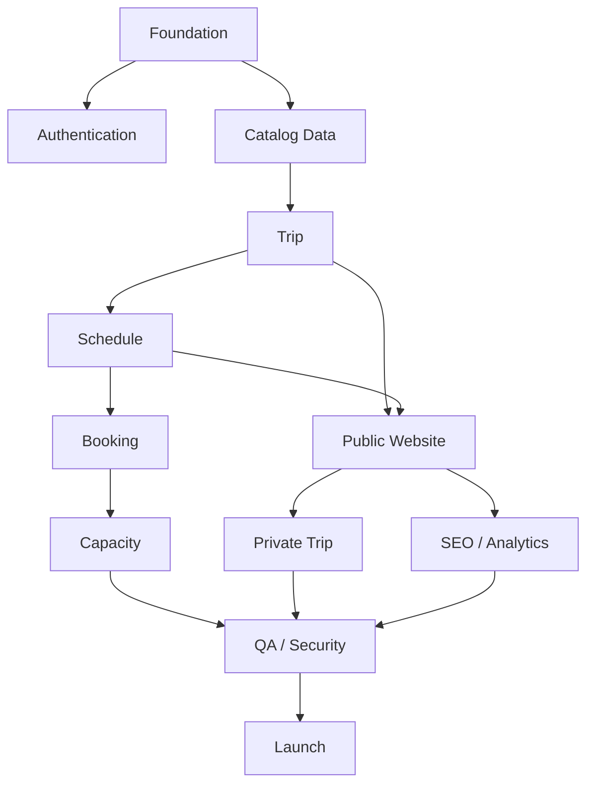

# Wildera Adventure
# Development Backlog

**Document:** 06_Development_Backlog_Wildera.md  
**Version:** 1.0  
**Status:** APPROVED FOR DEVELOPMENT  
**Related PRD:** 01_PRD_Wildera_Adventure.md v1.1  
**Related UX:** 02_UX_Specification_Wildera.md v1.0  
**Related Architecture:** 03_Technical_Architecture_Wildera.md v1.0  
**Related Database:** 04_Database_ERD_Wildera.md v1.0  
**Related API:** 05_API_Specification_Wildera.md v1.0  
**Product:** Wildera Adventure  
**Last Updated:** September 2026  

---

# 1. Purpose

Dokumen ini menerjemahkan seluruh requirement Wildera Adventure menjadi pekerjaan implementasi.

Flow:

```text
PRD
↓
UX
↓
Architecture
↓
Database
↓
API
↓
Development Backlog
↓
Implementation
```

Backlog mencakup:

- Epic
- Feature
- User Story
- Frontend Task
- Backend Task
- Database Task
- QA Task
- Acceptance Criteria
- Priority
- Dependency
- Sprint Recommendation

---

# 2. Development Principle

Urutan development tidak berdasarkan:

> halaman apa yang paling menarik dibuat terlebih dahulu.

Tetapi berdasarkan:

> dependency teknis dan risiko bisnis.

Prioritas tertinggi adalah:

```text
Foundation
↓
Authentication
↓
Catalog Data
↓
Trip + Schedule
↓
Capacity
↓
Booking
↓
Public Website
↓
Private Trip
↓
SEO / Analytics
↓
QA
↓
Launch
```

---

# 3. Priority Definition

## P0 — Critical

Harus selesai sebelum MVP launch.

Jika tidak selesai:

> sistem belum layak production.

---

## P1 — Important

Tidak wajib untuk MVP pertama tetapi sangat bernilai setelah launch.

---

## P2 — Nice to Have

Dikerjakan jika kapasitas tim memungkinkan.

---

## P3 — Future

Tidak dikerjakan sebelum ada business case.

---

# 4. Task Prefix

Gunakan prefix:

```text
FE  = Frontend
BE  = Backend
DB  = Database
QA  = Quality Assurance
DEV = General Development
OPS = Infrastructure / DevOps
SEC = Security
UX  = UI/UX
```

Example:

```text
BE-BOOK-001
FE-TRIP-004
DB-SCH-002
QA-BOOK-003
```

---

# 5. Task Status

Recommended:

```text
BACKLOG

READY

IN_PROGRESS

REVIEW

QA

DONE

BLOCKED
```

---

# 6. Definition of Ready

Task dapat masuk development jika:

- requirement jelas
- acceptance criteria tersedia
- dependency selesai
- UX tersedia jika diperlukan
- API contract tersedia
- database requirement diketahui
- tidak ada open question kritikal

---

# 7. Definition of Done

Task dianggap DONE jika:

- implementation selesai
- code review selesai
- lint/type check lolos
- unit test relevan lolos
- integration test relevan lolos
- acceptance criteria terpenuhi
- staging verified
- tidak ada critical bug terbuka
- documentation diperbarui jika contract berubah

---

# 8. Recommended Sprint Model

**[ASSUMPTION]**

Gunakan sprint:

```text
2 minggu
```

Tetapi sprint dapat disesuaikan dengan jumlah developer.

Urutan yang lebih penting daripada durasi sprint.

---

# 9. Development Phases

Recommended:

```text
Sprint 0
Foundation

Sprint 1
Catalog & Admin Core

Sprint 2
Public Website

Sprint 3
Booking & Capacity

Sprint 4
Private Trip + Content + SEO

Sprint 5
Hardening + UAT + Launch
```

---

# 10. EPIC Overview

## P0

```text
EPIC-001 Project Foundation
EPIC-002 Infrastructure & Environment
EPIC-003 Admin Authentication
EPIC-004 RBAC
EPIC-005 Destination Management
EPIC-006 Mountain Management
EPIC-007 Route Management
EPIC-008 Trip Management
EPIC-009 Schedule Management
EPIC-010 Package & Meeting Point
EPIC-011 Public Homepage
EPIC-012 Trip Catalog
EPIC-013 Trip Detail
EPIC-014 Mountain Public Pages
EPIC-015 WhatsApp Conversion
EPIC-016 Booking Management
EPIC-017 Capacity Management
EPIC-018 Participant Management
EPIC-019 Private Trip
EPIC-020 Content / FAQ
EPIC-021 Media Management
EPIC-022 SEO
EPIC-023 Analytics
EPIC-024 Audit Logging
EPIC-025 Security
EPIC-026 Testing
EPIC-027 Deployment
EPIC-028 Launch
```

---

# 11. P1 Epics

```text
EPIC-101 Guide Profiles

EPIC-102 Gallery

EPIC-103 Testimonials

EPIC-104 Blog

EPIC-105 Participant Export

EPIC-106 Advanced Reporting

EPIC-107 Email Notification
```

---

# 12. Deferred Epics

Do NOT build in MVP:

```text
EPIC-201 Customer Login

EPIC-202 Online Checkout

EPIC-203 Payment Gateway

EPIC-204 DP / Pelunasan

EPIC-205 Seat Reservation Timer

EPIC-206 Voucher

EPIC-207 Referral

EPIC-208 Loyalty

EPIC-209 Rental

EPIC-210 Merchandise
```

---

# EPIC-001 — Project Foundation

**Priority:** P0

Goal:

Mempersiapkan repository dan standar development.

---

## STORY-001

As a developer,  
I want a consistent project structure,  
so that frontend and backend can be developed predictably.

---

## DEV-FOUND-001

Create monorepo.

Structure:

```text
apps/web
apps/api
packages/ui
packages/types
packages/validation
docs
database
infrastructure
```

---

## DEV-FOUND-002

Configure TypeScript.

---

## DEV-FOUND-003

Configure linting.

---

## DEV-FOUND-004

Configure code formatting.

---

## DEV-FOUND-005

Configure shared environment handling.

---

## DEV-FOUND-006

Create README development guide.

---

## Acceptance Criteria

```text
GIVEN fresh repository

WHEN developer clones project

THEN developer can install dependencies

AND run frontend

AND run backend

AND connect to local database.
```

---

# EPIC-002 — Infrastructure & Environment

**Priority:** P0  
**Dependency:** EPIC-001

---

## OPS-INFRA-001

Create environment:

```text
LOCAL
STAGING
PRODUCTION
```

---

## OPS-INFRA-002

Provision PostgreSQL staging.

---

## OPS-INFRA-003

Provision PostgreSQL production.

---

## OPS-INFRA-004

Provision object storage.

---

## OPS-INFRA-005

Configure environment secrets.

---

## OPS-INFRA-006

Configure domain/subdomain structure.

Potential:

```text
wilderaadventure.id

api.wilderaadventure.id
```

---

## OPS-INFRA-007

Configure HTTPS.

---

## OPS-INFRA-008

Configure staging deployment.

---

## Acceptance Criteria

Production and staging must have:

- separate database
- separate credentials
- separate environment variables
- separate storage namespace

---

# EPIC-003 — Admin Authentication

**Priority:** P0  
**Dependency:** EPIC-001, EPIC-002

---

## DB-AUTH-001

Create:

```text
admin_users
```

---

## DB-AUTH-002

Create:

```text
roles
admin_user_roles
```

---

## BE-AUTH-001

Implement admin login.

Endpoint:

```text
POST /auth/login
```

---

## BE-AUTH-002

Implement password hashing.

Recommended:

```text
Argon2id
```

---

## BE-AUTH-003

Implement secure session.

---

## BE-AUTH-004

Implement logout.

---

## BE-AUTH-005

Implement:

```text
GET /auth/me
```

---

## FE-AUTH-001

Create admin login page.

---

## FE-AUTH-002

Handle invalid credentials.

---

## FE-AUTH-003

Protect admin routes.

---

## QA-AUTH-001

Test:

- valid login
- invalid password
- unknown email
- disabled account
- logout
- expired session

---

## Acceptance Criteria

```text
GIVEN valid active admin

WHEN correct email/password submitted

THEN authenticated session is created.
```

---

# EPIC-004 — RBAC

**Priority:** P0  
**Dependency:** EPIC-003

---

## DB-RBAC-001

Seed roles:

```text
SUPER_ADMIN

OPERATIONS

CONTENT
```

---

## BE-RBAC-001

Implement role guard.

---

## BE-RBAC-002

Implement permission checks.

---

## FE-RBAC-001

Hide inaccessible navigation.

---

## QA-RBAC-001

Verify:

CONTENT cannot:

```text
view participant personal data
confirm booking
cancel booking
```

---

## Acceptance Criteria

Backend must reject unauthorized access even if frontend URL is manually opened.

---

# EPIC-005 — Destination Management

**Priority:** P0  
**Dependency:** EPIC-003

---

## DB-DEST-001

Create destinations table.

---

## BE-DEST-001

Implement admin CRUD.

---

## BE-DEST-002

Implement slug validation.

---

## FE-DEST-001

Destination list.

---

## FE-DEST-002

Create/edit destination form.

---

## QA-DEST-001

Test:

- create
- edit
- duplicate slug
- archive/inactive
- permissions

---

# EPIC-006 — Mountain Management

**Priority:** P0  
**Dependency:** EPIC-005

---

## DB-MNT-001

Create mountains table.

---

## DB-MNT-002

Add FK destination.

---

## BE-MNT-001

Create mountain.

---

## BE-MNT-002

Edit mountain.

---

## BE-MNT-003

List/filter mountain.

---

## FE-MNT-001

Mountain admin list.

---

## FE-MNT-002

Mountain editor.

Fields:

```text
Name
Destination
Altitude
Difficulty
Description
Best Season
Coordinates
SEO
```

---

## QA-MNT-001

Validate:

- slug unique
- destination required
- altitude accepts valid number
- drafts not public

---

# EPIC-007 — Route Management

**Priority:** P0  
**Dependency:** EPIC-006

---

## DB-ROUTE-001

Create routes table.

---

## BE-ROUTE-001

Route CRUD.

---

## FE-ROUTE-001

Route management.

---

## Acceptance Criteria

One mountain supports multiple routes.

Example:

```text
Rinjani
├── Sembalun
├── Senaru
└── Torean
```

---

# EPIC-008 — Trip Management

**Priority:** P0  
**Dependency:** EPIC-006, EPIC-007

---

## DB-TRIP-001

Create:

```text
trips
```

---

## DB-TRIP-002

Create:

```text
trip_itineraries
trip_facilities
trip_gears
trip_faqs
```

---

## BE-TRIP-001

Trip CRUD.

---

## BE-TRIP-002

Implement draft status.

---

## BE-TRIP-003

Implement publish action.

---

## BE-TRIP-004

Implement archive.

---

## BE-TRIP-005

Implement duplicate.

---

## BE-TRIP-006

Itinerary CRUD.

---

## BE-TRIP-007

Facilities CRUD.

---

## BE-TRIP-008

Gear CRUD.

---

## BE-TRIP-009

Trip FAQ CRUD.

---

## FE-TRIP-001

Trip admin list.

---

## FE-TRIP-002

Create Trip — General tab.

---

## FE-TRIP-003

Trip Information tab.

---

## FE-TRIP-004

Itinerary editor.

---

## FE-TRIP-005

Include / Exclude editor.

---

## FE-TRIP-006

Gear editor.

---

## FE-TRIP-007

Requirements editor.

Include:

```text
Health Certificate Required
Beginner Friendly
Minimum Age
```

---

## FE-TRIP-008

SEO editor.

---

## QA-TRIP-001

Verify incomplete trip cannot publish if mandatory fields missing.

---

## QA-TRIP-002

Verify duplicated trip does not copy schedules.

---

# EPIC-009 — Schedule Management

**Priority:** P0  
**Dependency:** EPIC-008

---

## DB-SCH-001

Create:

```text
trip_schedules
```

---

## BE-SCH-001

Schedule CRUD.

---

## BE-SCH-002

Schedule open action.

---

## BE-SCH-003

Schedule close action.

---

## BE-SCH-004

Schedule cancel action.

---

## BE-SCH-005

Schedule complete action.

---

## BE-SCH-006

Compute schedule availability.

---

## FE-SCH-001

Schedule list per trip.

---

## FE-SCH-002

Create schedule.

---

## FE-SCH-003

Edit schedule.

---

## FE-SCH-004

Display:

```text
Capacity
Confirmed
Available
Availability Status
```

---

## QA-SCH-001

Validate:

```text
end_date >= start_date

capacity > 0

minimum <= capacity
```

---

# EPIC-010 — Package & Meeting Point

**Priority:** P0  
**Dependency:** EPIC-009

---

## DB-PKG-001

Create meeting_points.

---

## DB-PKG-002

Create schedule_packages.

---

## BE-PKG-001

Meeting point CRUD.

---

## BE-PKG-002

Package CRUD.

---

## FE-PKG-001

Package management inside Schedule.

---

## FE-PKG-002

Meeting point selector.

---

## QA-PKG-001

Verify package:

```text
does not have capacity
```

---

## QA-PKG-002

Verify price cannot be negative.

---

# EPIC-011 — Public Homepage

**Priority:** P0  
**Dependency:** EPIC-008, EPIC-009

---

## FE-HOME-001

Build public header.

---

## FE-HOME-002

Build mobile navigation.

---

## FE-HOME-003

Hero section.

---

## FE-HOME-004

Upcoming Trips.

---

## FE-HOME-005

Destination section.

---

## FE-HOME-006

Why Wildera.

---

## FE-HOME-007

How It Works.

---

## FE-HOME-008

Private Trip CTA.

---

## FE-HOME-009

FAQ preview.

---

## FE-HOME-010

Footer.

---

## BE-HOME-001

Expose required public trip data.

---

## QA-HOME-001

Mobile responsiveness.

---

## QA-HOME-002

Verify CTA links.

---

# EPIC-012 — Trip Catalog

**Priority:** P0  
**Dependency:** EPIC-008, EPIC-009

---

## BE-CATALOG-001

Implement:

```text
GET /trips
```

---

## BE-CATALOG-002

Search.

---

## BE-CATALOG-003

Filter month.

---

## BE-CATALOG-004

Filter difficulty.

---

## BE-CATALOG-005

Filter type.

---

## BE-CATALOG-006

Filter availability.

---

## BE-CATALOG-007

Sort nearest departure.

---

## BE-CATALOG-008

Sort lowest price.

---

## FE-CATALOG-001

Trip Catalog desktop.

---

## FE-CATALOG-002

Trip Catalog mobile.

---

## FE-CATALOG-003

Search component.

---

## FE-CATALOG-004

Desktop filters.

---

## FE-CATALOG-005

Mobile filter bottom sheet.

---

## FE-CATALOG-006

Sort.

---

## FE-CATALOG-007

Empty state.

---

## FE-CATALOG-008

Loading skeleton.

---

## QA-CATALOG-001

Combined filter test.

---

## QA-CATALOG-002

No result state.

---

## QA-CATALOG-003

Draft trips excluded.

---

# EPIC-013 — Trip Detail

**Priority:** P0  
**Dependency:** EPIC-008, EPIC-009, EPIC-010

---

## BE-DETAIL-001

Implement:

```text
GET /trips/:slug
```

---

## BE-DETAIL-002

Include:

```text
Mountain
Route
Itinerary
Facilities
Gear
FAQs
Schedules
Packages
Availability
```

---

## FE-DETAIL-001

Hero/gallery.

---

## FE-DETAIL-002

Trip summary.

---

## FE-DETAIL-003

Schedule selector.

---

## FE-DETAIL-004

Package selector.

---

## FE-DETAIL-005

Availability display.

---

## FE-DETAIL-006

Trip overview.

---

## FE-DETAIL-007

Itinerary.

---

## FE-DETAIL-008

Include/Exclude.

---

## FE-DETAIL-009

Gear.

---

## FE-DETAIL-010

Health Requirement.

---

## FE-DETAIL-011

Difficulty information.

---

## FE-DETAIL-012

FAQ.

---

## FE-DETAIL-013

Policy links.

---

## FE-DETAIL-014

Mobile sticky CTA.

---

## QA-DETAIL-001

No schedule.

---

## QA-DETAIL-002

Available schedule.

---

## QA-DETAIL-003

Almost Full.

---

## QA-DETAIL-004

Sold Out.

---

## QA-DETAIL-005

Closed schedule.

---

## QA-DETAIL-006

Cancelled schedule.

---

# EPIC-014 — Mountain Public Pages

**Priority:** P0  
**Dependency:** EPIC-006

---

## BE-PUBLIC-MNT-001

Implement:

```text
GET /mountains
```

---

## BE-PUBLIC-MNT-002

Implement:

```text
GET /mountains/:slug
```

---

## FE-PUBLIC-MNT-001

Mountain directory.

---

## FE-PUBLIC-MNT-002

Mountain detail.

---

## FE-PUBLIC-MNT-003

Upcoming trips.

---

## FE-PUBLIC-MNT-004

Route section.

---

## QA-PUBLIC-MNT-001

Verify archived mountain behavior.

---

# EPIC-015 — WhatsApp Conversion

**Priority:** P0  
**Dependency:** EPIC-013

---

## BE-WA-001

Expose public business WhatsApp setting.

---

## FE-WA-001

Create centralized:

```text
WhatsApp message builder
```

---

## FE-WA-002

Trip Booking WhatsApp CTA.

---

## FE-WA-003

Health Assistance CTA.

---

## FE-WA-004

Global WhatsApp CTA.

---

## FE-WA-005

Encode contextual message safely.

---

## QA-WA-001

Verify selected:

```text
Trip
Schedule
Package
Price
```

appear correctly.

---

## QA-WA-002

Verify no sensitive data included.

---

## Acceptance Criteria

```text
GIVEN user selected schedule and package

WHEN Book via WhatsApp clicked

THEN WhatsApp opens

AND message contains correct trip context.
```

---

# EPIC-016 — Booking Management

**Priority:** P0  
**Dependency:** EPIC-009, EPIC-010

---

## DB-BOOK-001

Create:

```text
customers
bookings
```

---

## BE-BOOK-001

Admin booking list.

---

## BE-BOOK-002

Create booking.

---

## BE-BOOK-003

Booking detail.

---

## BE-BOOK-004

Edit booking contact data.

---

## BE-BOOK-005

Confirm booking action.

---

## BE-BOOK-006

Cancel booking.

---

## BE-BOOK-007

Complete booking.

---

## BE-BOOK-008

No-show action.

---

## FE-BOOK-001

Booking list.

---

## FE-BOOK-002

Booking search.

---

## FE-BOOK-003

Booking filter.

---

## FE-BOOK-004

Create booking form.

---

## FE-BOOK-005

Booking detail.

---

## FE-BOOK-006

Booking status actions.

---

## FE-BOOK-007

Cancellation confirmation dialog.

---

## QA-BOOK-001

Create inquiry booking.

---

## QA-BOOK-002

Create confirmed booking.

---

## QA-BOOK-003

Invalid package/schedule combination.

---

## QA-BOOK-004

Invalid state transitions.

---

# EPIC-017 — Capacity Management

**Priority:** P0 — CRITICAL  
**Dependency:** EPIC-016

This is one of the highest-risk epics.

---

## BE-CAP-001

Implement confirmed-seat calculation.

---

## BE-CAP-002

Implement available-seat calculation.

---

## BE-CAP-003

Implement availability status.

---

## BE-CAP-004

Transactional booking confirmation.

---

## BE-CAP-005

Schedule row locking.

---

## BE-CAP-006

Confirmed booking quantity increase validation.

---

## BE-CAP-007

Capacity reduction validation.

---

## BE-CAP-008

Cancellation capacity behavior.

---

## DB-CAP-001

Create index:

```text
bookings(schedule_id, status)
```

---

## QA-CAP-001

Capacity 20 / confirmed 18 / new 2:

```text
SUCCESS
```

---

## QA-CAP-002

Capacity 20 / confirmed 19 / new 2:

```text
REJECT
```

---

## QA-CAP-003

Two concurrent final-seat confirmations.

Expected:

```text
1 SUCCESS
1 CONFLICT
```

---

## QA-CAP-004

Confirmed booking quantity:

```text
2 → 4
```

with insufficient capacity.

Expected:

```text
REJECT
```

---

## QA-CAP-005

Confirmed booking cancellation.

Expected:

availability increases automatically.

---

## QA-CAP-006

Capacity:

```text
20 → 17
```

when confirmed 18.

Expected:

```text
REJECT
```

---

# EPIC-018 — Participant Management

**Priority:** P0  
**Dependency:** EPIC-016

---

## DB-PART-001

Create booking_participants.

---

## BE-PART-001

Participant list.

---

## BE-PART-002

Create participant.

---

## BE-PART-003

Edit participant.

---

## BE-PART-004

Delete participant where allowed.

---

## BE-PART-005

Schedule participant manifest.

---

## FE-PART-001

Participant management inside Booking Detail.

---

## FE-PART-002

Schedule Manifest page.

---

## FE-PART-003

Show:

```text
Expected participants

Completed participant data
```

---

## QA-PART-001

Booking count 5 with 3 participant details must remain valid.

---

## QA-PART-002

Sensitive data must not appear in public APIs.

---

# EPIC-019 — Private Trip

**Priority:** P0

---

## DB-PRIVATE-001

Create private_trip_inquiries.

---

## BE-PRIVATE-001

Public submission endpoint.

---

## BE-PRIVATE-002

Validation.

---

## BE-PRIVATE-003

Phone normalization.

---

## BE-PRIVATE-004

Rate limiting.

---

## BE-PRIVATE-005

Generate inquiry number.

---

## BE-PRIVATE-006

Admin list.

---

## BE-PRIVATE-007

Lead detail.

---

## BE-PRIVATE-008

Assign admin.

---

## BE-PRIVATE-009

Status transitions.

---

## FE-PRIVATE-001

Private Trip landing page.

---

## FE-PRIVATE-002

Private Trip form.

---

## FE-PRIVATE-003

Inline validation.

---

## FE-PRIVATE-004

Success state.

---

## FE-PRIVATE-005

Error state preserving data.

---

## FE-PRIVATE-006

Admin lead list.

---

## FE-PRIVATE-007

Admin lead detail.

---

## QA-PRIVATE-001

Valid submission.

---

## QA-PRIVATE-002

Missing destination.

---

## QA-PRIVATE-003

Invalid WhatsApp.

---

## QA-PRIVATE-004

Double click prevention.

---

## QA-PRIVATE-005

Rate limiting behavior.

---

# EPIC-020 — Content & FAQ

**Priority:** P0

---

## DB-CMS-001

Create:

```text
faqs
content_pages
site_settings
```

---

## BE-CMS-001

FAQ CRUD.

---

## BE-CMS-002

Content Page CRUD.

---

## BE-CMS-003

Publish/archive.

---

## BE-CMS-004

Public content endpoint.

---

## BE-CMS-005

Public settings endpoint.

---

## FE-CMS-001

FAQ admin.

---

## FE-CMS-002

Static page editor.

---

## FE-CMS-003

FAQ public page.

---

## FE-CMS-004

About page.

---

## FE-CMS-005

Terms.

---

## FE-CMS-006

Privacy.

---

## FE-CMS-007

Cancellation.

---

## FE-CMS-008

Safety.

---

# EPIC-021 — Media Management

**Priority:** P0

---

## DB-MEDIA-001

Create media_assets.

---

## DB-MEDIA-002

Create trip_media.

---

## DB-MEDIA-003

Create mountain_media.

---

## BE-MEDIA-001

Upload image.

---

## BE-MEDIA-002

Validate MIME type.

---

## BE-MEDIA-003

Validate size.

---

## BE-MEDIA-004

Store object storage metadata.

---

## BE-MEDIA-005

Attach image to Trip.

---

## BE-MEDIA-006

Attach image to Mountain.

---

## FE-MEDIA-001

Media uploader.

---

## FE-MEDIA-002

Cover image selector.

---

## QA-MEDIA-001

Invalid file type rejected.

---

## QA-MEDIA-002

Oversized file rejected.

---

# EPIC-022 — SEO

**Priority:** P0  
**Dependency:** Public pages

---

## FE-SEO-001

Dynamic title.

---

## FE-SEO-002

Meta description.

---

## FE-SEO-003

Canonical URL.

---

## FE-SEO-004

OpenGraph.

---

## FE-SEO-005

Image alt.

---

## FE-SEO-006

Breadcrumb.

---

## FE-SEO-007

XML sitemap.

---

## FE-SEO-008

robots.txt.

---

## FE-SEO-009

Prevent Admin indexing.

---

## QA-SEO-001

Published trips in sitemap.

---

## QA-SEO-002

Draft trips absent.

---

## QA-SEO-003

Correct social preview.

---

# EPIC-023 — Analytics

**Priority:** P0

---

## FE-AN-001

Install analytics.

---

## FE-AN-002

Track:

```text
view_home
```

---

## FE-AN-003

Track:

```text
view_trip_list
```

---

## FE-AN-004

Track:

```text
view_trip
```

---

## FE-AN-005

Track:

```text
select_schedule
```

---

## FE-AN-006

Track:

```text
select_package
```

---

## FE-AN-007

Track:

```text
click_book_whatsapp
```

---

## FE-AN-008

Track:

```text
click_health_whatsapp
```

---

## FE-AN-009

Track:

```text
private_trip_inquiry
```

---

## QA-AN-001

Ensure analytics contains no:

```text
phone
email
participant name
medical data
```

---

# EPIC-024 — Audit Logging

**Priority:** P0

---

## DB-AUDIT-001

Create audit_logs.

---

## BE-AUDIT-001

Audit trip publishing.

---

## BE-AUDIT-002

Audit capacity change.

---

## BE-AUDIT-003

Audit booking confirmation.

---

## BE-AUDIT-004

Audit cancellation.

---

## BE-AUDIT-005

Audit admin permission changes.

---

## FE-AUDIT-001

Super Admin audit log page.

Optional for first launch if backend logging already exists, but backend audit writing remains P0.

---

# EPIC-025 — Security

**Priority:** P0

---

## SEC-001

HTTPS production.

---

## SEC-002

Secure cookies.

---

## SEC-003

CORS configuration.

---

## SEC-004

CSRF mitigation where required.

---

## SEC-005

Input validation.

---

## SEC-006

Rate limiting.

---

## SEC-007

File upload validation.

---

## SEC-008

Secret management.

---

## SEC-009

Prevent sensitive logs.

---

## SEC-010

Admin route protection.

---

## SEC-011

Security headers.

---

## SEC-012

Admin failed-login protection.

---

## QA-SEC-001

Direct admin API without session.

Expected:

```text
401
```

---

## QA-SEC-002

Wrong role.

Expected:

```text
403
```

---

# EPIC-026 — Testing

**Priority:** P0

---

## Unit Tests

Priority:

```text
Capacity
Booking state
Schedule bookability
WhatsApp builder
Validation
```

---

## Integration Tests

```text
Authentication

Trip publishing

Schedule

Booking confirmation

Capacity

Cancellation

Private Trip
```

---

## E2E Public

```text
Homepage
↓
Trip Catalog
↓
Trip Detail
↓
Schedule
↓
Package
↓
WhatsApp
```

---

## E2E Admin

```text
Login
↓
Create Trip
↓
Create Schedule
↓
Create Booking
↓
Confirm
↓
Capacity changes
```

---

# EPIC-027 — Deployment

**Priority:** P0

---

## OPS-DEP-001

Configure CI.

Pipeline:

```text
Install

Lint

Type Check

Test

Build
```

---

## OPS-DEP-002

Deploy staging frontend.

---

## OPS-DEP-003

Deploy staging API.

---

## OPS-DEP-004

Configure staging DB migration.

---

## OPS-DEP-005

Deploy production frontend.

---

## OPS-DEP-006

Deploy production backend.

---

## OPS-DEP-007

Production database migration.

---

## OPS-DEP-008

Configure backups.

---

## OPS-DEP-009

Configure health monitoring.

---

## OPS-DEP-010

Configure error tracking.

---

# EPIC-028 — Launch

**Priority:** P0

---

## LAUNCH-001

Final production seed.

---

## LAUNCH-002

Create Super Admin.

---

## LAUNCH-003

Set:

```text
WhatsApp
Instagram
Contact Email
```

---

## LAUNCH-004

Input real:

```text
Destinations
Mountains
Trips
Schedules
Packages
```

---

## LAUNCH-005

Upload real photography.

---

## LAUNCH-006

Finalize legal pages.

---

## LAUNCH-007

Check mobile.

---

## LAUNCH-008

Check SEO.

---

## LAUNCH-009

Check analytics.

---

## LAUNCH-010

Check WhatsApp.

---

## LAUNCH-011

Backup verification.

---

## LAUNCH-012

Admin training.

---

# 13. Sprint 0 — Foundation

Goal:

> Semua developer dapat bekerja pada foundation yang sama.

Tasks:

```text
EPIC-001
Project Foundation

EPIC-002
Basic Staging Infrastructure

EPIC-003
Authentication foundation

Database initialization

Prisma configuration

Base API structure

Base Next.js structure
```

Deliverable:

```text
Frontend running
Backend running
PostgreSQL connected
Admin login working
Staging deployed
```

---

# 14. Sprint 1 — Catalog & Admin Core

Goal:

Membuat struktur produk dapat dikelola admin.

Tasks:

```text
Destination

Mountain

Route

Trip

Trip Content

Media

Basic RBAC
```

Deliverable:

Admin dapat membuat:

```text
Gunung
↓
Route
↓
Trip
```

dan publish Trip.

---

# 15. Sprint 2 — Schedule & Public Experience

Goal:

Customer dapat menemukan dan memahami Trip.

Tasks:

```text
Schedule

Package

Meeting Point

Homepage

Trip Catalog

Mountain Public

Trip Detail
```

Deliverable:

```text
Visitor
↓
Trip Catalog
↓
Trip Detail
↓
Schedule
↓
Package
```

working.

---

# 16. Sprint 3 — Booking & Operations

Goal:

Admin dapat mencatat transaksi Open Trip.

Tasks:

```text
Booking

Capacity

Participant

Manifest

WhatsApp Integration
```

Critical milestone:

```text
Capacity protection complete
```

Deliverable:

```text
Customer WhatsApp
↓
Admin Booking
↓
Confirmed
↓
Capacity Updated
```

---

# 17. Sprint 4 — Private Trip & Growth

Tasks:

```text
Private Trip

FAQ

Content Pages

SEO

Analytics

Audit Logs
```

Deliverable:

Customer dapat:

```text
Request Private Trip
```

dan marketing funnel dapat diukur.

---

# 18. Sprint 5 — Hardening

Focus:

```text
Bug Fix

Integration Test

E2E

Security

Performance

Mobile QA

UAT

Deployment

Launch
```

Jangan menambah fitur baru pada Sprint 5 kecuali blocking issue.

---

# 19. Critical Dependency Graph



---

# 20. Critical Path

Project launch tidak boleh melewati:

```text
Foundation
↓
Trip
↓
Schedule
↓
Booking
↓
Capacity
↓
QA
↓
Launch
```

Ini critical path.

Jika capacity belum benar:

> project tidak boleh launch.

---

# 21. Highest-Risk Features

Rank:

## #1 Capacity

Reason:

Overselling dapat menyebabkan masalah operasional langsung.

---

## #2 Booking State

Reason:

Data participant dan operational trip bergantung pada booking.

---

## #3 Admin Authentication

Reason:

Data customer tidak boleh public.

---

## #4 Media / Performance

Reason:

Website outdoor banyak gambar dan mudah menjadi lambat.

---

## #5 WhatsApp Funnel

Reason:

Ini adalah conversion utama MVP.

---

# 22. MVP Exit Criteria

MVP tidak dianggap selesai hanya karena semua halaman terlihat jadi.

MVP selesai ketika:

```text
Trip dapat dibuat

Schedule dapat dibuat

Package dapat dibuat

Trip dapat dilihat public

Schedule availability akurat

WhatsApp booking bekerja

Booking dapat dicatat

Capacity tidak dapat oversold

Participant dapat dikelola

Private Trip bekerja

SEO dasar bekerja

Analytics bekerja

Admin secure

Production backup tersedia
```

---

# 23. UAT Scenario 1 — Open Trip

Founder/Admin harus dapat:

```text
Create Rinjani

Create Sembalun Route

Create Open Trip

Add Itinerary

Add Include / Exclude

Add Gear

Create Schedule

Set Capacity 20

Create Jakarta Package

Publish
```

Visitor kemudian:

```text
opens Trip

selects schedule

selects package

clicks WhatsApp
```

Expected:

correct contextual message.

---

# 24. UAT Scenario 2 — Manual Booking

Admin receives WhatsApp customer.

Admin creates:

```text
2 participant booking
```

confirms booking.

Expected:

```text
Capacity 20

Confirmed 2

Available 18
```

---

# 25. UAT Scenario 3 — Final Seat

Initial:

```text
Capacity 20
Confirmed 19
Available 1
```

Admin tries:

```text
2 participants
```

Expected:

```text
Rejected
```

Admin tries:

```text
1 participant
```

Expected:

```text
Confirmed
Available 0
Sold Out
```

---

# 26. UAT Scenario 4 — Cancellation

Booking:

```text
2 participants
CONFIRMED
```

cancelled.

Expected:

availability increases by 2.

No manual seat update.

---

# 27. UAT Scenario 5 — Health Requirement

Trip:

```text
health_certificate_required = true
```

Public page must display:

- requirement
- assistance explanation
- WhatsApp CTA

No document upload.

---

# 28. UAT Scenario 6 — Private Trip

Visitor submits:

```text
Rinjani
20 Nov
5 participants
WhatsApp
```

Expected:

```text
Inquiry created
Status NEW
Visible in admin
```

---

# 29. UAT Scenario 7 — RBAC

CONTENT admin attempts:

```text
Confirm Booking
```

Expected:

```text
403 FORBIDDEN
```

---

# 30. UAT Scenario 8 — SEO

Published Trip:

```text
Open Trip Rinjani
```

must have:

```text
indexable URL

title

description

canonical

OpenGraph
```

Draft Trip:

must not appear publicly.

---

# 31. Performance Acceptance

Public pages must avoid:

- huge original image downloads
- excessive JS
- blocking analytics
- unnecessary animations

Performance testing focus:

```text
Homepage

Trip Catalog

Trip Detail
```

especially mobile.

---

# 32. Browser QA

Minimum:

```text
Chrome

Safari

Mobile Chrome

Mobile Safari

Edge
```

---

# 33. Device QA

At minimum:

```text
Small mobile

Standard mobile

Tablet

Laptop

Desktop
```

Primary UX QA:

mobile.

---

# 34. Pre-Launch Security Checklist

Verify:

```text
HTTPS

No default passwords

Production secrets secured

No exposed .env

No debug mode

Admin protected

CORS restricted

Rate limiting active

Uploads validated

Database backup active

Sensitive logs checked
```

---

# 35. Pre-Launch Database Checklist

Verify:

```text
Migration applied

Constraints active

Indexes created

Roles seeded

Super Admin exists

Production test data removed

Backup configured

Restore procedure documented
```

---

# 36. Pre-Launch Business Checklist

Founder must provide:

```text
WhatsApp number

Instagram URL

Contact Email

Logo

Brand assets

Real trip photos

Real trip data

Prices

Schedules

Capacity

Meeting Points

FAQ

Terms

Privacy

Cancellation Policy

Safety Policy
```

---

# 37. Launch Blockers

Do NOT launch if:

```text
capacity can oversell

admin routes are publicly accessible

WhatsApp message is incorrect

real trip price is wrong

production backup unavailable

staging-only credentials used in production

critical mobile flow broken

private customer data visible publicly

legal pages missing

production site uses fake/test booking data
```

---

# 38. Non-Blocking Issues

Can launch with:

```text
no Blog

no Gallery

no Testimonial section

no Guide profiles

no email automation

no advanced reporting

no payment gateway
```

These are not MVP blockers.

---

# 39. P1 Roadmap — After Launch

Order should depend on real data.

Recommended candidates:

## P1-A

Participant CSV/Excel export.

## P1-B

Testimonials.

## P1-C

Gallery.

## P1-D

Guide Profiles.

## P1-E

Blog / SEO Content.

## P1-F

Email Notification.

## P1-G

Advanced reporting.

---

# 40. Phase 2 Entry Criteria

Do not build online payment merely because it was planned.

Payment Phase starts if data shows:

- booking volume increasing
- WhatsApp booking administration becoming bottleneck
- customer demands online checkout
- reconciliation becomes expensive
- abandoned leads due to manual payment

Then activate:

```text
Online Booking

Payment Gateway

DP

Pelunasan

Webhook

Seat Reservation
```

---

# 41. Technical Debt Policy

Technical debt may be accepted for non-critical UI.

Technical debt is NOT acceptable for:

```text
Authentication

Authorization

Capacity

Booking integrity

Sensitive data

Database migrations

Backups
```

---

# 42. Bug Severity

## S0 — Critical

Example:

```text
data leak
admin inaccessible
capacity overselling
database corruption
```

Launch blocker.

---

## S1 — High

Example:

```text
booking cannot be created
WhatsApp CTA broken
Trip page unavailable
```

Must fix before launch.

---

## S2 — Medium

Example:

```text
filter wrong in edge case
layout problem tablet
```

Can be triaged.

---

## S3 — Low

Example:

```text
minor spacing
copy typo
```

Can move post-launch.

---

# 43. Product Change Control

After documents are approved:

New request must answer:

```text
Is it P0?

Does it block current business flow?

What existing work does it delay?
```

Example:

> "Tambahkan loyalty point sebelum launch."

Default answer:

```text
P3
```

unless there is new business evidence.

---

# 44. Backlog Rule

Do not silently add scope.

Every feature must have:

```text
Epic

Priority

Owner

Acceptance Criteria
```

before being developed.

---

# 45. Recommended Team Structure

Lean team:

```text
1 Product Owner / Founder

1 UI/UX

1 Frontend Developer

1 Backend Developer

1 QA
```

DevOps can be handled by backend/full-stack resource initially if experienced.

Alternative small team:

```text
1 Full-stack Developer
1 UI/UX
1 QA / Product
```

but delivery risk becomes higher.

---

# 46. Ownership

Founder / Product Owner:

```text
Business Rules
Scope
Content
Pricing
Policy
Acceptance
```

Designer:

```text
UX
UI
Responsive Design
Design System
```

Frontend:

```text
Public UI
Admin UI
Analytics
WhatsApp
SEO rendering
```

Backend:

```text
API
Auth
Business Rules
Capacity
Database
Audit
```

QA:

```text
Functional
Integration
Regression
UAT Support
```

---

# 47. Documentation Update Rule

If implementation reveals required architecture change:

update:

```text
03 Technical Architecture
```

If database changes:

update:

```text
04 Database ERD
```

If endpoint changes:

update:

```text
05 API Specification
```

If product requirement changes:

update:

```text
01 PRD
```

Backlog should never become the only source of truth.

---

# 48. MVP Final Development Sequence

Recommended final order:

```text
1. Repository / Infrastructure

2. Database Foundation

3. Admin Auth / RBAC

4. Destination / Mountain / Route

5. Trip Management

6. Schedule / Package

7. Public Homepage

8. Trip Catalog

9. Trip Detail

10. WhatsApp Conversion

11. Booking Management

12. Capacity Protection

13. Participant Management

14. Private Trip

15. Content / Legal

16. SEO

17. Analytics

18. Audit / Security

19. Integration Testing

20. UAT

21. Production Deployment

22. Launch
```

---

# 49. Final MVP Flow to Validate

Public:

```text
Instagram / Google
↓
Website
↓
Trip Catalog
↓
Trip Detail
↓
Schedule
↓
Package
↓
WhatsApp
```

Operational:

```text
WhatsApp
↓
Admin
↓
Booking
↓
Confirmation
↓
Capacity
↓
Participant
↓
Trip
```

Private:

```text
Website
↓
Private Trip
↓
Inquiry
↓
Admin
↓
Discussion
↓
Manual Booking
```

---

# 50. MVP Definition of Success

Development MVP dianggap berhasil jika Wildera dapat menjalankan operasi nyata:

```text
publish trip
↓
receive website traffic
↓
generate WhatsApp lead
↓
confirm customer
↓
record booking
↓
control capacity
↓
manage participant
↓
run trip
```

tanpa spreadsheet atau sistem terpisah menjadi sumber utama inventory.

---

# 51. Project Documentation Completion

Dengan dokumen ini, baseline documentation Wildera adalah:

```text
01_PRD_Wildera_Adventure.md

02_UX_Specification_Wildera.md

03_Technical_Architecture_Wildera.md

04_Database_ERD_Wildera.md

05_API_Specification_Wildera.md

06_Development_Backlog_Wildera.md
```

Relationship:

```text
01 Product
↓
02 UX
↓
03 Architecture
↓
04 Database
↓
05 API
↓
06 Execution
```

---

# 52. Recommended Project Status

Current documentation status:

```text
01 PRD
REVIEW

02 UX Specification
APPROVED BASELINE

03 Technical Architecture
REVIEW

04 Database ERD
REVIEW

05 API Specification
REVIEW

06 Development Backlog
REVIEW
```

Sebelum development dimulai penuh:

review dokumen 03–06 bersama developer.

Setelah tidak ada critical objection:

```text
APPROVED FOR DEVELOPMENT
```

---

# 53. Final Principle

Jangan mengukur progress project menggunakan:

```text
berapa banyak halaman selesai
```

Gunakan:

```text
berapa banyak complete business flow yang sudah bekerja
```

Contoh:

Lebih bernilai mempunyai:

```text
Trip
↓
Schedule
↓
WhatsApp
↓
Booking
↓
Capacity
```

yang benar-benar bekerja,

daripada mempunyai:

```text
15 halaman cantik
```

tetapi admin belum dapat mencatat booking dengan aman.

---

# 54. Project Baseline

Untuk MVP Wildera Adventure, scope resmi adalah:

```text
TRIP DISCOVERY

+

WHATSAPP CONVERSION

+

PRIVATE TRIP LEAD

+

ADMIN OPERATION

+

CENTRAL BOOKING

+

SCHEDULE CAPACITY
```

Payment online tetap:

```text
DEFERRED
```

hingga data bisnis menunjukkan bahwa automation tersebut benar-benar diperlukan.