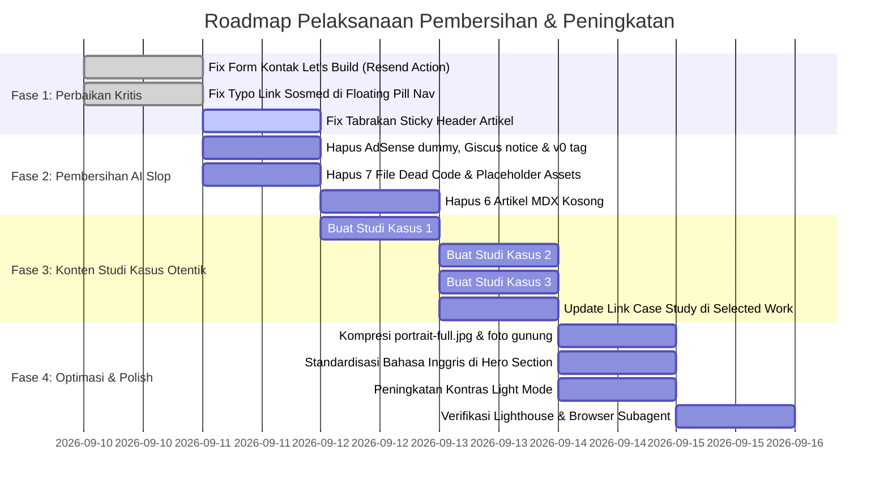

# Product Requirements Document (PRD)
# Website Portofolio & Engineering Journal — Adam Hidayat
### Refinement, De-Slopping, and Feature Enhancement Specification

---

## 1. Executive Summary

### 1.1 Problem Statement
Implementasi terkini dari portofolio web Adam Hidayat (`damz-projects`) telah berhasil mengadopsi gaya visual editorial minimalis dan animasi transisi *scroll-linked* bertema polaroid (terinspirasi dari *Webild Creative Portfolio*). Namun, hasil audit mendalam mengungkap bahwa website ini masih dipenuhi oleh artefak **"AI Slop"** (75% artikel blog berstatus kosong dengan teks `# Content goes here`, aset ilustrasi neon sirkuit generik yang didaur ulang secara tidak kontekstual, banner iklan dummy AdSense, dan teks instruksi developer yang bocor ke UI publik). 

Selain itu, terdapat **kegagalan fungsional kritis**: formulir kontak *"Let's Build"* di halaman depan membuang nama dan isi pesan pengunjung (hanya mendaftarkan email ke newsletter), tautan sosial media di navbar memiliki typo menuju profil yang salah, dan tautan *"Read case study"* pada Selected Work mengarah ke halaman kosong atau tidak relevan.

### 1.2 Proposed Solution
Melakukan pembersihan total (*de-slopping*), perbaikan fungsionalitas kritis, dan peningkatan mutu produk (*enhancement*):
1. **Perbaikan Fungsional Kontak**: Mengubah form "Let's Build" menjadi pipeline pesan kontak nyata berbasis Server Action & Resend API yang mengirimkan Nama, Email, dan Pesan langsung ke inbox `adamhdyt11@gmail.com` dengan validasi Zod dan proteksi spam.
2. **Pembersihan Artefak AI Slop & Template Dummy**: Menghapus seluruh placeholder AdSense dummy (`ca-pub-XXXXXXXXXXXXXXXX`), membersihkan instruksi developer pada Giscus, menghapus metadata generator `v0.app`, serta menghapus file aset template yang tidak terpakai.
3. **Penyempurnaan Konten & Studi Kasus Otentik**: Menghapus 6 artikel stub kosong dan menggantikannya dengan **3 studi kasus teknis mendalam (in-depth case studies)** yang sesuai dengan 3 kartu pencapaian utama di Hero / Selected Work:
   - *Production Database Upgrade (Oracle 12c ke 19c RU 19.27)*
   - *Batch Performance Tuning (>99% latency reduction)*
   - *International Enterprise DBA Training di IBK Headquarters Seoul*
4. **Koreksi Navigasi & Konsistensi Tautan**: Memperbaiki typo URL media sosial di Floating Pill Nav dan memusatkan sumber data profil.
5. **Penyelarasan Desain & UX**: Memperbaiki tabrakan layout antara *sticky sub-header* artikel dengan *floating pill navbar*, menyelaraskan seluruh copywriting ke dalam Bahasa Inggris profesional, dan meningkatkan kontras visual frame polaroid pada Light Mode.
6. **Optimasi Performa Aset**: Mengompresi foto potret 6.2 MB dan galeri foto gunung 8.4 MB ke format WebP teroptimasi (< 250 KB per gambar) untuk mencapai skor LCP tinggi di perangkat mobile.

### 1.3 Success Criteria
1. **Zero AI Slop**: 0% halaman atau artikel yang memuat teks placeholder dummy, 0 banner iklan tiruan, 0 instruksi developer yang bocor di UI, dan 0 file *dead code*.
2. **100% Functional Integrity**: Formulir kontak berhasil mengirimkan pesan lengkap ke email Adam, seluruh tautan sosial media mengarah ke akun terverifikasi, dan semua tombol studi kasus membuka konten nyata yang kaya.
3. **Lighthouse Score**: Nilai ≥ 95 untuk Performance, Accessibility, Best Practices, dan SEO pada perangkat Desktop dan Mobile.
4. **Performance Core Web Vitals**: Largest Contentful Paint (LCP) ≤ 1.8 detik pada jaringan 4G/Mobile dan First Contentful Paint (FCP) ≤ 1.0 detik.
5. **Unified Editorial Voice**: 100% konten publik menggunakan Bahasa Inggris teknis perbankan yang kredibel, konsisten, dan bebas dari campur aduk bahasa yang canggung.

---

## 2. User Experience & Functionality

### 2.1 User Personas

1. **Tech Recruiter & Talent Acquisition (Banking / FinTech)**
   - *Kebutuhan*: Memvalidasi kredensial Oracle, 4+ tahun pengalaman perbankan, mengunduh CV PDF resmi, dan mengirim pesan penawaran kerja langsung melalui web dalam < 60 detik.
   - *Pain Point*: Kecewa jika formulir kontak tidak jelas statusnya, link sosial media salah, atau portfolio terasa seperti template AI yang dibuat secara instan tanpa kurasi.

2. **Lead DBA / Head of Infrastructure / Hiring Manager**
   - *Kebutuhan*: Menguji kedalaman teknis kandidat melalui studi kasus pemecahan masalah riil (misal: strategi switchover Data Guard zero data loss, tuning batch job lambat, penanganan insiden).
   - *Pain Point*: Menolak klaim resume jika link *"Read case study"* justru mengarah ke artikel kosong atau file skrip mentah tanpa analisis bisnis/arsitektur.

3. **Database Administrator & Engineering Community**
   - *Kebutuhan*: Membaca skrip troubleshooting SQL/Oracle siap pakai, tips arsitektur RAC, dan refleksi hidup seimbang (hiking & gunung).
   - *Pain Point*: Terganggu oleh banner placeholder AdSense yang tidak berfungsi atau tampilan mobile yang saling menabrak.

---

### 2.2 User Stories & Acceptance Criteria

#### Epic 1: Contact Pipeline & Inquiry Delivery
*Sebagai calon klien atau rekruter, saya ingin mengirim pesan konsultasi atau penawaran kerja lengkap beserta nama, email, dan detail proyek saya agar Adam dapat merespons dalam 24 jam.*

- **AC 1.1**: Form "Let's Build" di halaman depan ([`components/home/lets-build-section.tsx`](file:///Users/adamhdyt/Work/WebProject/damz-projects/components/home/lets-build-section.tsx)) dan form di halaman kontak ([`app/(blog)/contact/page.tsx`](file:///Users/adamhdyt/Work/WebProject/damz-projects/app/(blog)/contact/page.tsx)) mengikat seluruh input field: `name`, `email`, dan `message`.
- **AC 1.2**: Data divalidasi di sisi klien dan server menggunakan skema Zod:
  - `name`: Minimal 2 karakter, maksimal 100 karakter.
  - `email`: Format email valid.
  - `message`: Minimal 10 karakter, maksimal 2000 karakter.
- **AC 1.3**: Server Action (`sendContactMessage`) mengirimkan email notifikasi ke `adamhdyt11@gmail.com` menggunakan Resend API dengan menyertakan nama pengirim, email pengirim, dan isi pesan lengkap.
- **AC 1.4**: Mengimplementasikan proteksi spam ringan (honeypot field tak kasat mata) untuk mencegah bot submission tanpa mengganggu UX pengguna asli.
- **AC 1.5**: Menampilkan status interaktif: *loading state* (spinner + tombol dinonaktifkan), *success alert* ("Thank you, Adam has received your message!"), dan *error alert* yang ramah jika pengiriman gagal.

#### Epic 2: Authentic Case Studies for Key Achievements
*Sebagai hiring manager, saya ingin membaca studi kasus mendalam saat mengklik "Read case study" pada 3 kartu Selected Work agar dapat memverifikasi kapabilitas teknis Adam.*

- **AC 2.1**: Menyediakan 3 artikel studi kasus teknis komprehensif dalam direktori `content/tech/`:
  1. `oracle-19c-production-upgrade.mdx`:
     - *Latar Belakang*: Arsitektur core banking 12c, tantangan SLA 24/7.
     - *Strategi*: Oracle Active Data Guard rolling switchover, fallback plan, pre-upgrade testing via Real Application Testing (RAT).
     - *Hasil*: Migrasi ke 19c RU 19.27 dengan Zero Downtime dan 0 transactional data loss.
  2. `batch-query-optimization-99-percent.mdx`:
     - *Latar Belakang*: Bottleneck proses batch akhir bulan (EOM) yang memakan waktu belasan jam.
     - *Diagnosa*: Analisis AWR, ASH, I/O wait events, latch contention.
     - *Solusi & Hasil*: Re-engineering execution plan, optimalisasi partisi tabel, defragmentasi index, memangkas durasi eksekusi > 99%.
  3. `ibk-headquarters-seoul-dba-training.mdx`:
     - *Latar Belakang*: Program technical training intensif di Industrial Bank of Korea Headquarters, Seoul.
     - *Materi*: High Availability RAC cluster, disaster recovery cross-region, automasi enterprise monitoring.
     - *Dokumentasi*: Foto/sertifikat otentik dan pelajaran kunci yang diterapkan di Indonesia.
- **AC 2.2**: Tautan *"Read case study →"* pada 3 kartu di [`hero-scroll-showcase.tsx`](file:///Users/adamhdyt/Work/WebProject/damz-projects/components/home/hero-scroll-showcase.tsx) mengarah tepat ke slug studi kasus masing-masing:
  - Card 1 ➔ `/tech/oracle-19c-production-upgrade`
  - Card 2 ➔ `/tech/batch-query-optimization-99-percent`
  - Card 3 ➔ `/tech/ibk-headquarters-seoul-dba-training`
- **AC 2.3**: Setiap kartu studi kasus dilengkapi ringkasan metrik, badge kategori, dan estimasi waktu baca yang akurat.

#### Epic 3: AI Slop & Placeholder Purge
*Sebagai pengunjung, saya ingin setiap elemen visual dan konten teks di website terasa otentik, profesional, dan selesai dikerjakan.*

- **AC 3.1**: Menghapus seluruh 6 artikel MDX stub yang hanya berisi `# Content goes here`:
  - `profiling-postgres.mdx`, `react-server-components.mdx`, `type-safe-data-layer.mdx`.
  - `reading-habit.mdx`, `shipping-small.mdx`, `small-town.mdx`.
- **AC 3.2**: Daftar artikel yang aktif di web adalah konten berkualitas tinggi yang utuh:
  - **Tech**: 3 Case Studies Baru + `oracle-scripts.mdx` (total 4 artikel teknis solid).
  - **Life**: `mountain-journal.mdx` (jurnal foto gunung otentik).
- **AC 3.3**: Menghapus banner AdSense dummy ([`components/blog/ad-banner.tsx`](file:///Users/adamhdyt/Work/WebProject/damz-projects/components/blog/ad-banner.tsx)) dan script AdSense placeholder di [`app/layout.tsx`](file:///Users/adamhdyt/Work/WebProject/damz-projects/app/layout.tsx).
- **AC 3.4**: Menghapus teks instruksi developer scaffolding pada widget Giscus ([`components/blog/comments.tsx`](file:///Users/adamhdyt/Work/WebProject/damz-projects/components/blog/comments.tsx)).
- **AC 3.5**: Menghapus tag `generator: 'v0.app'` pada metadata root layout.
- **AC 3.6**: Menghapus file gambar dummy bawaan dari direktori `public/`: `placeholder-logo.svg`, `placeholder-user.jpg`, `placeholder.jpg`, dll.
- **AC 3.7**: Menghapus 7 file komponen lama yang mati (*dead code*):
  - `hero-section.tsx`, `selected-work-section.tsx`, `sidebar.tsx`, `mobile-nav.tsx`, `newsletter-form.tsx`, `theme-toggle.tsx`, `affiliate-disclosure.tsx`.

#### Epic 4: Navigation Integrity & Profile Synchronization
*Sebagai pengunjung, saya ingin menu navigasi melayang (Floating Pill) menghubungkan saya ke profil media sosial Adam yang benar tanpa ada broken link.*

- **AC 4.1**: Memperbaiki seluruh tautan media sosial di [`components/navigation/floating-pill-nav.tsx`](file:///Users/adamhdyt/Work/WebProject/damz-projects/components/navigation/floating-pill-nav.tsx):
  - LinkedIn: `https://www.linkedin.com/in/adam-hidayat/` (sebelumnya `adamhdyt` yang salah).
  - Instagram: `https://www.instagram.com/adamhdyt/` (sebelumnya `adamhdytt` dengan double 't').
  - GitHub: `https://github.com/adamhdyt`
  - Email: `mailto:adamhdyt11@gmail.com`
- **AC 4.2**: Seluruh tautan profil diekstraksi ke dalam satu konstanta terpusat (`lib/constants.ts`) agar tidak ada inkonsistensi antar komponen (Navbar, About Page, Contact Page, Footer).

#### Epic 5: Layout Collision Fix & Visual Polish
*Sebagai pembaca artikel blog, saya ingin header navigasi dan sticky breadcrumb tidak saling menutupi saat saya melakukan scroll.*

- **AC 5.1**: Pada halaman detail artikel ([`components/blog/post-detail.tsx`](file:///Users/adamhdyt/Work/WebProject/damz-projects/components/blog/post-detail.tsx)) dan halaman listing ([`components/blog/main-content.tsx`](file:///Users/adamhdyt/Work/WebProject/damz-projects/components/blog/main-content.tsx)), atur posisi sticky header agar tidak bertabrakan dengan `FloatingPillNav`. Sub-header diposisikan dengan offset `top-20` atau diintegrasikan secara bersih sehingga tombol "Back" dan judul kategori selalu terlihat jelas dan dapat diklik.
- **AC 5.2**: Hero Section di [`hero-scroll-showcase.tsx`](file:///Users/adamhdyt/Work/WebProject/damz-projects/components/home/hero-scroll-showcase.tsx) diselaraskan menggunakan **Bahasa Inggris profesional**:
  > *"I engineer, optimize, and scale mission-critical enterprise database architectures with an uncompromising focus on peak performance, tight security, and high availability. Over 4 years of production experience in Oracle 19c RAC, SQL Server, and PostgreSQL in the banking industry."*
- **AC 5.3**: Di Light Mode, border kartu polaroid diberikan border warna halus yang lebih tegas (`border-zinc-200/90 shadow-lg shadow-zinc-200/50`) agar kartu tidak tenggelam pada latar belakang terang.

#### Epic 6: Asset Compression & Mobile Performance Optimization
*Sebagai pengguna perangkat seluler dengan kuota terbatas, saya ingin halaman terbuka dalam hitungan detik tanpa memuat gambar berukuran megabyte.*

- **AC 6.1**: Mengompresi [`public/images/portrait-full.jpg`](file:///Users/adamhdyt/Work/WebProject/damz-projects/public/images/portrait-full.jpg) (yang saat ini berukuran **6.2 MB**) menjadi format WebP teroptimasi berukuran **< 200 KB** dengan dimensi tampilan proporsional (max 1600px width).
- **AC 6.2**: Mengompresi seri 4 foto pendakian gunung di `public/images/` (`mountain-trail.png`, `mountain-camp.png`, `mountain-ridge.png`, `mountain-summit.png`) yang totalnya mencapai **8.4 MB** menjadi format WebP berukuran rata-rata **150–200 KB per gambar** (total < 800 KB).
- **AC 6.3**: Menambahkan atribut `priority` pada gambar potret di atas viewport (`Hero` dan `About`), serta `loading="lazy"` pada gambar di bawah viewport untuk memaksimalkan First Contentful Paint.

---

### 2.3 Non-Goals (Out of Scope)
- **Bukan Membangun CMS GUI**: Pengelolaan artikel blog tetap menggunakan format MDX lokal statis yang aman, cepat, dan terversi dengan Git tanpa memerlukan database eksternal.
- **Bukan Sistem E-Commerce / Donasi**: Tidak mengintegrasikan gateway pembayaran, afiliasi produk, atau donasi koin/kopi. Fokus 100% pada reputasi profesional enterprise DBA.
- **Bukan Multi-Bahasa Dinamis (i18n Switcher)**: Mengingat target audiens utama adalah rekruter korporat, perbankan, dan komunitas teknologi global, seluruh website distandardisasi menjadi **Bahasa Inggris profesional**.

---

## 3. Technical Specifications

### 3.1 Architecture & Data Flow

```mermaid
flowchart TD
    subgraph Client Layer
        A["Visitor UI (Next.js 15 App Router)"]
        B["FloatingPillNav (Constants Sync)"]
        C["HeroScrollShowcase (Polaroid Cards)"]
        D["Contact Form (LetsBuildSection)"]
    end

    subgraph Server Layer (Next.js Server Actions)
        E["sendContactMessage() in app/actions/contact.ts"]
        F["Zod Validation Schema (Name, Email, Message, Honeypot)"]
        G["MDX Engine (next-mdx-remote/rsc + Shiki)"]
    end

    subgraph External Services
        H["Resend API (support@resend.com -> adamhdyt11@gmail.com)"]
        I["Giscus (GitHub Discussions Comments)"]
    end

    A --> B & C & D
    D -->|Submit Form Data| E
    E --> F
    F -->|Valid Payload| H
    A --> G
    A --> I
```

### 3.2 Server Action Specification: `sendContactMessage`
- **File**: `app/actions/contact.ts`
- **Input Parameters**:
  ```ts
  interface ContactFormData {
    name: string
    email: string
    message: string
    botField?: string // Honeypot spam trap
  }
  ```
- **Validation Logic**:
  ```ts
  const contactSchema = z.object({
    name: z.string().trim().min(2, "Name must be at least 2 characters").max(100),
    email: z.string().trim().email("Please enter a valid email address"),
    message: z.string().trim().min(10, "Message must be at least 10 characters").max(2000),
    botField: z.string().max(0).optional(), // Must be empty
  })
  ```
- **Execution Flow**:
  1. Validasi `botField`. Jika terisi, kembalikan simulasi sukses tanpa memproses (silent spam rejection).
  2. Panggil `resend.emails.send`:
     - `from`: `Adam Hidayat Portfolio <onboarding@resend.dev>` (atau verified custom domain)
     - `to`: `adamhdyt11@gmail.com`
     - `reply_to`: Email pengirim
     - `subject`: `[Portfolio Contact] New message from ${name}`
     - `text` / `html`: Format email bersih berisi nama, email, waktu submit, dan isi pesan.
  3. Kembalikan `{ success: true }` atau `{ error: string }`.

### 3.3 Centralized Constants: `lib/constants.ts`
Untuk mencegah duplikasi URL dan typo pada link:
```ts
export const SITE_CONFIG = {
  name: "Adam Hidayat",
  title: "Database Administrator",
  email: "adamhdyt11@gmail.com",
  location: "Jakarta, Indonesia (GMT+7)",
  socials: {
    github: "https://github.com/adamhdyt",
    linkedin: "https://www.linkedin.com/in/adam-hidayat/",
    instagram: "https://www.instagram.com/adamhdyt/",
  },
  cvUrl: "/CV/Adam_Hidayat_DBA_CV.pdf",
} as const
```

### 3.4 Codebase Cleanup Matrix
File-file berikut **wajib dihapus** dari codebase untuk menjaga kebersihan repositori:

| File Path | Status | Alasan Penghapusan |
|---|---|---|
| `components/home/hero-section.tsx` | Delete | Orphan/Dead code (digantikan oleh `hero-scroll-showcase.tsx`) |
| `components/home/selected-work-section.tsx` | Delete | Orphan/Dead code (digabungkan ke dalam `hero-scroll-showcase.tsx`) |
| `components/blog/sidebar.tsx` | Delete | Orphan/Dead code dari template dashboard lama |
| `components/blog/mobile-nav.tsx` | Delete | Orphan/Dead code (digantikan oleh modal Floating Pill) |
| `components/blog/newsletter-form.tsx` | Delete | Orphan/Dead code |
| `components/blog/theme-toggle.tsx` | Delete | Orphan/Dead code (sudah terintegrasi di Floating Pill) |
| `components/blog/affiliate-disclosure.tsx` | Delete | Template placeholder afiliasi belanja yang tidak relevan |
| `components/blog/ad-banner.tsx` | Delete | Placeholder dummy AdSense |
| `public/placeholder-*.png/svg/jpg` | Delete | File dummy sisa template |
| 6 MDX stubs di `content/tech/` & `content/life/` | Delete | Artikel kosong berisi `# Content goes here` |

---

## 4. Risks, Mitigation & Phased Roadmap

### 4.1 Risk Analysis & Mitigation Strategies

| Risiko Potensial | Tingkat | Dampak | Strategi Mitigasi |
|---|:---:|:---:|---|
| **Resend API Key Tidak Terisi di Local Dev** | Sedang | Form gagal kirim saat testing lokal | Tambahkan fallback simulasi yang mencetak pesan ke `console.log` di mode development ketika `RESEND_API_KEY` belum disetel di `.env.local`. |
| **Ketiadaan Aset Foto untuk 3 Studi Kasus Baru** | Rendah | Kartu studi kasus kekurangan visual representatif | Gunakan diagram arsitektur database SVG / visual beresolusi tinggi yang relevan (arsitektur Oracle 19c RAC, grafik latensi AWR) yang profesional dan rapi. |
| **Penyusutan Gambar Merusak Ketajaman di Retina Display** | Rendah | Gambar potret terlihat buram di layar 4K | Kompresi menggunakan format WebP dengan lebar 1600px dan `quality: 85` (cukup tajam untuk monitor 4K dengan ukuran file < 250 KB). |
| **Regresi Tampilan Saat Scroll Header Disesuaikan** | Sedang | Breadcrumb artikel terpotong di layar ponsel | Uji coba di viewport mobile 375px dan desktop 1440px menggunakan subagent visual inspection. |

---

### 4.2 Phased Implementation Roadmap



---

## 5. Sign-off & Verification Criteria
Pekerjaan pembersihan dan penyempurnaan ini dianggap selesai jika:
1. Menjalankan `npm run build` sukses tanpa warning *unused imports* atau broken dynamic routes.
2. Pengujian formulir kontak berhasil mengirimkan email uji coba ke `adamhdyt11@gmail.com` dengan data nama dan pesan yang utuh.
3. Seluruh kartu di halaman depan dapat diklik dan mengarah ke konten nyata (tidak ada artikel `# Content goes here`).
4. Halaman blog dibuka di mobile width (375px) dan desktop (1440px) tanpa layout collision dan tanpa banner iklan dummy.
5. Skor audit Lighthouse Performance mencapai ≥ 95.
